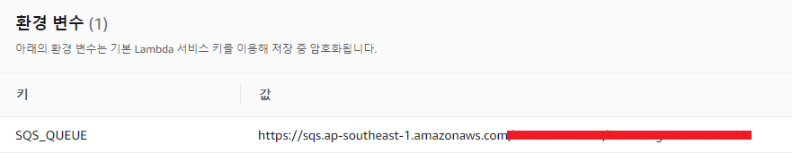

```python
import socket
import time
import urllib.request, urllib.error
import datetime
import json
import os
import boto3

def lambda_handler(event, context):
    # body data 파싱 (sqs에 트리거 걸어놓고 읽어온 event)
    body_class = eval(event["Records"][0]["body"])
    urls = body_class["urls"]
    service = body_class["service"]
    region = body_class["region"]

    # url list
    for url_data in urls:
        url = url_data["url"]

        # DNS Time
        dns = url.replace('https://', '').replace('http://', '')
        dns_start = time.time()
        try:
            socket.gethostbyname(dns)
        except Exception as e:
            print('>>>>>>>>>> Error resolving DNS for: {}, {}'.format(dns, e))
        dns_elapsed = time.time() - dns_start

        # URL 호출
        http_start = time.time()
        http_code = None
        body = ''
        url_call_time = ''
        try:
            url_call_time = datetime.datetime.now()
            res = urllib.request.urlopen(url, timeout=10)  # 200
            http_code = res.code
            body = res.read()
        except urllib.error.HTTPError as e:
            print('>>>>>>>>>> HTTPError for : {}'.format(url))
            http_code = e.code
            # return
        except urllib.error.URLError as e:
            print('>>>>>>>>>> URLError for : {}, {}'.format(url, e.reason))
        http_elapsed = time.time() - http_start

        # result data
        result_data = make_result_data(str(url_call_time), 'AWS', service, region, url_data, dns_elapsed, http_code, http_elapsed, len(body))

        # reulst SQS로 전송
        msg = send_sqs_message(os.environ['SQS_QUEUE'], json.dumps(result_data, ensure_ascii=False))
        print('result message : {}'.format(msg))

def send_sqs_message(sqs_queue_url, msg_body):
    # Send the SQS message
    sqs_client = boto3.client('sqs')
    try:
        msg = sqs_client.send_message(QueueUrl=sqs_queue_url,
                                      MessageBody=msg_body)
    except ClientError as e:
        logging.error(e)
        return None
    return msg
    
def make_result_data(time, host_type, service, region, url, dns_elapsed, http_code, http_elapsed, body_size):
    url_data = {}
    url_data['id'] = url["id"]
    url_data['name'] = url["name"]
    url_data['url'] = url["url"]
    url_data['dns_time'] = dns_elapsed
    url_data['http_code'] = http_code
    url_data['running_time'] = http_elapsed
    url_data['body_size'] = body_size
    url_data['speed_download'] = body_size/http_elapsed

    result_data = {}
    result_data['time'] = time
    result_data['host_type'] = host_type
    result_data['service'] = service
    result_data['region'] = region
    result_data['url'] = url_data

    return result_data
```


### 환경변수

- SQS 해당 큐의 url 값

