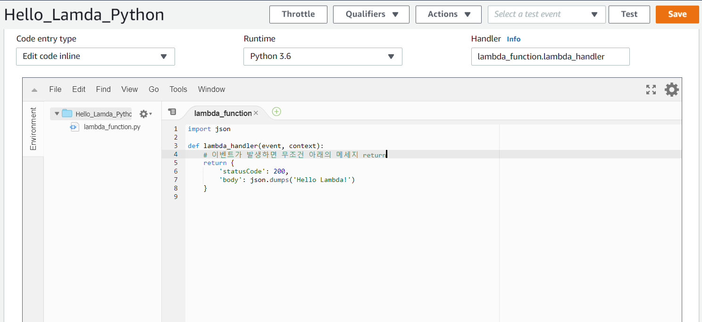

[TOC]

# AWS Lambda 사용

### [1] function 만들기


> create function 클릭

<br>


> 보통 node.js, python으로 많이 생성함

<br>

---

### [2] 확인


> Add trigger > 이벤트가 발생했을 때 
>
> Add destination > 처리

<br>

---

### [3] function code 작성

> trigger를 통해 이벤트 함수로 발생
>
> ```python
> import json
> 
> def lambda_handler(event, context):
>     # 이벤트가 발생하면 무조건 아래의 메세지 return
>     return {
>         'statusCode': 200,
>         'body': json.dumps('Hello Lambda!')
>     }
> ```



<br>

---

### [4] Trigger 추가


<br>

### [5] Trigger 확인


<br>

---

### [6] API 확인


