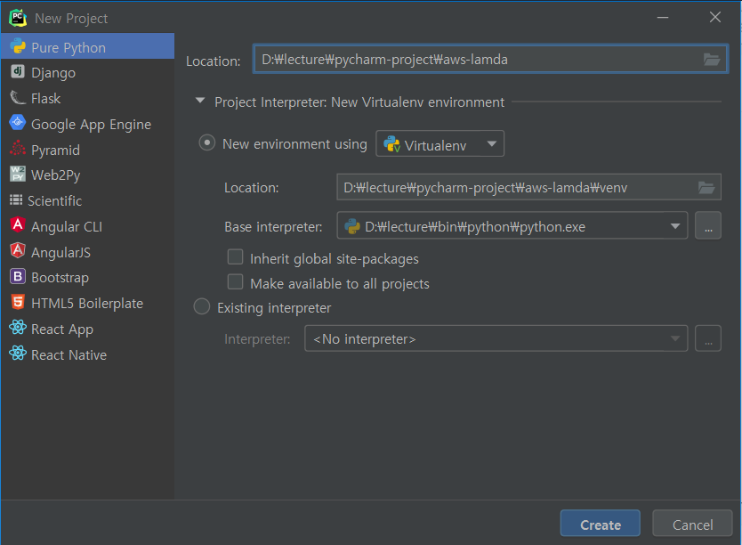
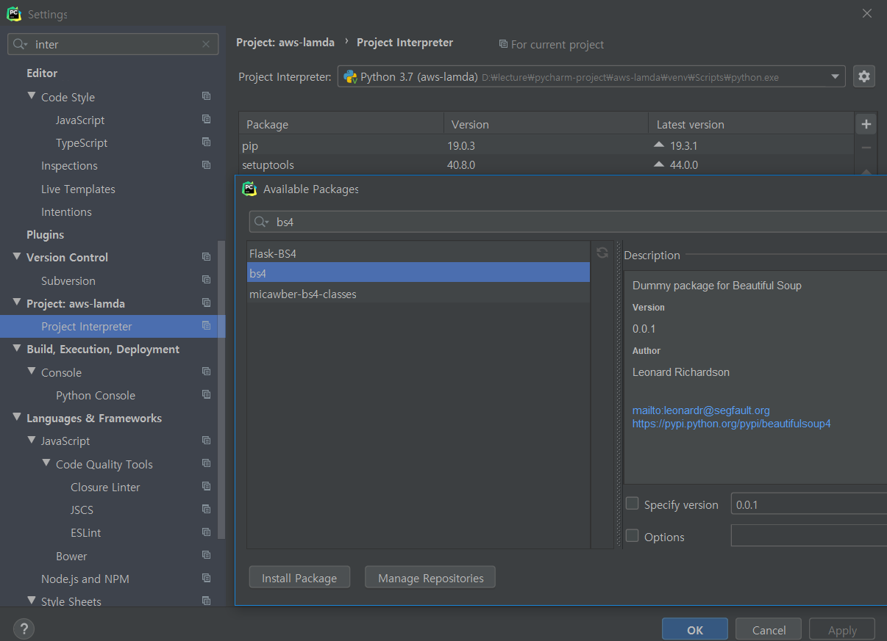
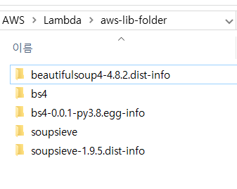
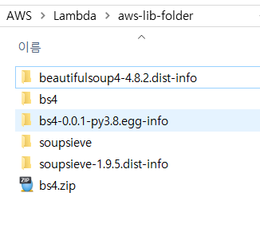
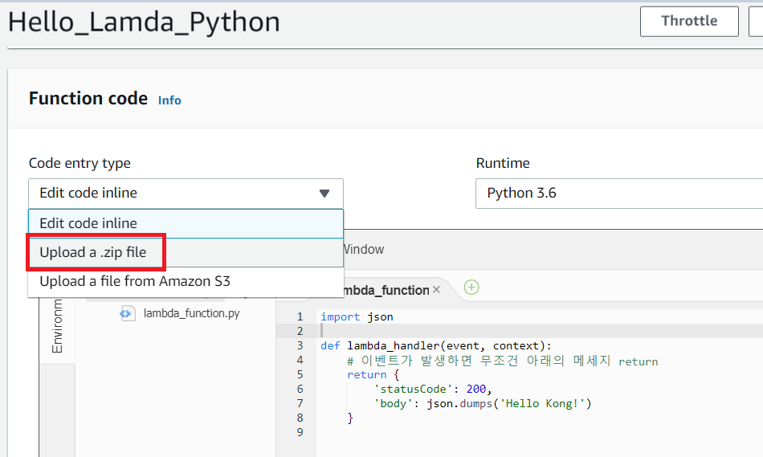
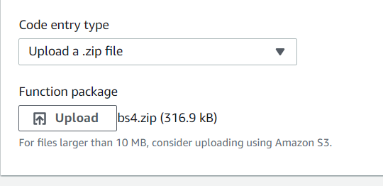
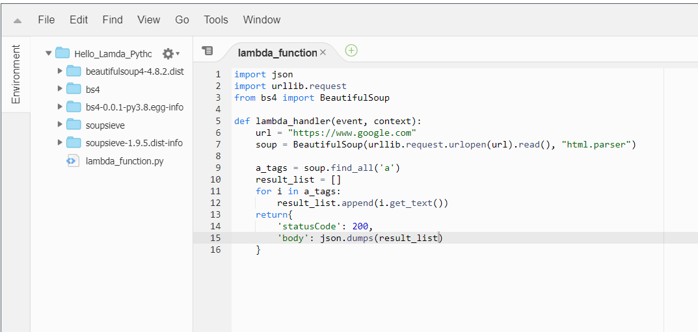
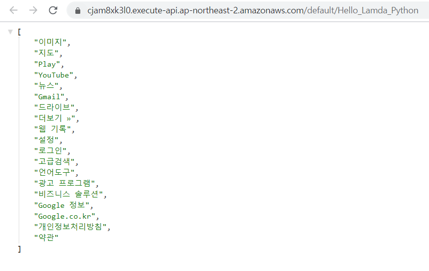

[TOC]

# AWS Lamda를 사용한 Crawling

* AWS Lambda python default libraries

  ```
  https://gist.github.com/gene1wood/4a052f39490fae00e0c3#file-all_aws_lambda_modules_python3-6-txt
  ```

  

### [1] pycharm project 생성

> 웹에서 코드 직접짜기 불편하니까



<br>

### [2] Project Interpreter - bs4 설치



```python
import urllib.request
from bs4 import BeautifulSoup

url = "https://www.google.com"
soup = BeautifulSoup(urllib.request.urlopen(url).read(), "html.parser")

a_tags = soup.find_all('a')
result_list = []
for i in a_tags:
    result_list.append(i.get_text())
print(result_list)
```

```
['이미지', '지도', 'Play', 'YouTube', '뉴스', 'Gmail', '드라이브', '더보기 »', '웹 기록', '설정', '로그인', '고급검색', '언어도구', '광고 프로그램', '비즈니스 솔루션', 'Google 정보', 'Google.co.kr', '개인정보처리방침', '약관']
```

<br>

### [3] python 에서 사용할 library 설치

BeautifulSoup같은 라이브러리를 AWS Lamda에서 사용하기 위해서는 별도의 폴더에 해당 라이브러리를 모두 다운 받은 후 aws에 올리고, function이 사용할 수 있도록 해야함

```powershell
$ pip install bs4 -t .
Collecting bs4
  Using cached https://files.pythonhosted.org/packages/10/ed/7e8b97591f6f456174139ec089c769f89a94a1a4025fe967691de971f314/bs4-0.0.1.tar.gz
Collecting beautifulsoup4 (from bs4)
  Using cached https://files.pythonhosted.org/packages/cb/a1/c698cf319e9cfed6b17376281bd0efc6bfc8465698f54170ef60a485ab5d/beautifulsoup4-4.8.2-py3-none-any.whl
Collecting soupsieve>=1.2 (from beautifulsoup4->bs4)
  Using cached https://files.pythonhosted.org/packages/81/94/03c0f04471fc245d08d0a99f7946ac228ca98da4fa75796c507f61e688c2/soupsieve-1.9.5-py2.py3-none-any.whl
Installing collected packages: soupsieve, beautifulsoup4, bs4
  Running setup.py install for bs4: started
    Running setup.py install for bs4: finished with status 'done'
Successfully installed beautifulsoup4-4.8.2 bs4-0.0.1 soupsieve-1.9.5
WARNING: You are using pip version 19.2.3, however version 19.3.1 is available.
You should consider upgrading via the 'python -m pip install --upgrade pip' command.
```

> 설치 확인
>
> 

<br>

### [4] bs4.zip 압축

```powershell
$ zip -r bs4.zip .
  adding: beautifulsoup4-4.8.2.dist-info/ (260 bytes security) (stored 0%)
  
  ...
  
  adding: soupsieve-1.9.5.dist-info/WHEEL (172 bytes security) (deflated 14%)
```



<br>

### [5] bs4.zip 올리기



<br>



<br>

### [6] bs4 lib사용



```python
import json
import urllib.request
from bs4 import BeautifulSoup

def lambda_handler(event, context):
    url = "https://www.google.com"
    soup = BeautifulSoup(urllib.request.urlopen(url).read(), "html.parser")
    
    a_tags = soup.find_all('a')
    result_list = []
    for i in a_tags:
        result_list.append(i.get_text())
    return{
        'statusCode': 200,
        'body': json.dumps(result_list)
    }
```




