[TOC]

# AWS Lambda 공통 라이브러리 관리

### [1] Layer 만들기

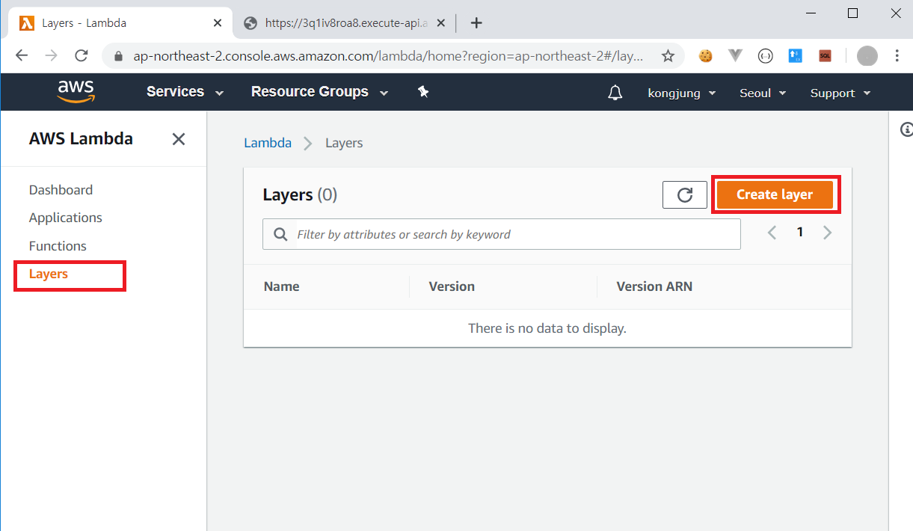

#### file upload

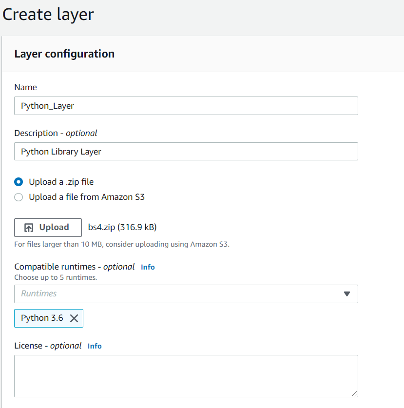


<br>

### [2] create function

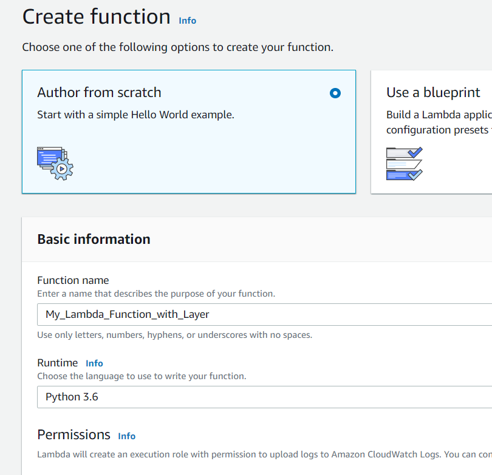

<br>

### [3] add Layer to function

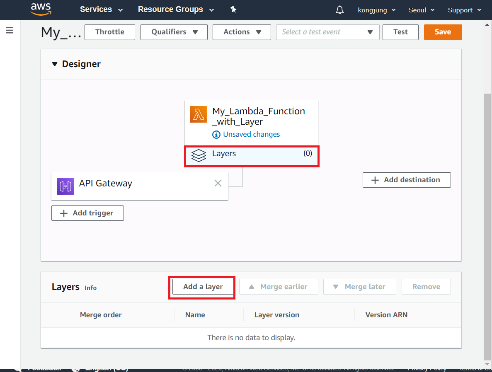

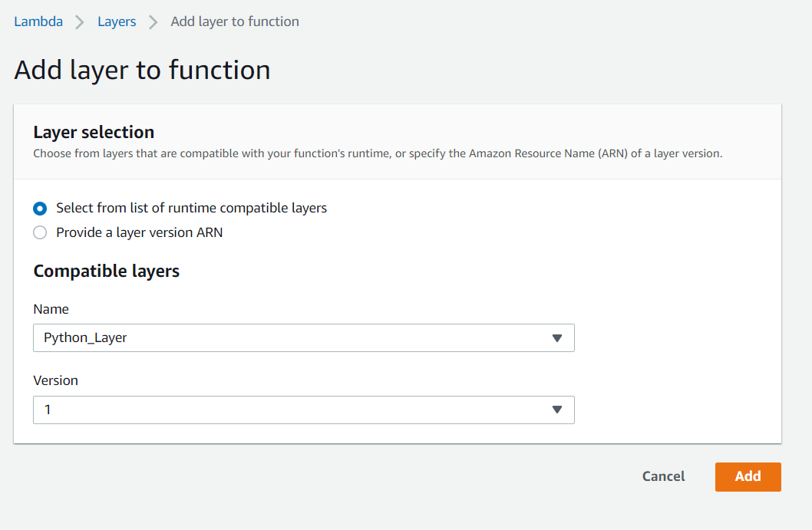


<br>

### [4] 실행 (ERROR)

```python
import json
import urllib.request
from bs4 import BeautifulSoup


def lambda_handler(event, context):
    url = "https://www.naver.com"
    soup = BeautifulSoup(urllib.request.urlopen(url).read(), "html.parser")
    
    a_tags = soup.find_all('a')
    
    result_list = []
    
    for i in a_tags:
        result_list.append(i.get_text())
        
    return {
        'statusCode': 200,
        'body': json.dumps(result_list)
    }
```

```
Response:
{
  "errorMessage": "Unable to import module 'lambda_function'"
}
```

> 이유. bs4를 그냥 압축하면 안되고 최상위 폴더가 `Library/python/`인 경로로 압축을 해줘야함

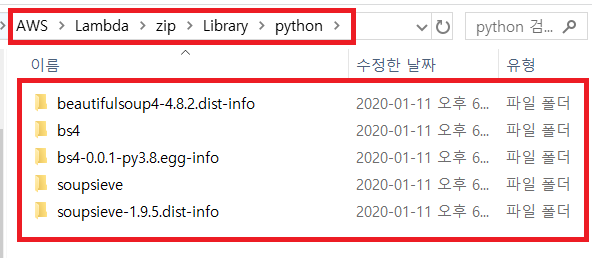

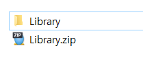

<br>

### [5] Layer Version 추가

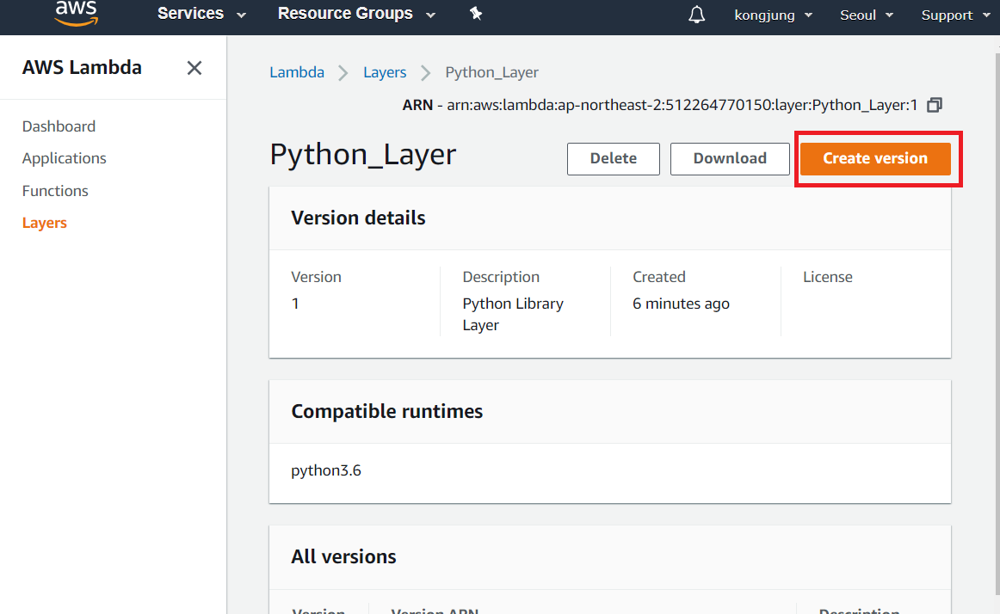

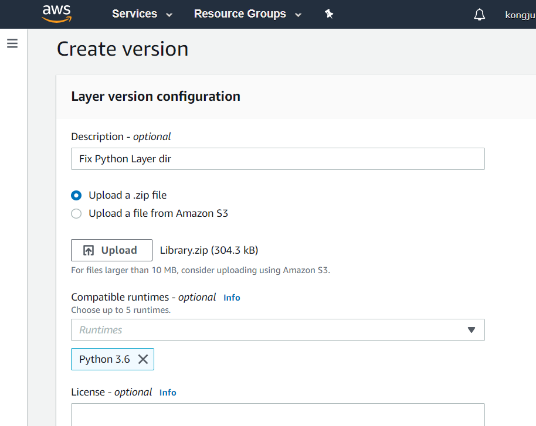

<br>

### [6] retry

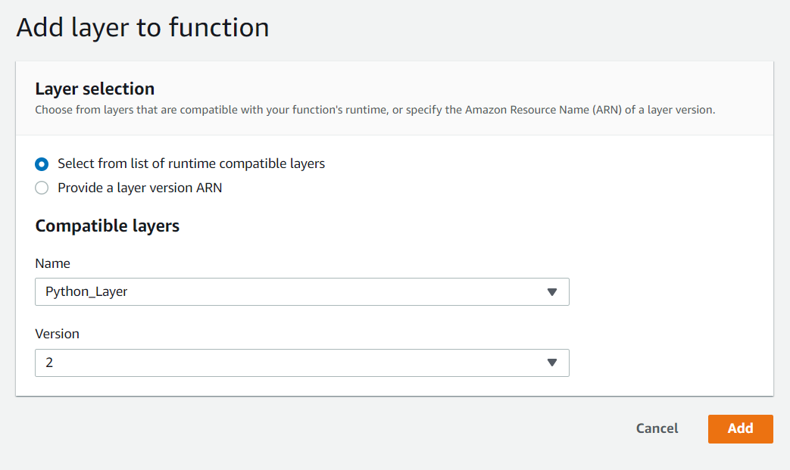

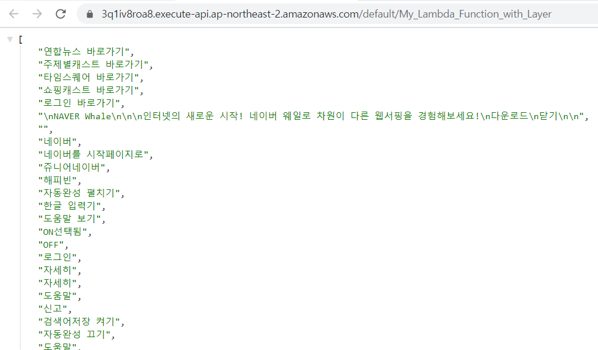


