# Stack

**LIFO (Last-In-First-Out) 구조**

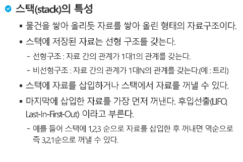

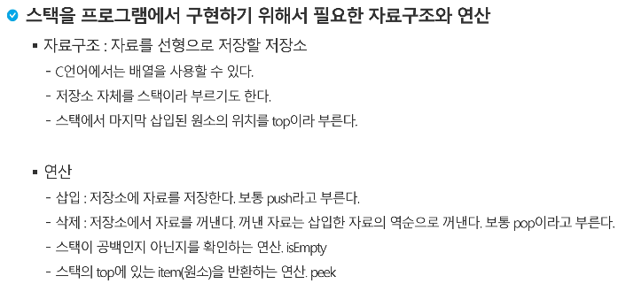


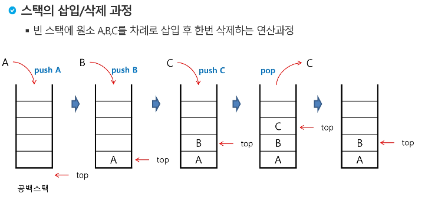

---

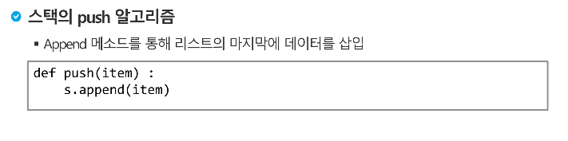

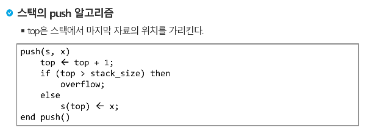

---

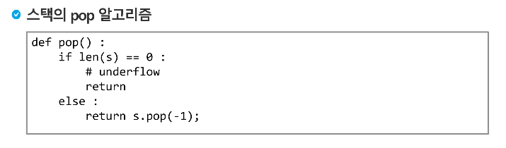

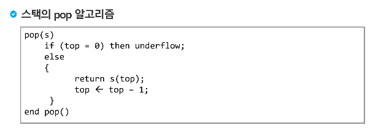

---

### 기본 구현

```python
stack = [0] * 10
top = -1
for i in range(3):
    stack[top+1] = i
    top += 1
    
for i in range(3):
    t = stack[top]
    top-=1
      print(t)
```

---

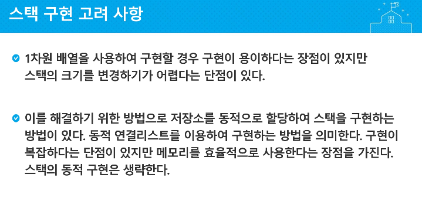


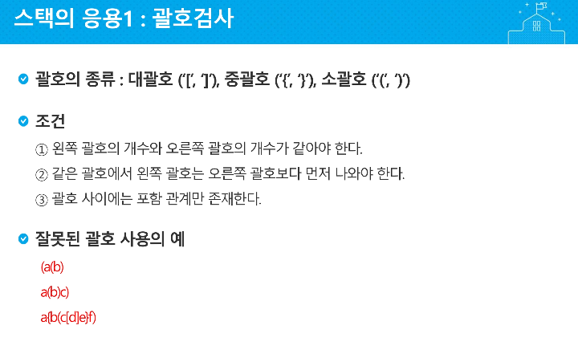

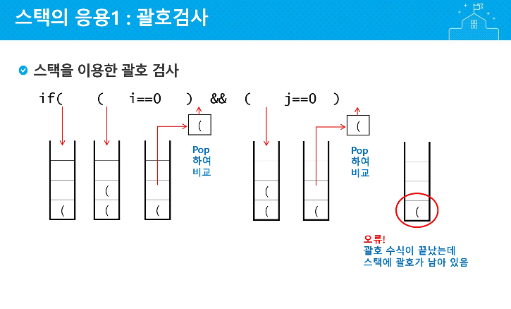


```python

def checkStack(s):
    stack = [0] * len(s)
    top = -1
    wrong = 0
    for i in range(len(s)):
        if (s[i] == "("):
            top += 1
            stack[top] = s[i]
        elif s[i] == ")":
            if top == -1:
                wrong = 1
                break
            if stack[top] == "(":
                top -=1
    if top == -1 and not wrong : return "Yes"
    else: return "No"

a = "()()((()))"
b = "((()((((()()((()())((())))))"

print("괄호 짝이 맞니?",checkStack(a))
print("괄호 짝이 맞니?",checkStack(b))

```


---

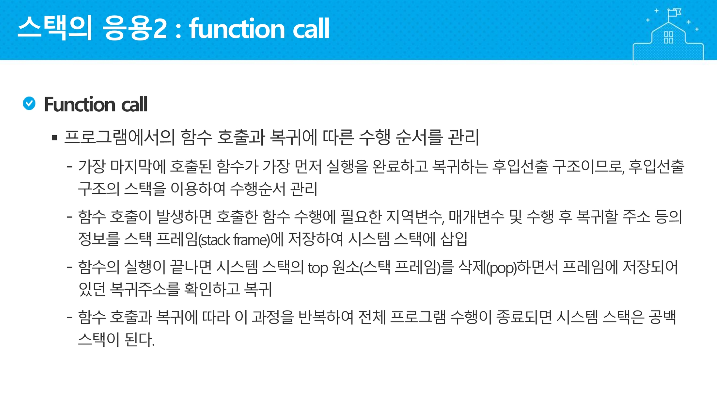

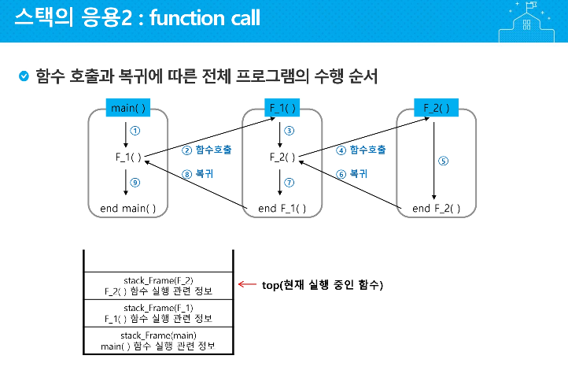

---

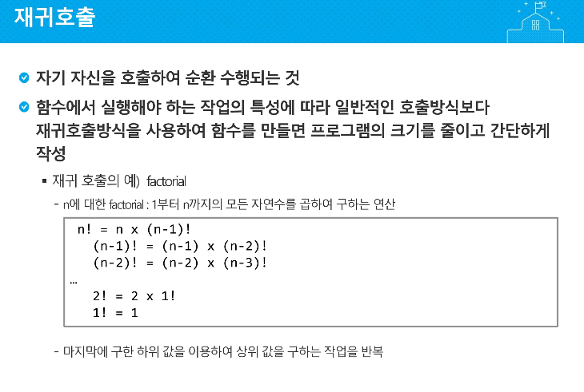

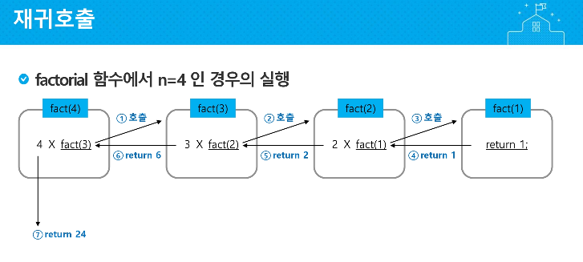

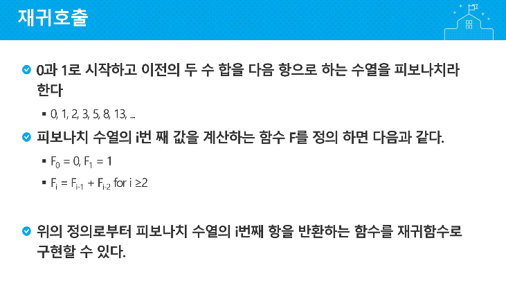

## 피보나치 수를 구하는 재귀함수

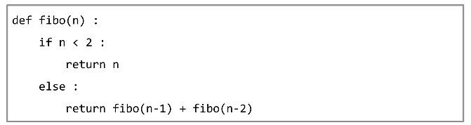

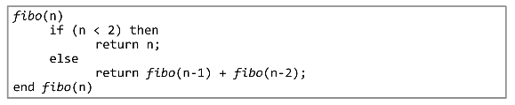

> ## ---> 엄청난 중복 호출이 존재함!!!!!
>
> 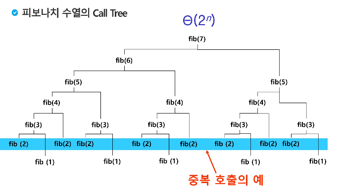


## Memoization 

### - 중복 제거(이전에 계산한 값을 메모리에 저장 -> 다시 계산하지 X)

```python
memo = [0] * 100
memo[0] = 0
memo[1] = 1

def f(n):
    if n <2 or memo[n] != 0 :
        return memo[n]
    memo[n] = f(n-1) + f(n-2)
    return memo[n]
```


---

# DP(Dynamic Programming)


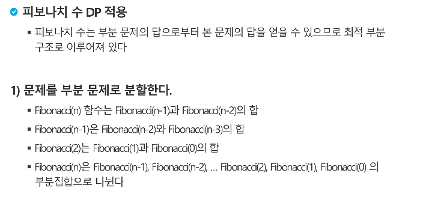

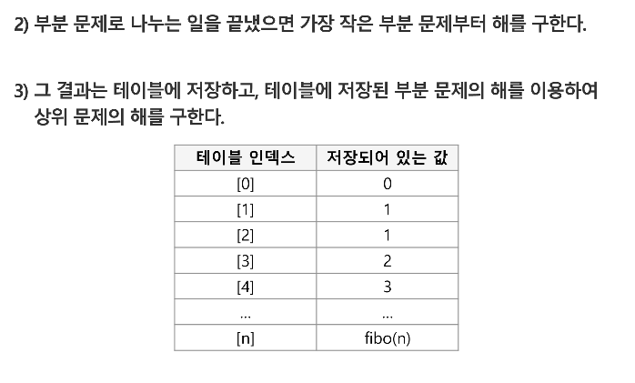

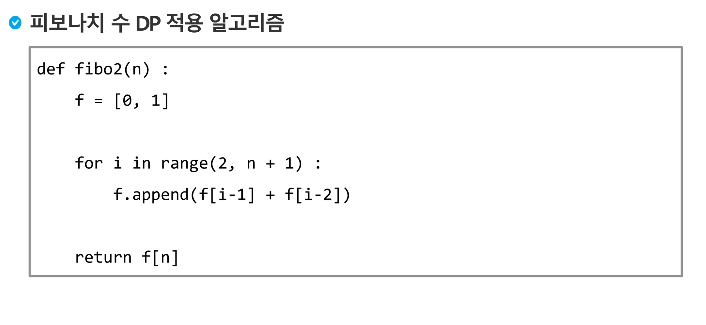

```python
def fibo2(n):
    f = [0,1]
    
    for i in range(2, n+1):
        f[i] = f[i-1] + f[i-2]
```

---


---

# DP의 구현 방식

### fiboMemo() -> 재귀적 DP -> 다이나믹 백트레킹

### fiboIterative() -> 반복적 DP -> DP

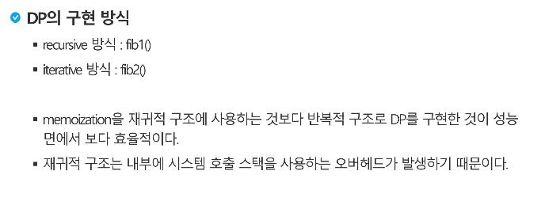

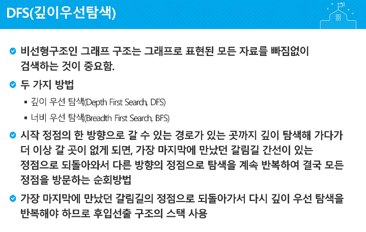


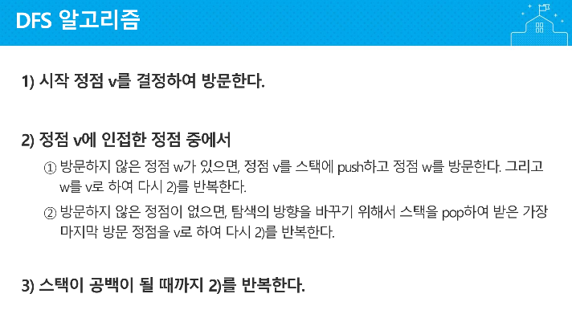

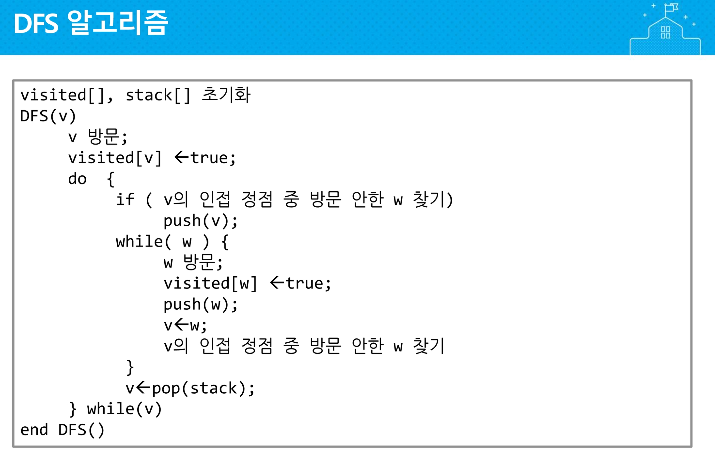

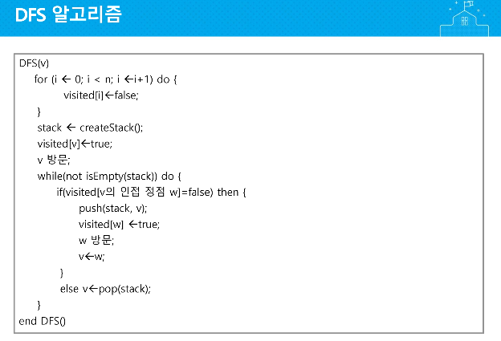


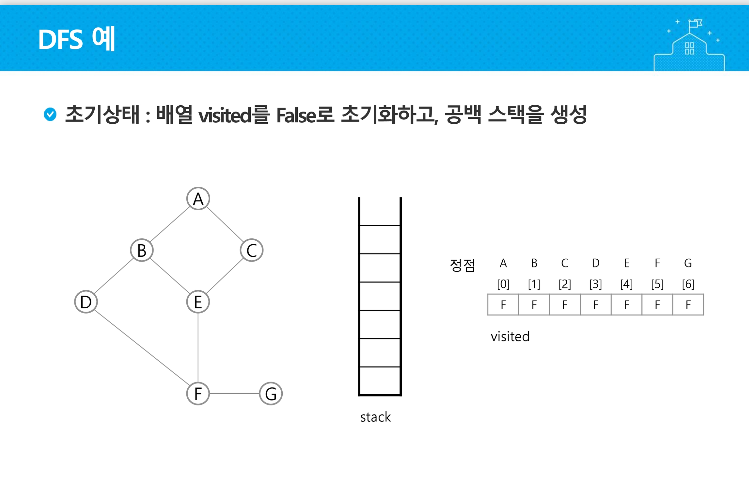


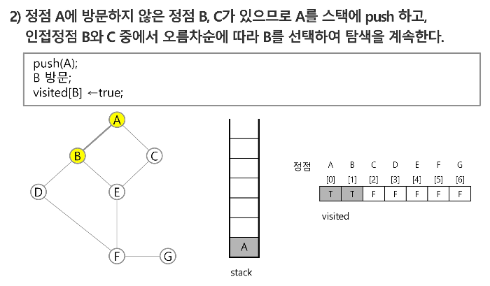


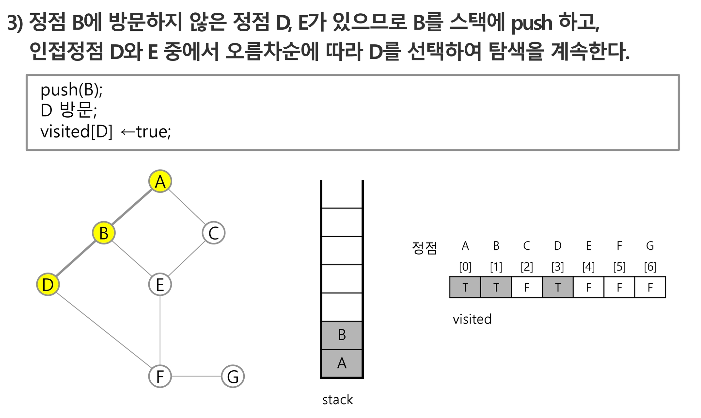

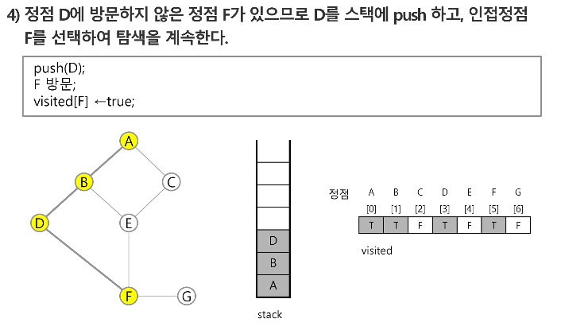

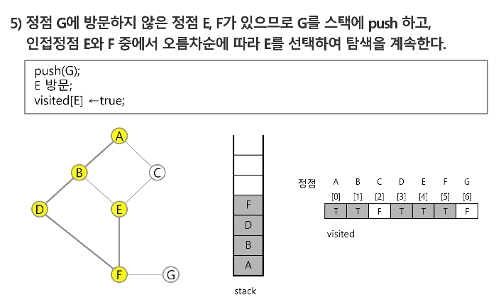

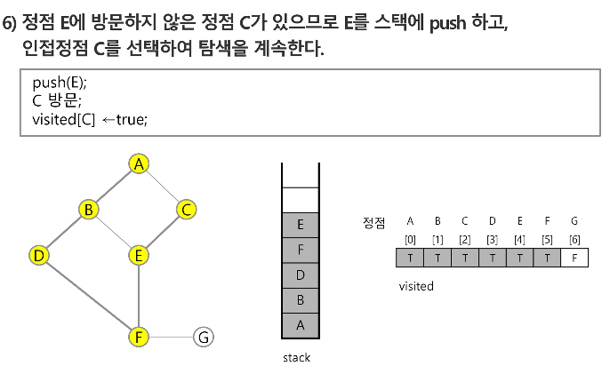

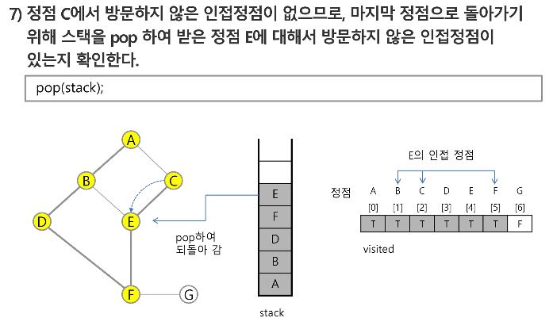

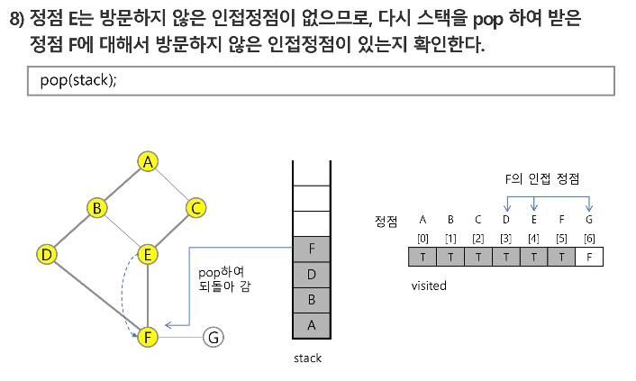

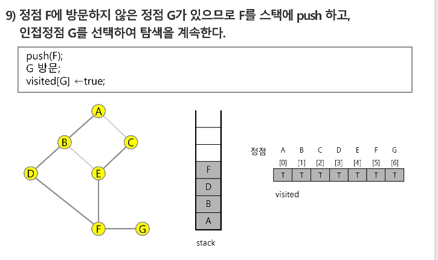

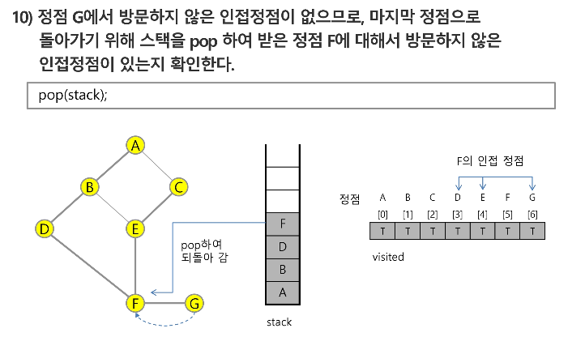

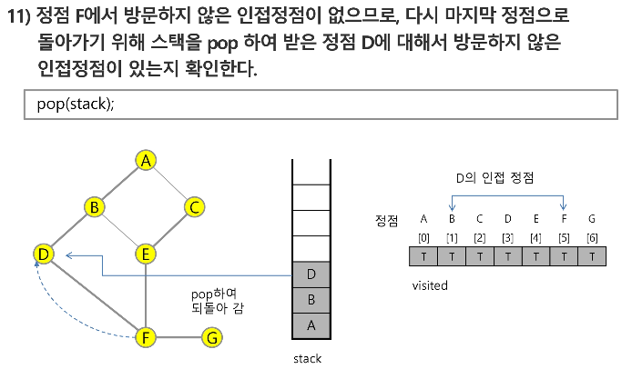

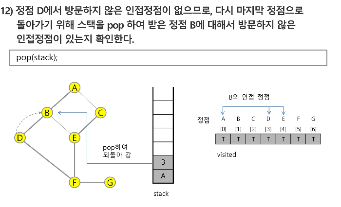

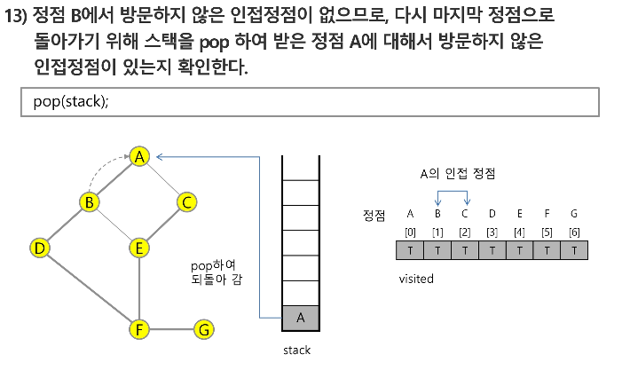

