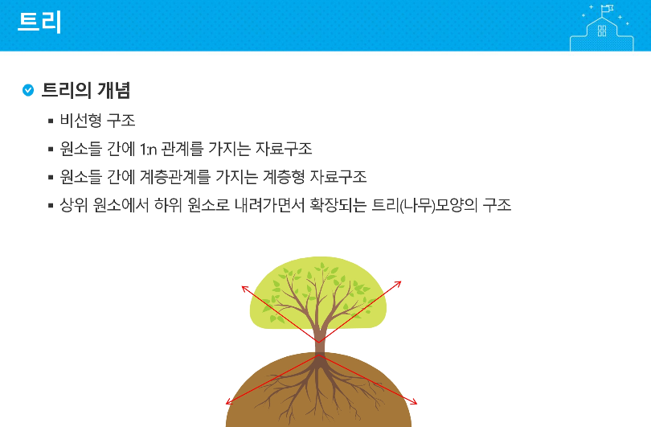
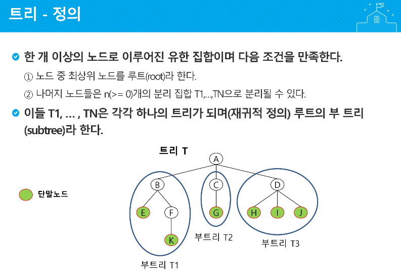
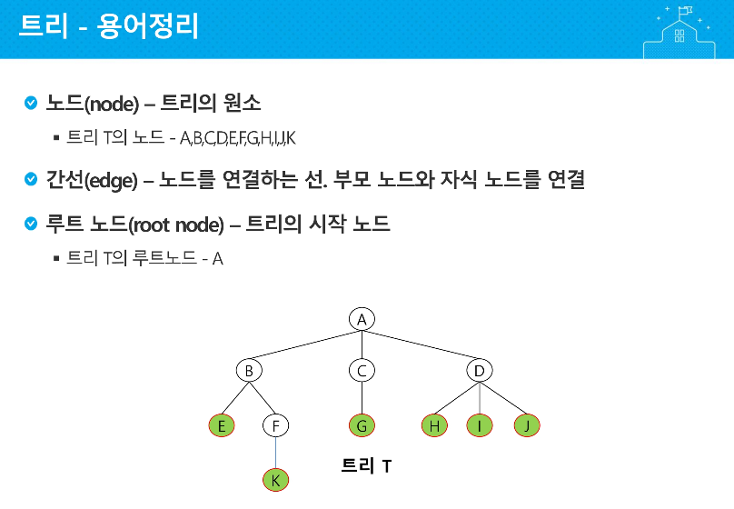
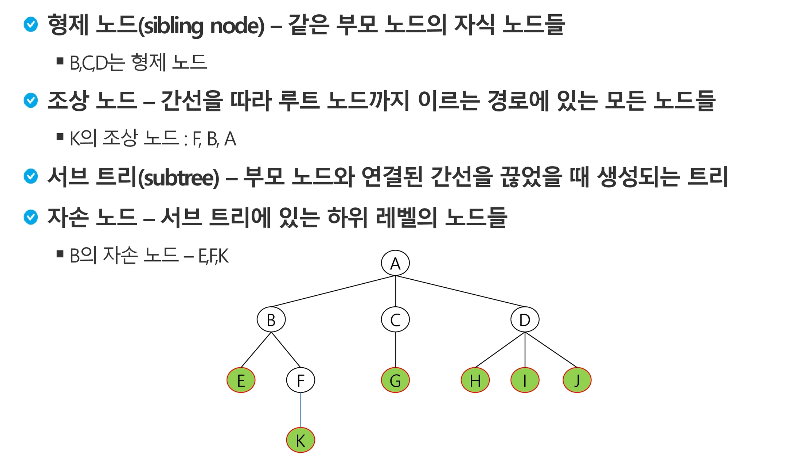
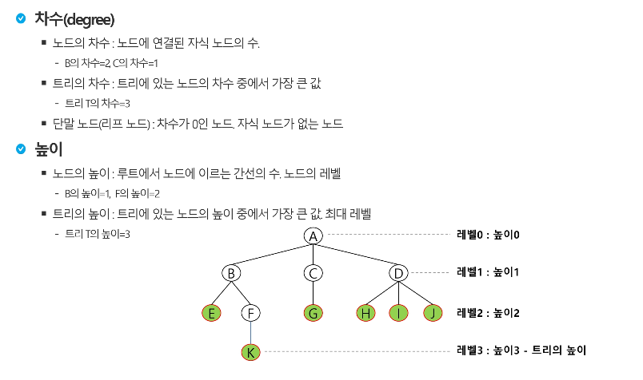

# TREE

---

### 트리의 시작 : 부모가 없는 A => 루트 노드 

### 부모를 자르면 서브트리 : 부트리 T1, T2, T3 => B, C , D 루트노드

**노드 하나 : 부트리** ==> 트리구조의 최소의 엘리먼트는 노드 하나

---

**==> 자식으로 가는 것만 차수로 따짐**

방향성 X : 연결된 간선 수

ex) 1-2-3 = 1-1차수 2-2차수 3-1차수

방향성 O : 진입, 진출 차수

ex) 1->2->3 = 1-0,1차수 2-1,1차수 3-1,0차수

트리 : 자식으로 가는 간선만

ex) 1-2-3 : 1-1차수, 2-2차수, 3-0차수