### Start

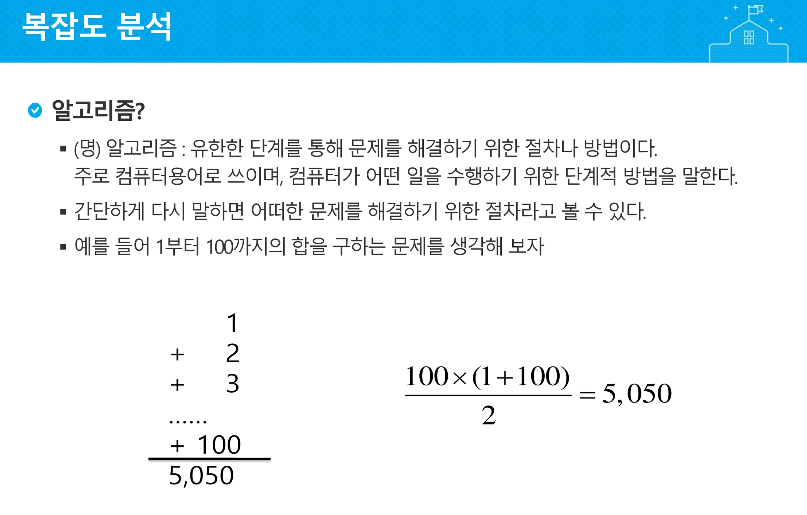

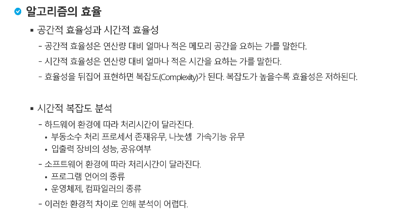


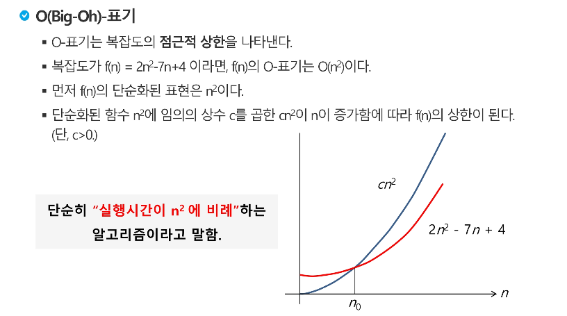

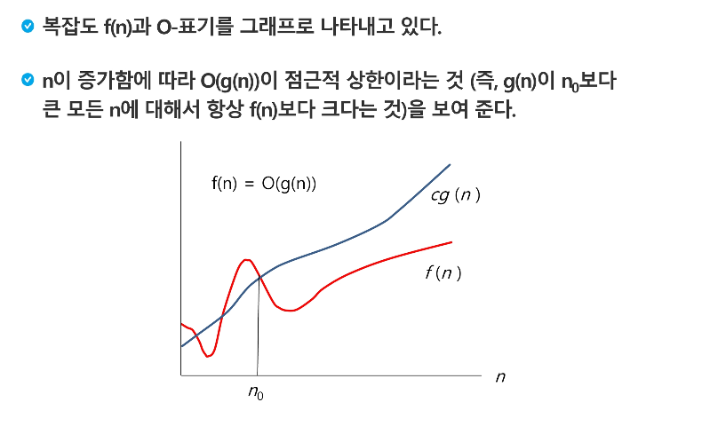


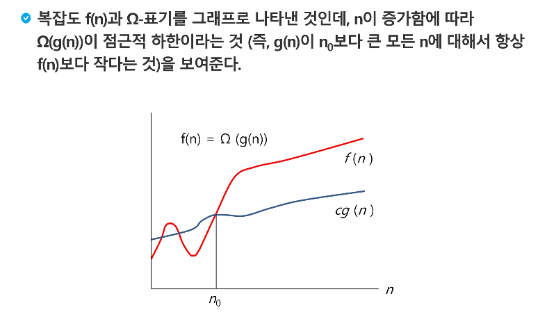

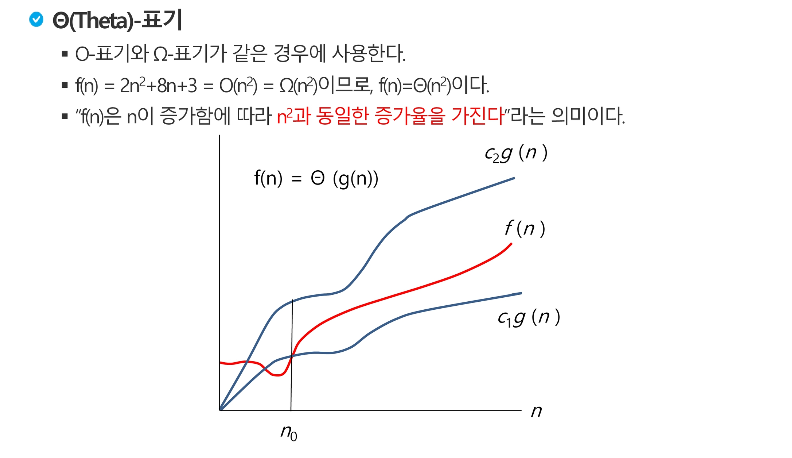


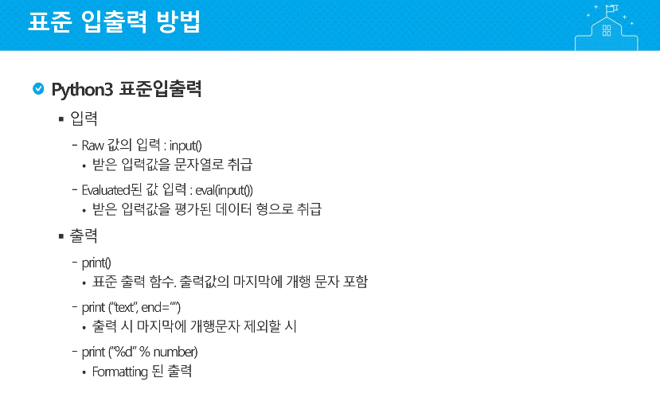

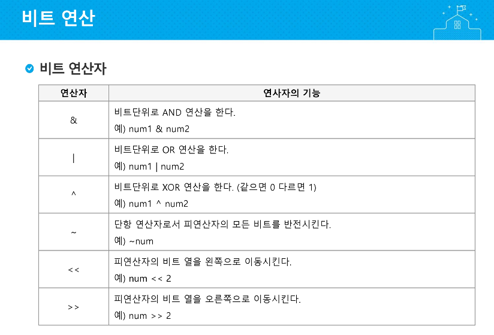

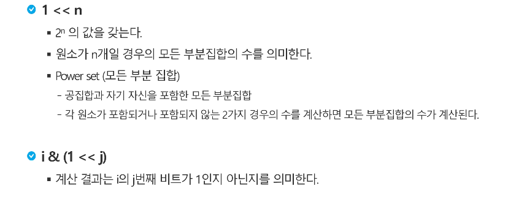

​		숫자 i의 j번째 비트가 1인지 아닌지.

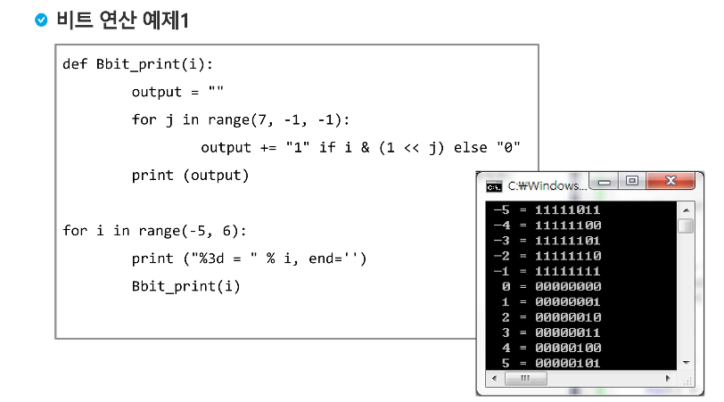

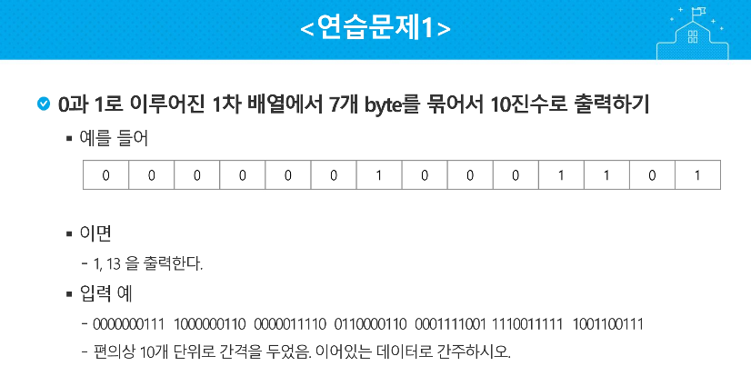

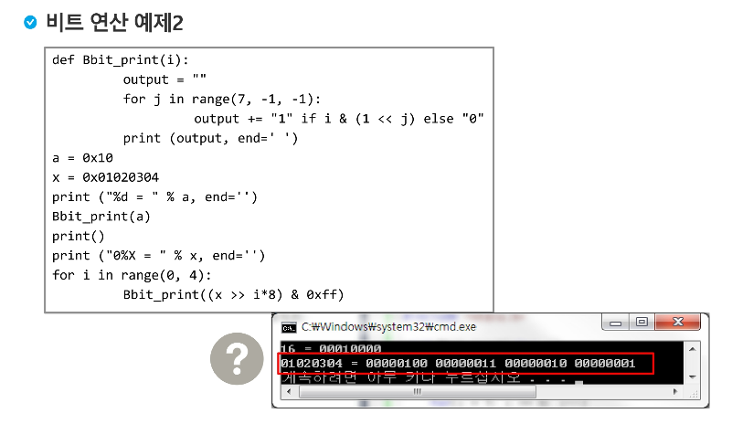

```python
def B(i):
    output = ""
    for j in range(7, -1, -1):
        output += "1" if i & (1 << j) else "0"
    print(output, end = ' ')

a = 0x10
x = 0x01020304

print("%d = " % a, end='')
B(a)
print()
print("0%X = " % x, end='')
for i in range(0, 4):
    B((x>>i*8)&0xff)
    
''' 출력 '''
# 16 = 00010000 
# 01020304 = 00000100 00000011 00000010 00000001 
```


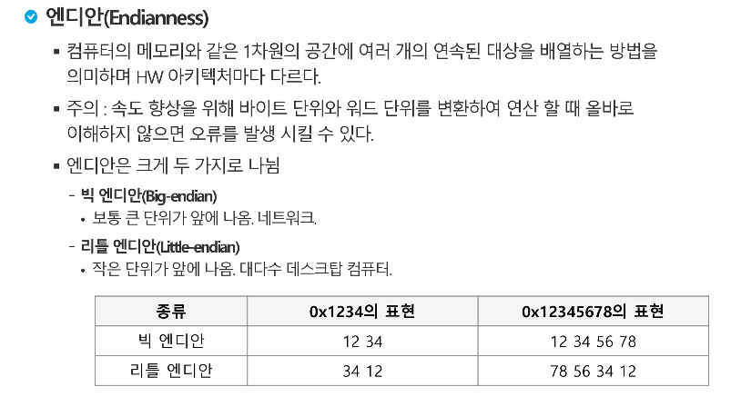

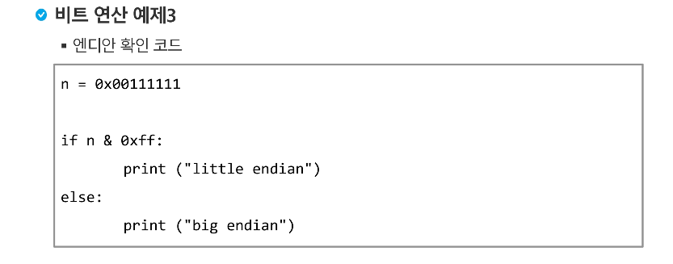

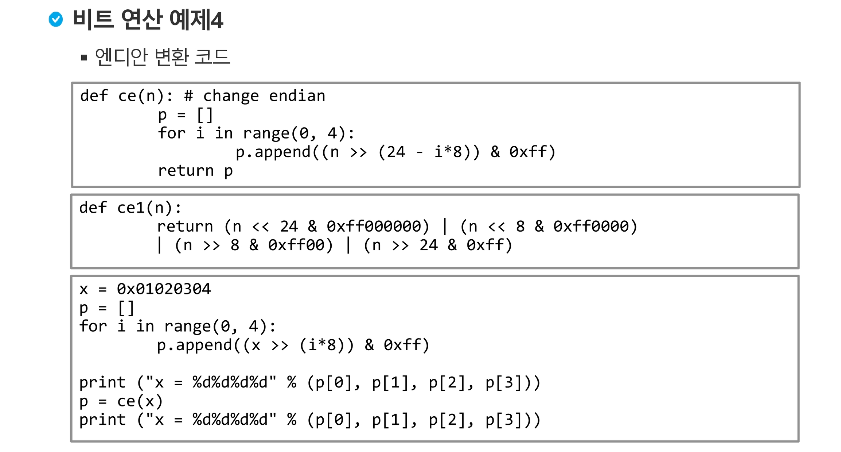

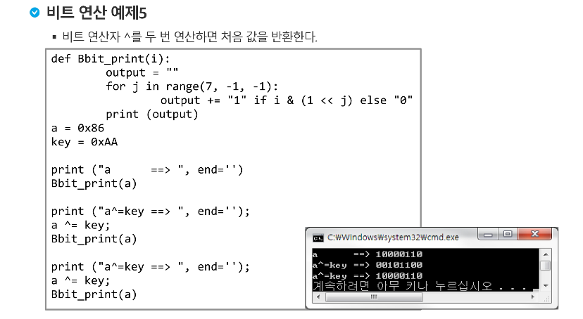

```python
def B(i):
    output = ""
    for j in range(7, -1, -1):
        output += "1" if i & (1 << j) else "0"
    print(output)

a = 0x86 #1000 0110
key = 0xAA

print("a       => ", end='')
B(a)

print("a^=key  => ", end='')
a ^= key
B(a)

print("a^=key  => ", end='')
a ^= key
B(a)

'''출력'''
# a       => 10000110
# a^=key  => 00101100
# a^=key  => 10000110
```

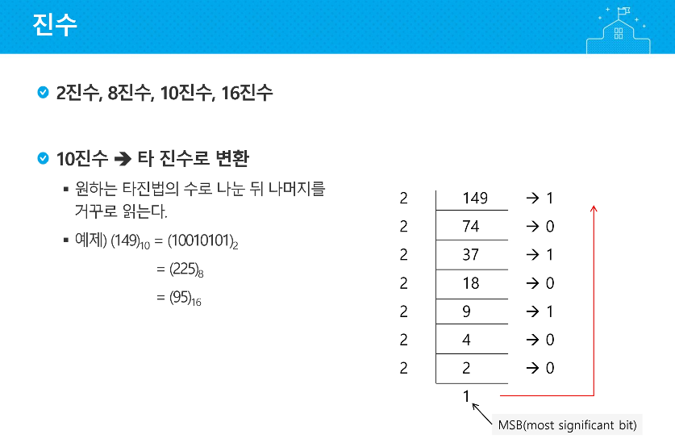

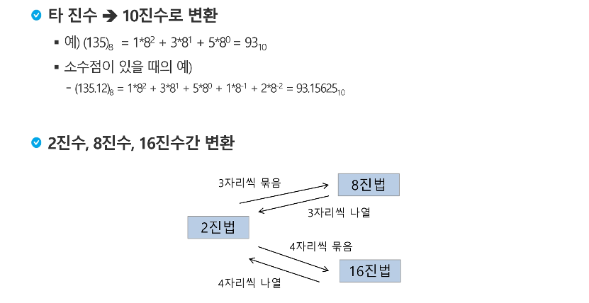

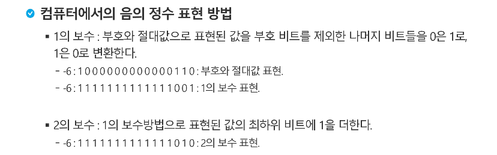


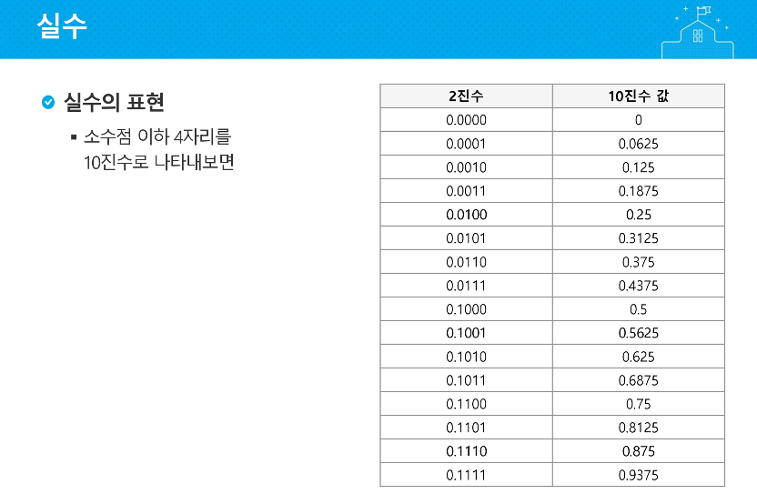


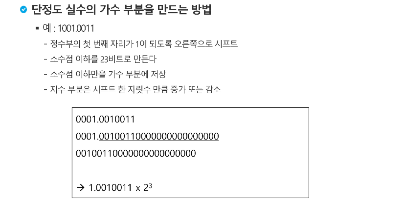


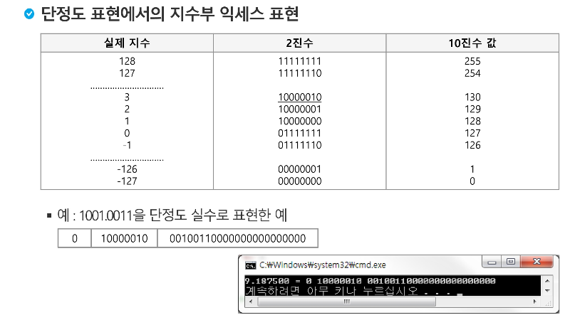

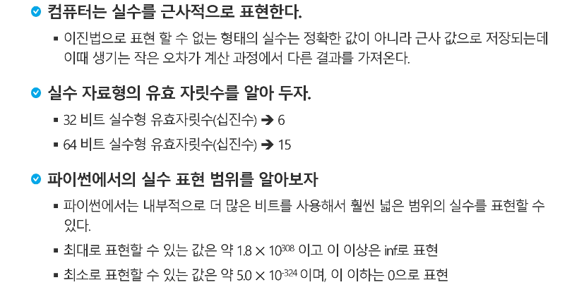

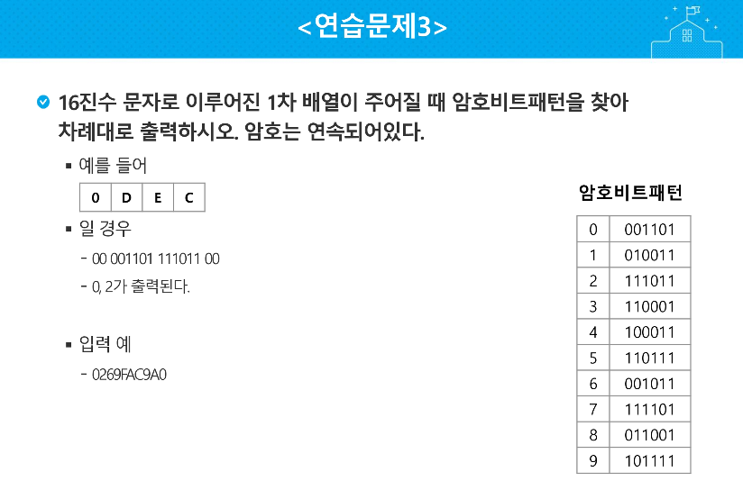


