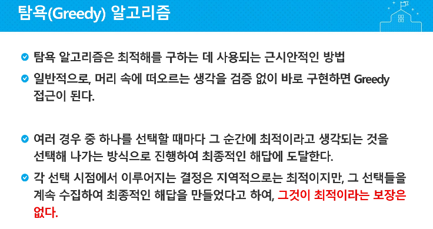


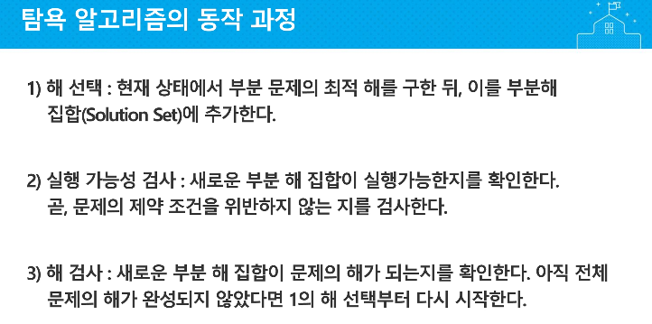

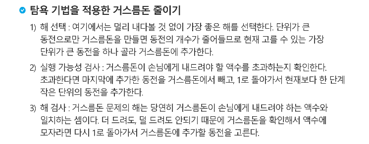

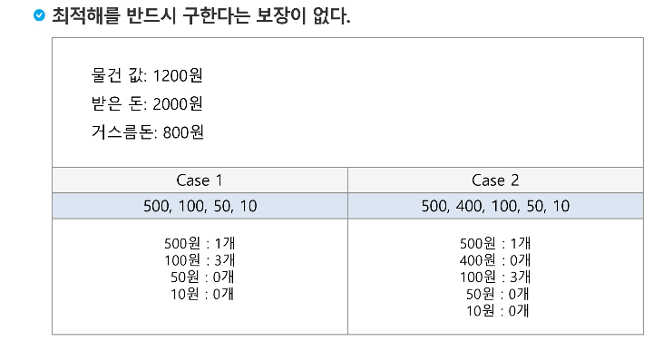

탐욕 거스름돈 : 거스름돈 간 배수의 관계여야함!

---

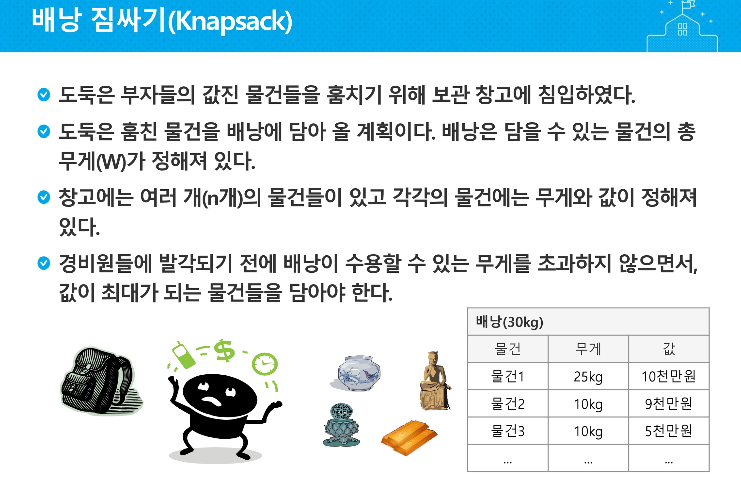

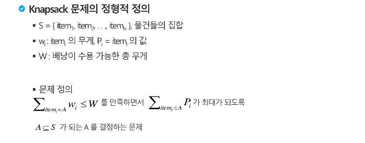


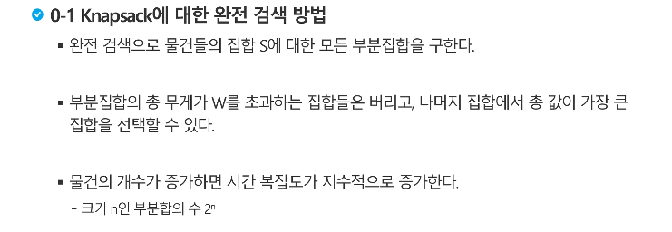

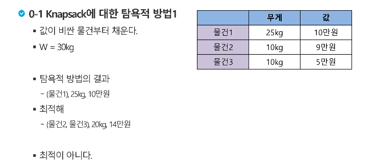

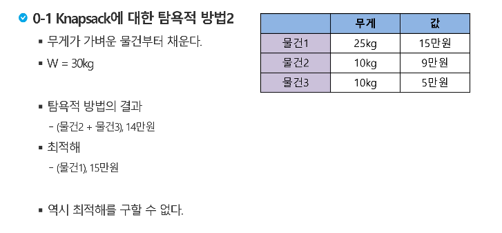

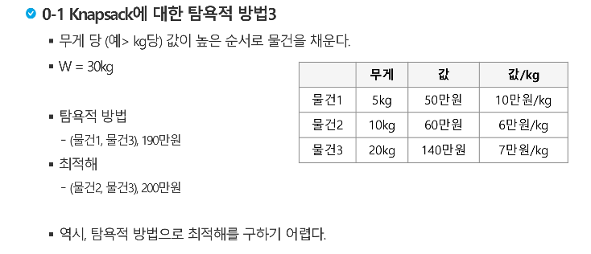

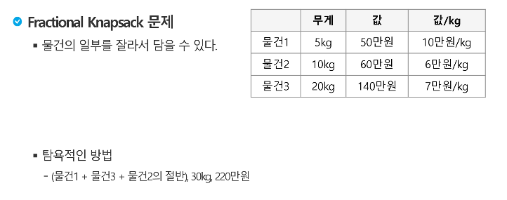

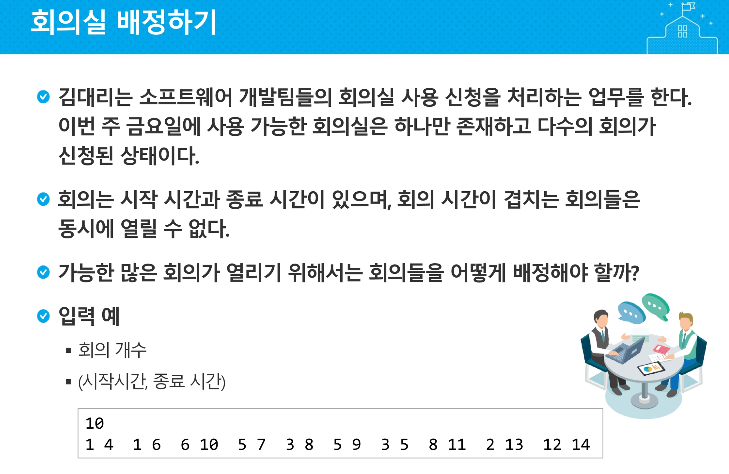

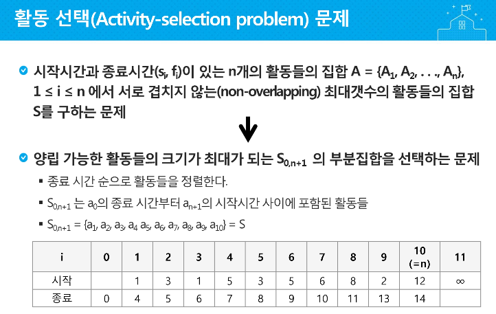

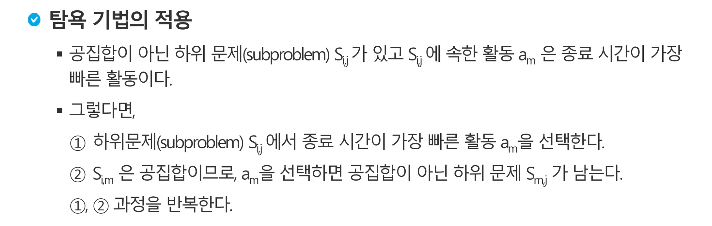

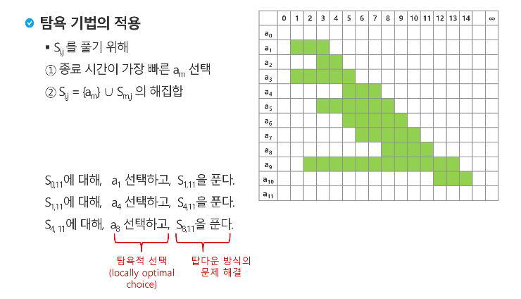

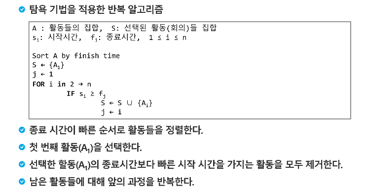

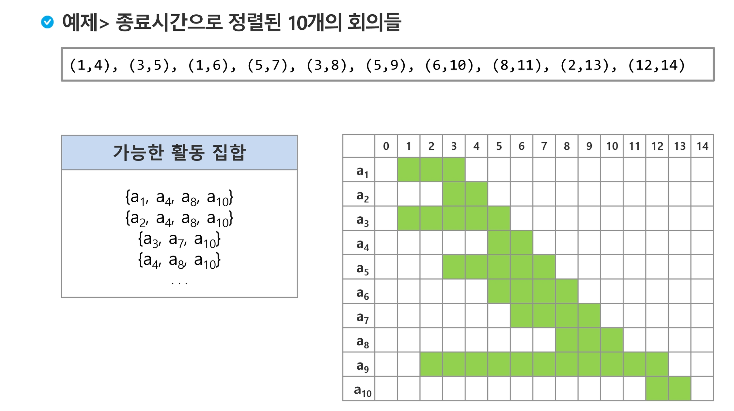

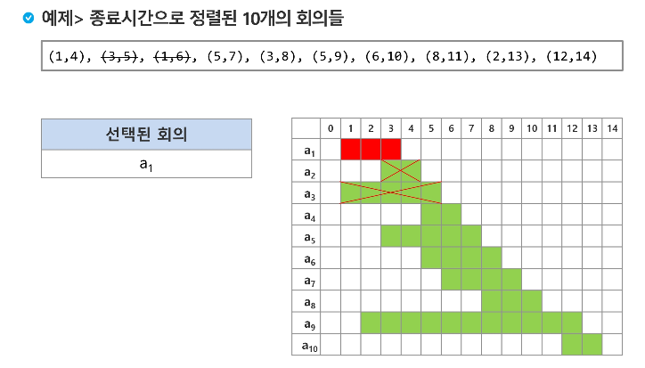

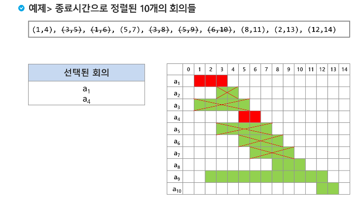

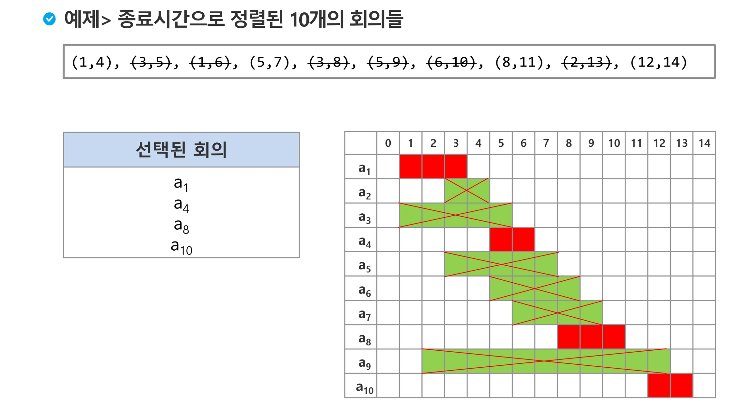

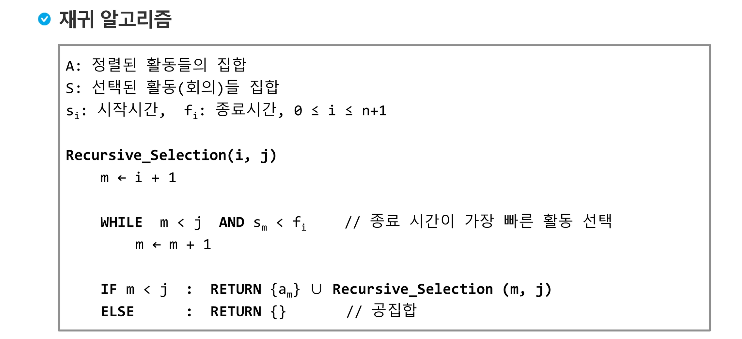

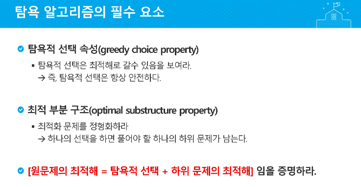

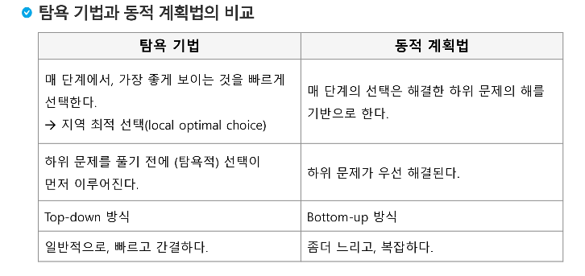

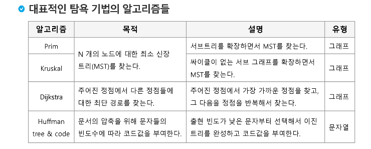

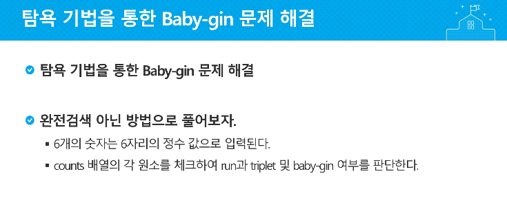

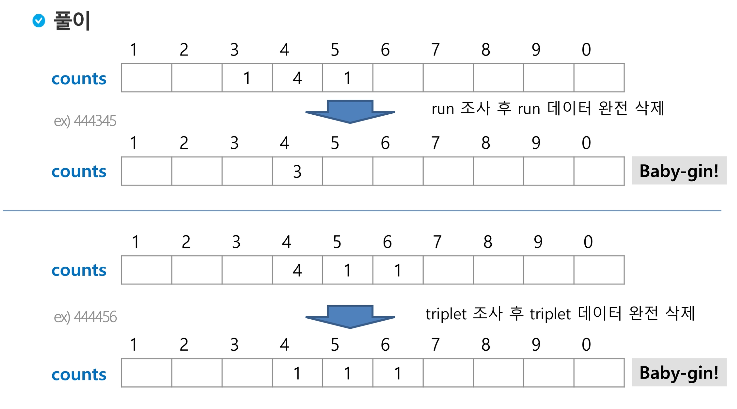

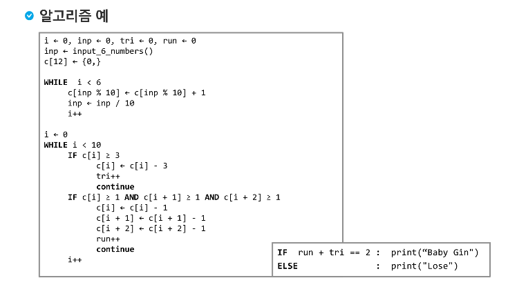

```python
num = '124783'
c = [0] * 12

for i in range(6):
    c[int(num[i])] += 1

i = 0
tri = run = 0
while i < 10:
    if c[i] >= 3:
        c[i] -= 3
        tri += 1
        continue
    if c[i]>=1 and c[i+1]>=1 and c[i+2] >= 1:
        c[i] -= 1
        c[i+1] -= 1
        c[i+2] -= 1
        run += 1
        continue
    i += 1

if run + tri == 2: print("Baby-gin이 맞습니다")
else: print("Baby-gin이 아닙니다")
```

