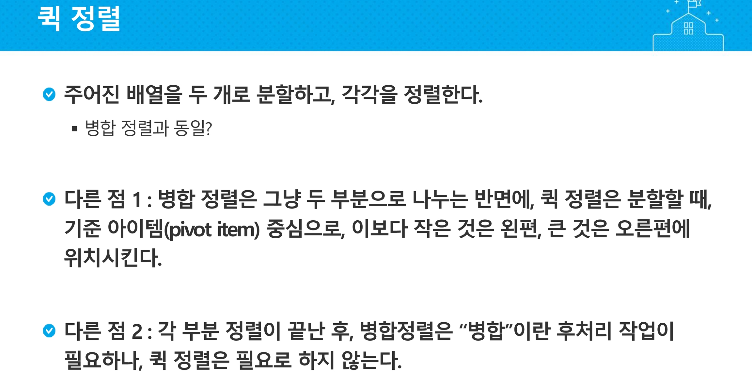

### 								< 피봇을 잘 잡아야함!!!! >

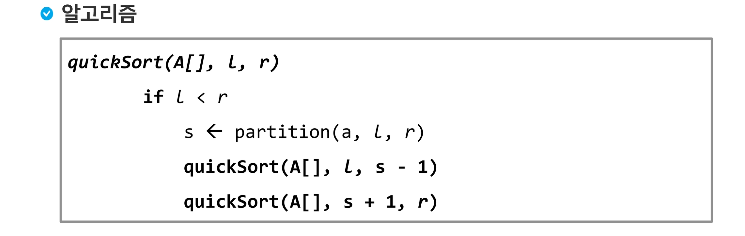

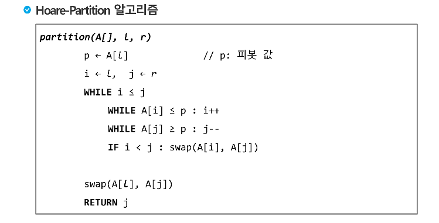

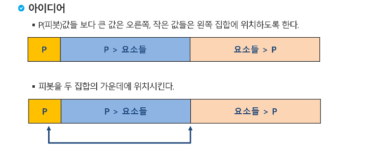

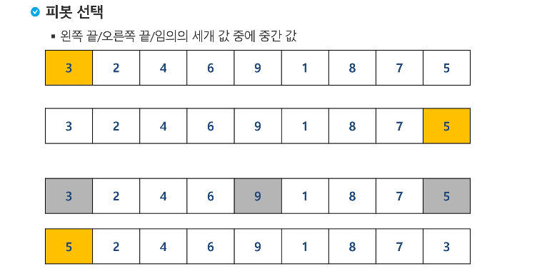

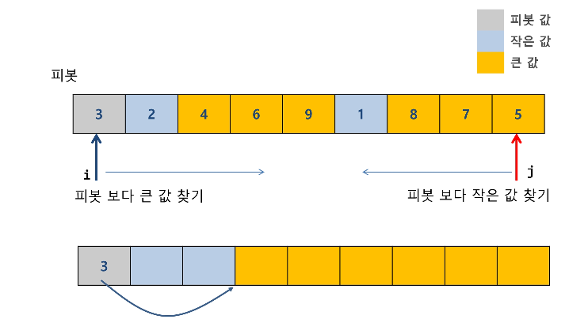

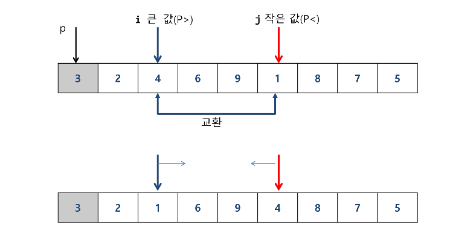

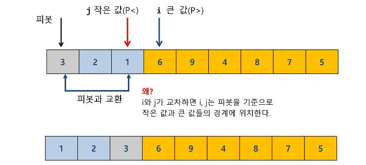

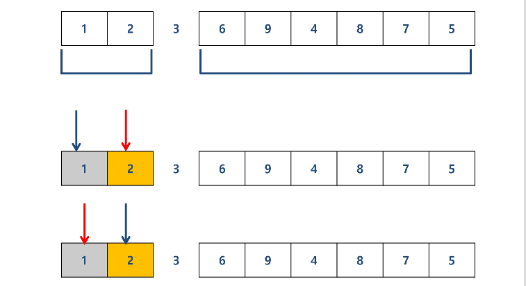

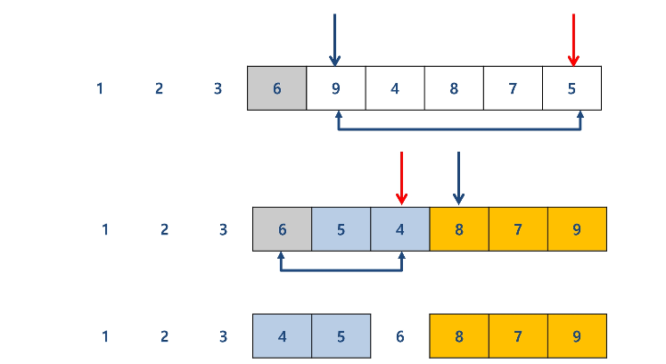

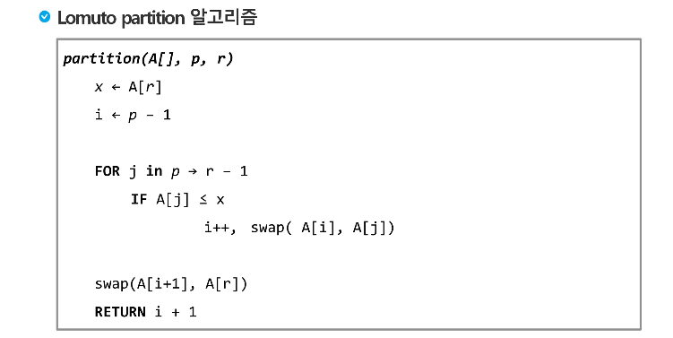

제일 뒤의 값을 r

가장 앞을 p,j

i = -1

j를 ++ 하면서 r보다 작은 값 찾기

j가 r보다 작은 값 찾으면 i를 ++ 한뒤 i위치값과 j위치값을 바꿈!

--> i까지는 r보다 작은값 위치, j는 r보다 큰 값들의 위치

--> 끝까지 가면, r을 i다음 위치로 보내고 pivot으로!


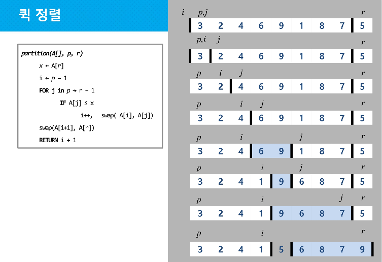


---

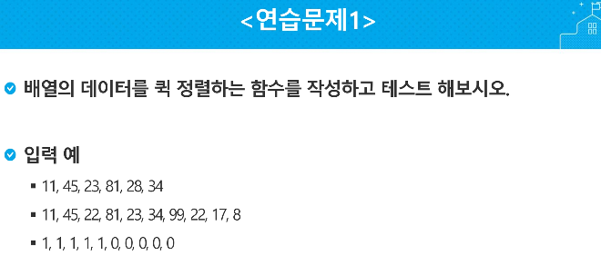

## 첫번째 값 pivot

```python
def swap(x, i, j):
    x[i], x[j] = x[j], x[i]

def qsort(x, left, right):
    if left < right:
        splitpoint = partition(x, left, right)
        qsort(x, left, splitpoint-1)
        qsort(x, splitpoint+1, right)

def partition(x, left, right):
    pivot_val = x[left]
    pivot_idx = left
    while left <= right: # pivot보다 큰 값이 작은 값보다 뒤에 있으면 stop
        while left <= right and x[left] <= pivot_val: # pivot보다 큰 값 찾을 때까지 left+=1
            left += 1
        while left <= right and x[right] >= pivot_val: # pivot보다 작은 값 찾을 때까지 right-=1
            # 만약 pivot이 제일 크면 left가 right를 넘음, 그럼 그냥 pivot을 맨 뒤로 보내면 됨
            right -= 1
        if left <= right: # 만약, pivot보다 작은값이, pivot보다 큰값보다 뒤에 있으면, 자리 바꾸기
            swap(x, left, right)
            left += 1
            right -= 1
    swap(x, pivot_idx, right) # pivot보다 큰 값이 작은 값보다 뒤에 있으면, pivot과 right(pivot보다 작은값) 바꾸기
    return right # 다 끝나면, right(pivot과 자리 바꾼 곳)를 기준으로 나눠야함


# x = [11, 45, 23, 81, 28, 34, 99, 22, 17, 8]
x = [99, 81, 45]
qsort(x, 0, len(x)-1)
print(x)


# 간단
def swap(i, j):
    A[i], A[j] = A[j], A[i]

def quickSort(l, r):
    if l < r:
        s = partition(l, r)
        quickSort(l, s-1)
        quickSort(s+1, r)

def partition(l, r):
    p = A[l]
    i = l
    j = r

    while i <= j :
        while i <= j and A[i] <= p :
            i += 1
        while i <= j and A[j] >= p:
            j -= 1
        if i < j :
            swap(i, j)
    swap(l, j)
    return j

A = [11, 45, 23, 81, 28, 34, 99, 22, 17, 8]
quickSort(0, len(A)-1)
print(A)
```


## 중간값 pivot

```python
# 중간 값 pivot
def sort(left, right):
    if right <= left:
        return

    mid = partition(left, right)
    sort(left, mid - 1)
    sort(mid, right)

def partition(left, right):
    pivot = arr[(left + right) // 2]
    while left <= right:
        while arr[left] < pivot:
            left += 1
        while arr[right] > pivot:
            right -= 1
        if left <= right:
            arr[left], arr[right] = arr[right], arr[left]
            left, right = left + 1, right - 1
    return left


arr = [11, 45, 23, 81, 28, 34, 99, 22, 17, 8]
# arr = [11, 45, 23, 81, 28, 34]
# arr = [1, 1, 1, 1, 1, 0, 0, 0, 0, 0]
sort(0, len(arr) - 1)
print(arr)
```

