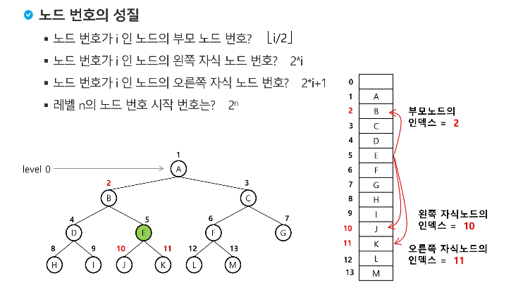
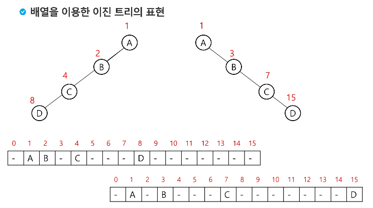
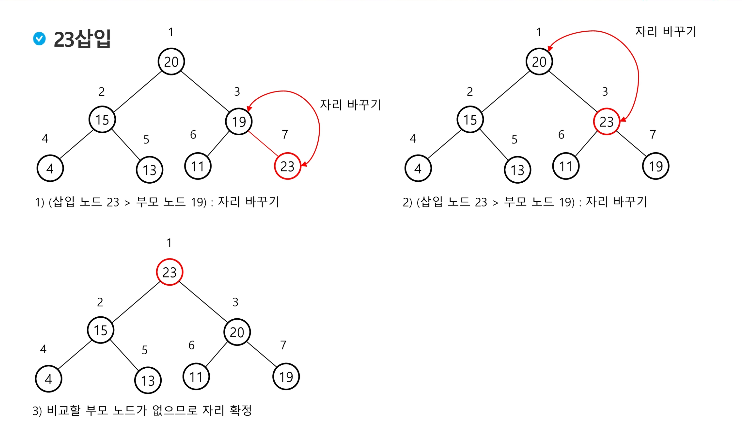

---


```python
# 전위순회
def preorder_traverse(T):
    if T:
        visited.append(T)
        preorder_traverse(G[T][0])
        preorder_traverse(G[T][1])

# 중위순회
def inorder_traverse(T):
    if T:
        inorder_traverse(G[T][0])
        visited.append(T)
        inorder_traverse(G[T][1])


# 후위순회
def postorder_traverse(T):
    if T:
        postorder_traverse(G[T][0])
        postorder_traverse(G[T][1])
        visited.append(T)


# -----------------------------------------------------------------------------------
# 트리의 정점 총 수 : V
# 연결된 간선 관계 : a
# V = int(input())
# a = list(map(int,input().split()))

V = 13
a = [1, 2, 1, 3, 2, 4, 3, 5, 3, 6, 4, 7, 5, 8, 5, 9, 6, 10, 6, 11, 7, 12, 10, 13]

G = [[0] * 3 for _ in range(V+1)]

for i in range(0, len(a) - 1, 2):
    if G[a[i]][0] == 0:
        G[a[i]][0] = a[i + 1]
    else:
        G[a[i]][1] = a[i + 1]
    if G[a[i + 1]][2] == 0: G[a[i + 1]][2] = a[i]

# 왼쪽자식, 오른쪽자식, 부모
# G = [[0, 0, 0],
#      [2, 3, 0],
#      [4, 0, 1],
#      [5, 6, 1],
#      [7, 0, 2],
#      [8, 9, 3],
#      [10, 11, 3],
#      [12, 0, 4],
#      [0, 0, 5],
#      [0, 0, 5],
#      [13, 0, 6],
#      [0, 0, 6],
#      [0, 0, 7],
#      [0, 0, 10]]

visited = []
T = 0
for i in range(len(G)):
    if G[i][2] == 0:
        T = i
preorder_traverse(T)
visited.append('//')
inorder_traverse(T)
visited.append('//')
postorder_traverse(T)

print(visited)

```


---





