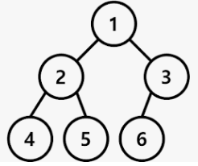
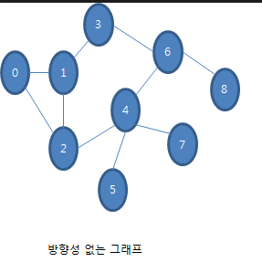
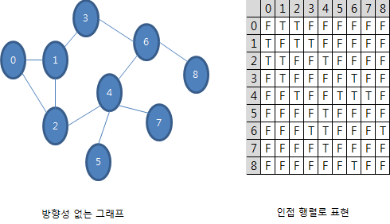
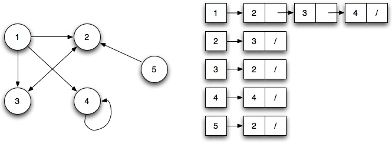
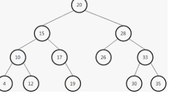
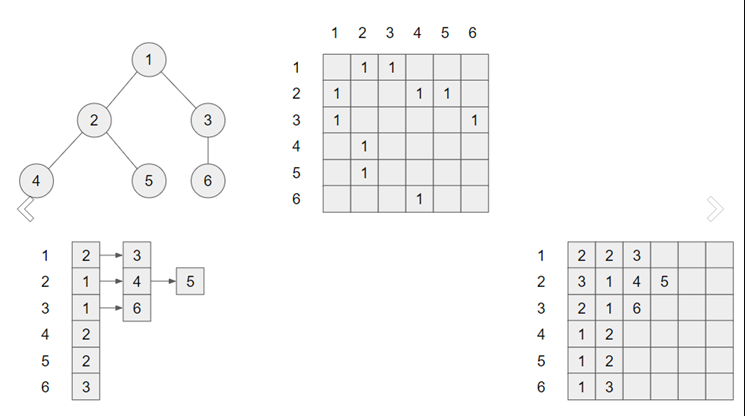

------

>  **선형자료구조** : O--O--O

> **비선형 자료구조** : 나하고 연결된 게 몇갠지 모름 
>
> 

> **그래프 자료구조** : 
>
> 
>
> - 인접행렬
>   - 
> - 인접 리스트
>   - 
>
> ### 순회방법
>
> - DFS : 스택
>   - 사용자 정의 stack : 재귀
>   - 시스템 정의 stack
> - BFS : 큐

> **Tree**
>
> 
>
> 순회방법 
>
> - in
> - post
> - pre

> MST
>
> 최단거리 : BES ... 

------

------

------

