# 3-2 분할정복알고리즘(퀵 정렬)

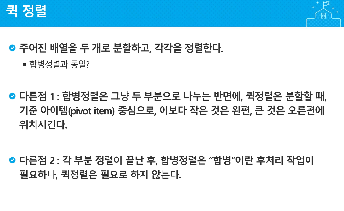

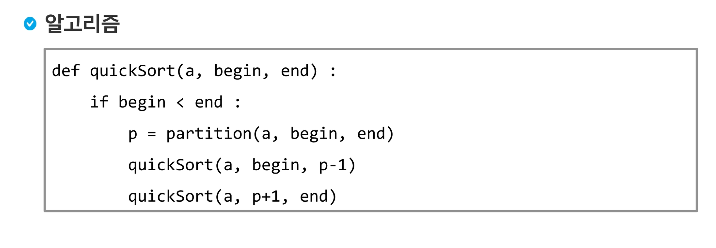

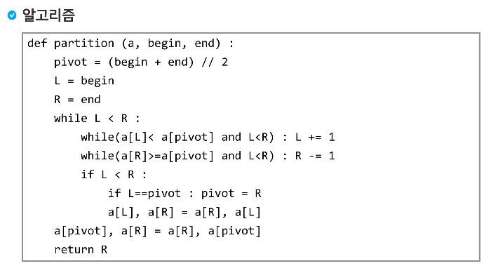

---

>0    1   2  3   4  5  6  7    -> index값
>
>69 10 30 2 16 8 31 22
>
>begin -> 69 (index 0)
>
>end -> 32 (index 7)
>
>===> 분할 기준 : p : 2(index 3)
>
>L -> 0,  R-> 7 비교: 69
>
> < 2 ?? R만 -1 이동
>
>

---

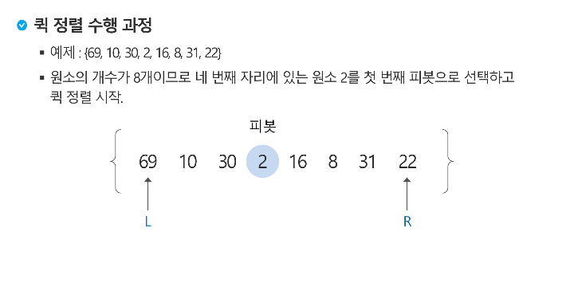

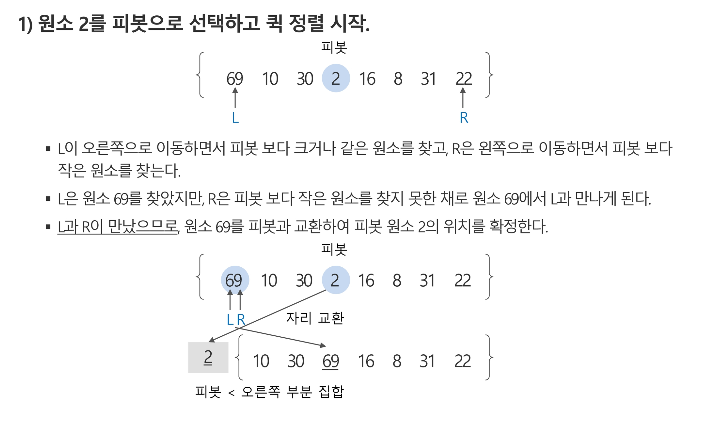

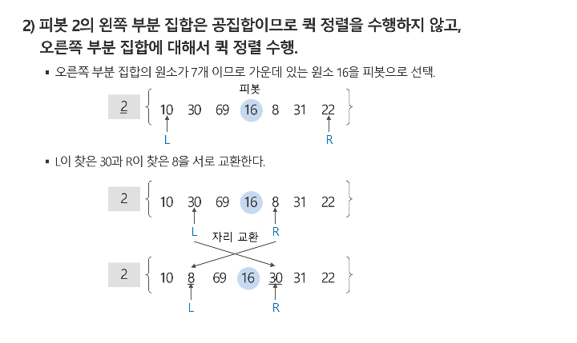

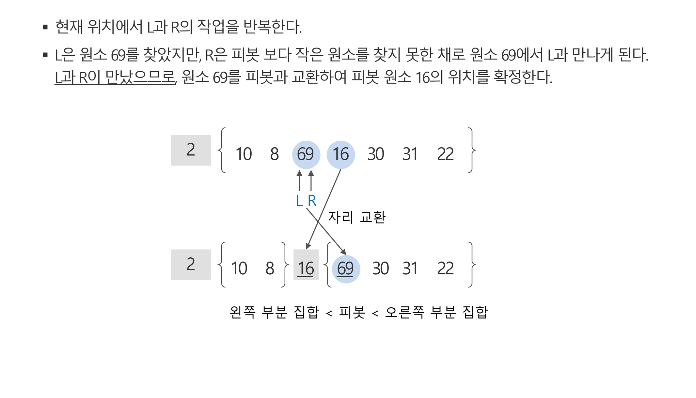

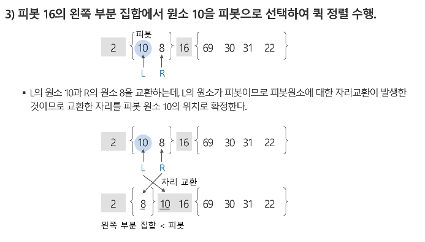

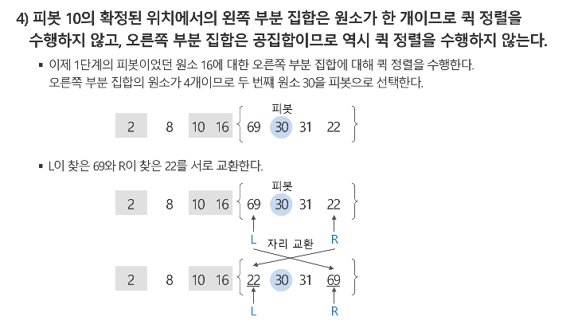

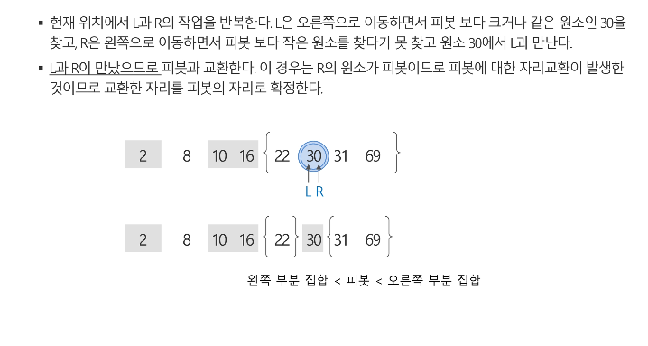

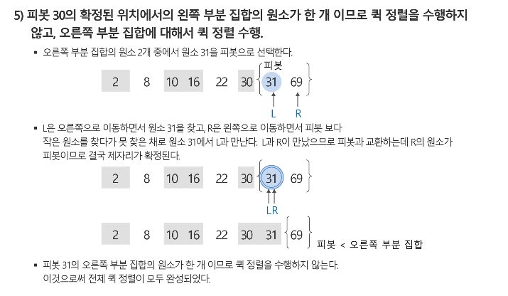

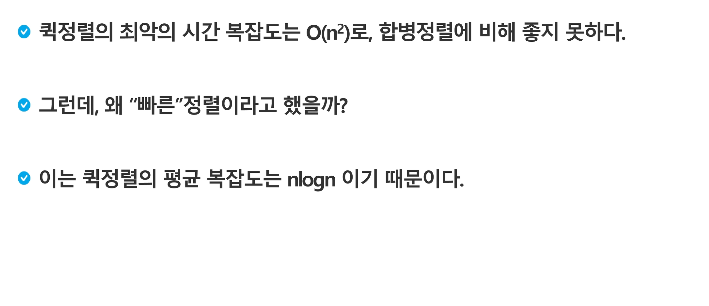

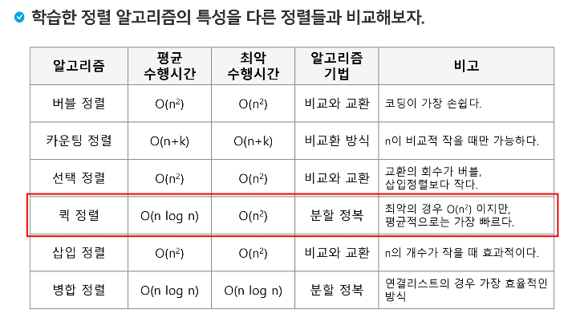

