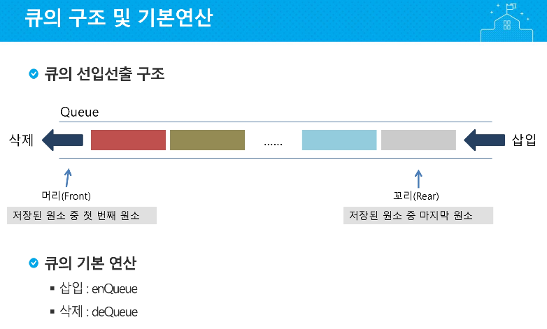

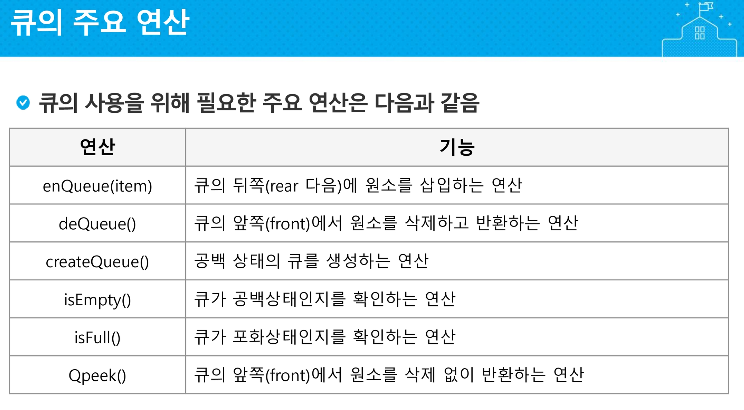

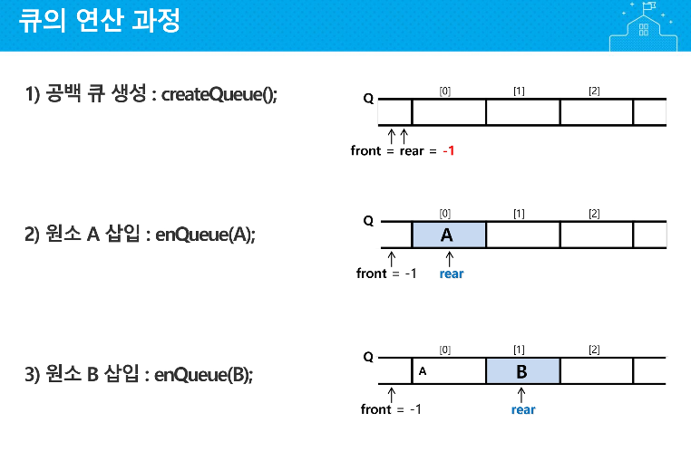

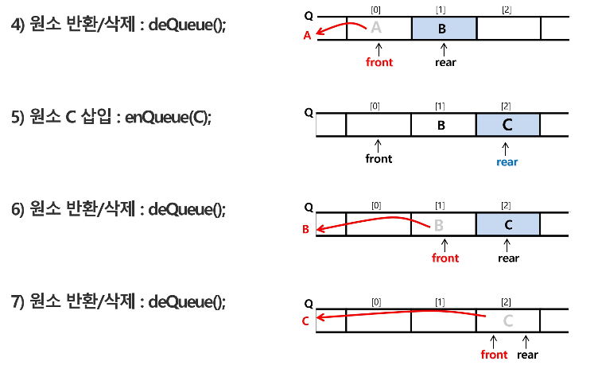

​	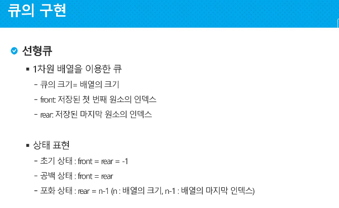																> Queue가 비었다


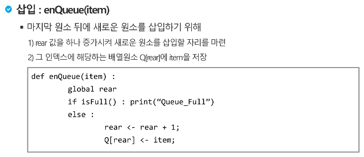

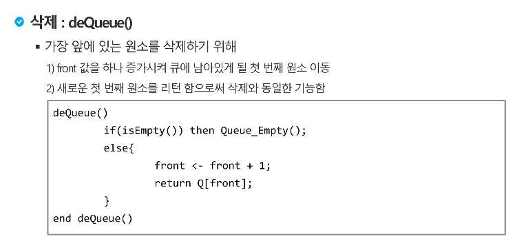

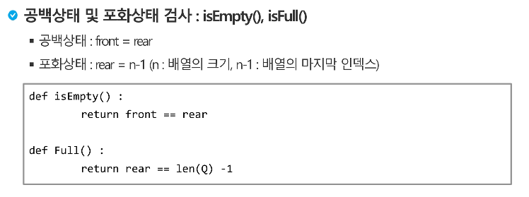

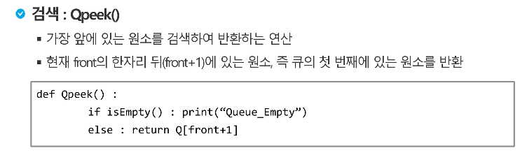


---


```python
Q = [0] * 10
f = r = -1

r += 1; Q[r] = 1
r += 1; Q[r] = 2
r += 1; Q[r] = 3

f += 1; print(Q[f])
f += 1; print(Q[f])
f += 1; print(Q[f])
```

---

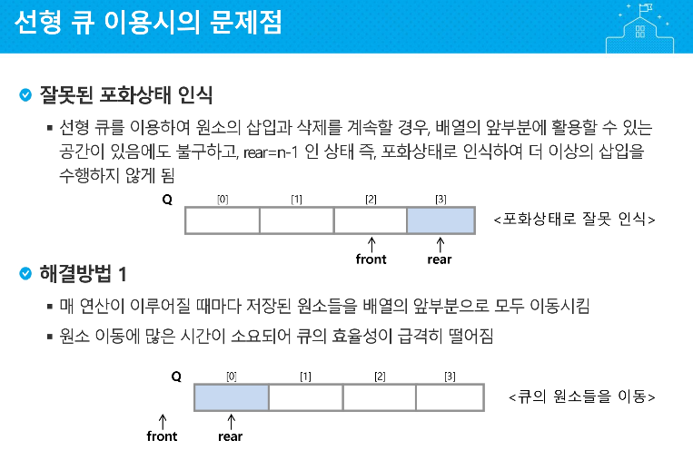

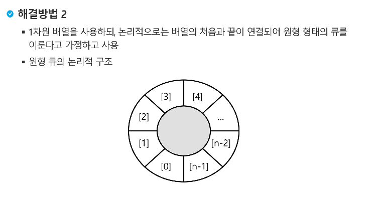

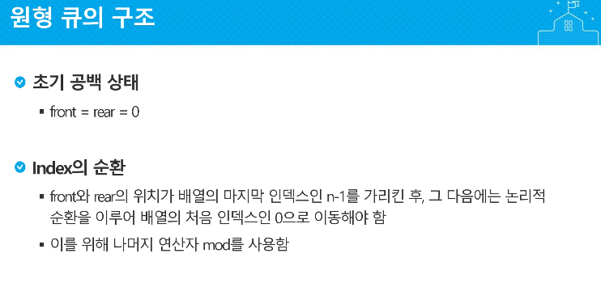

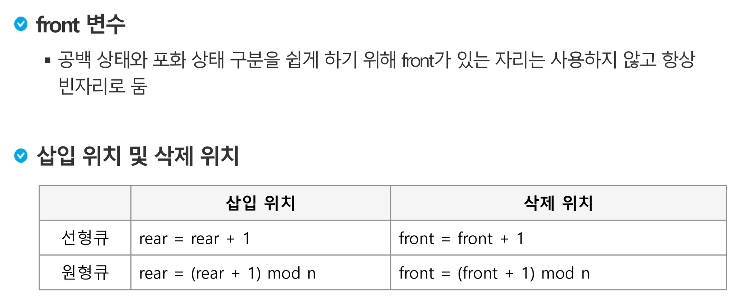

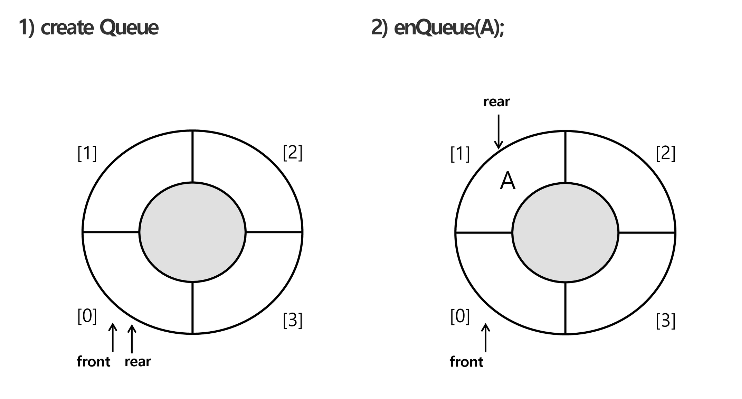

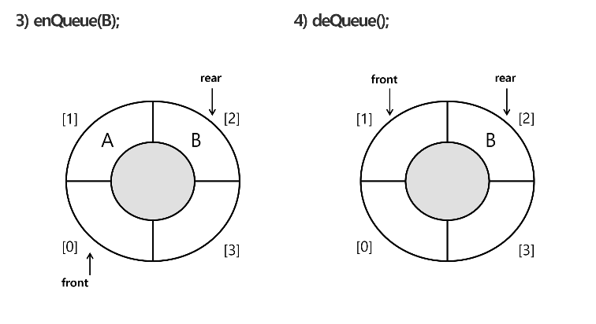

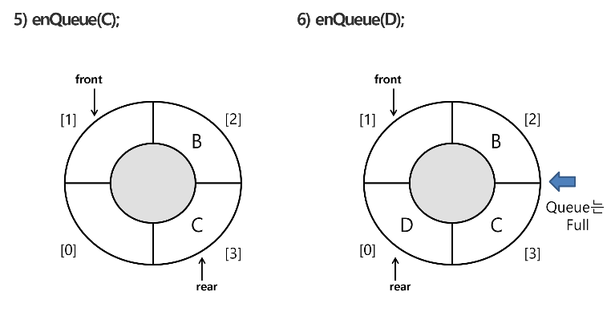


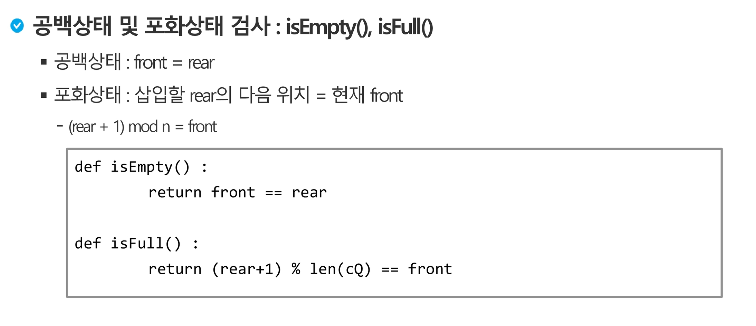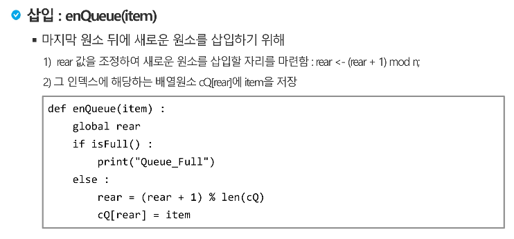

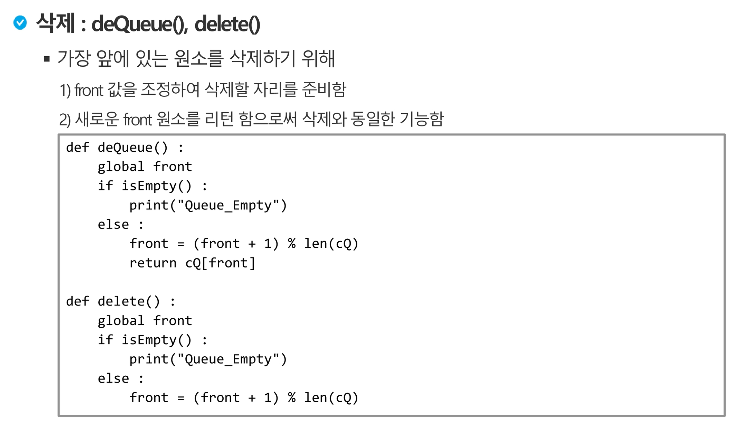

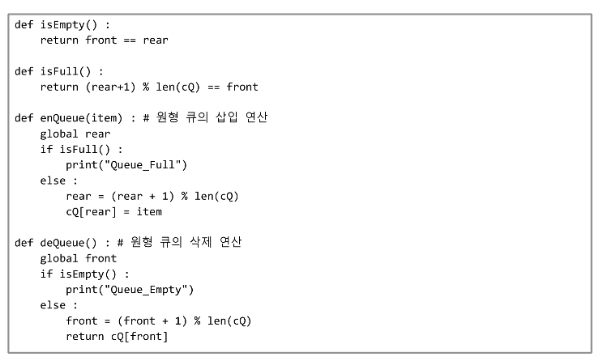


