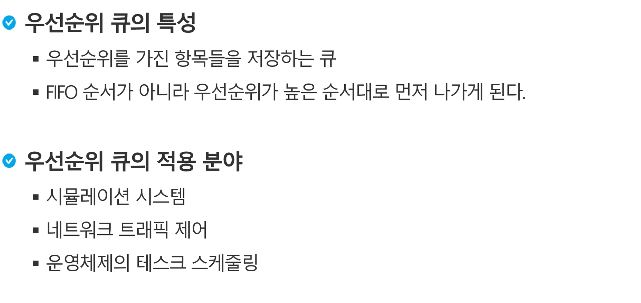
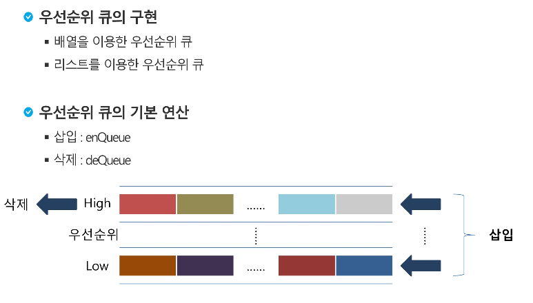
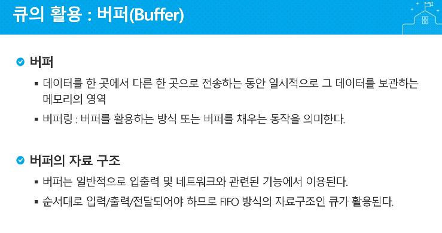
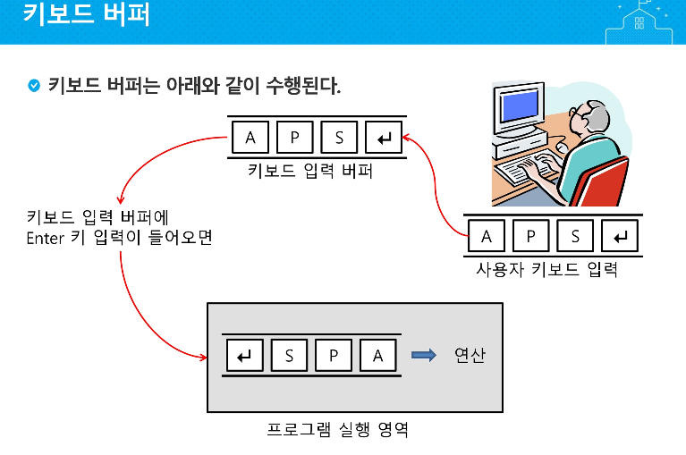
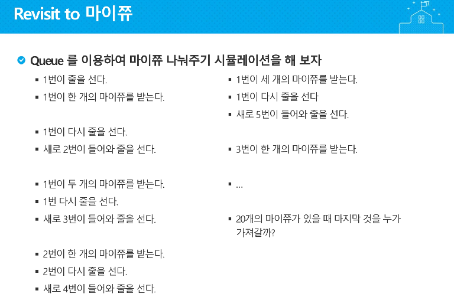
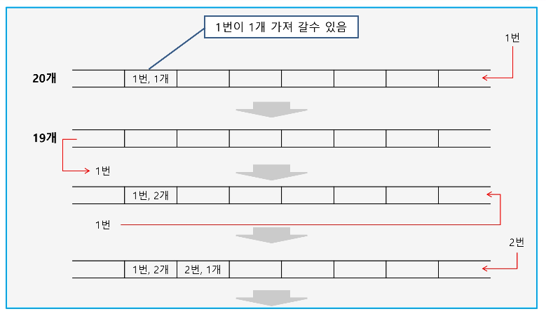
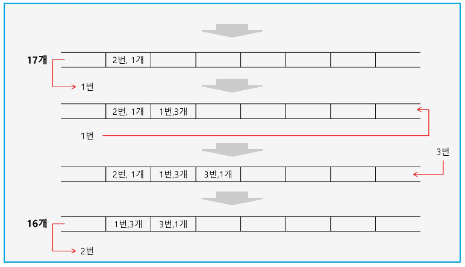
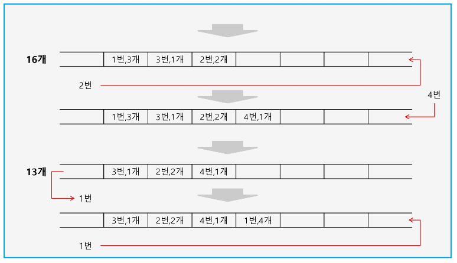
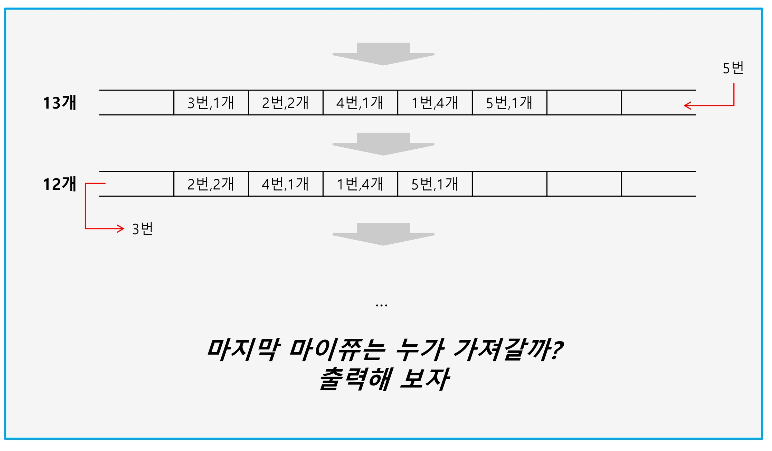

## 우선순위 큐










---












> **마지막에 사탕 받은 학생은?**

```python
class Node :
    def __init__(self, item, n=None):
        self.item = item
        self.next = n

def enQueue(item):
    global front, rear
    newNode = Node(item) # 새로운 노드 생성
    if front == None : # 큐가 비었다면
        front = newNode
    else:
        rear.next = newNode
    rear = newNode

def isEmpty():
    return front == None

def deQueue():
    global front, rear
    if isEmpty():
        print("EMPTY!")
        return None

    item = front.item
    front = front.next
    if front == None:
        rear = None
    return item

def Qpeek():
    return front.item

def printQ():
    f = front
    s = ""
    while f:
        s += str(f.item) + " "
        f = f.next
    return s

front = rear = None
ma = 20
check = 0
student = [0] * 22
first = 1
while (ma>0):
    if(check != 0):
        print(f"{check}번 학생 : 다시 줄을 선다.")
        enQueue(check)
    else : enQueue(first)
    print(f"학생 줄 : [{printQ()}]")
    if(first!=1):
        print(f"==>{first}번 학생: 입장하여 줄을 선다.")
        enQueue(first)
        print(f"학생 줄 : [{printQ()}]")

    check = deQueue()
    print(f"{check}번 학생 줄에서 나와...")
    cnt = student[check] + 1
    print(f"학생 줄 : [{printQ()}]")
    print(f"{check}번 학생 : 선생님한테 사탕 {cnt}개를 받는다.")
    student[check] += 1
    print("@@@@", student)
    ma -= cnt
    first +=1

    if(ma<0):
        print(f"===== 남은 사탕의 개수는 0개다.")
    else : print(f"===== 남은 사탕의 개수는 {ma}개다.")
    print()

```


