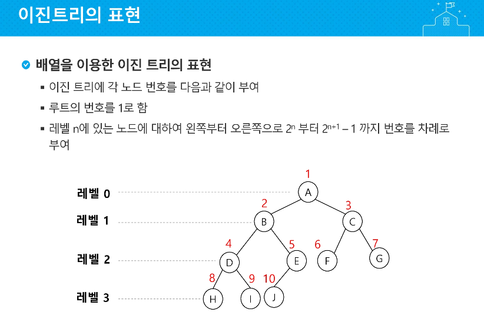
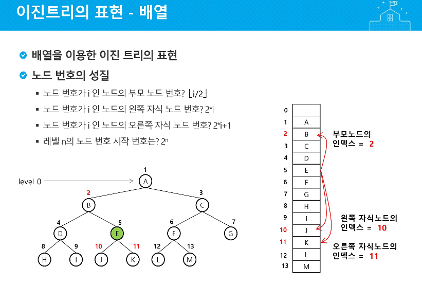
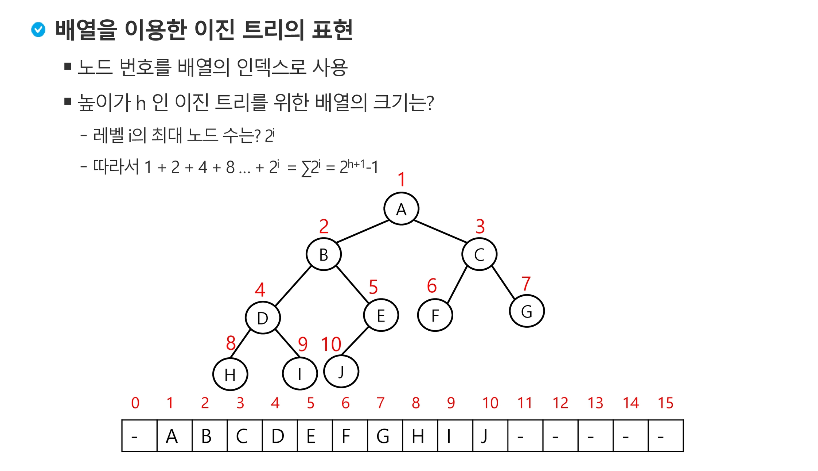
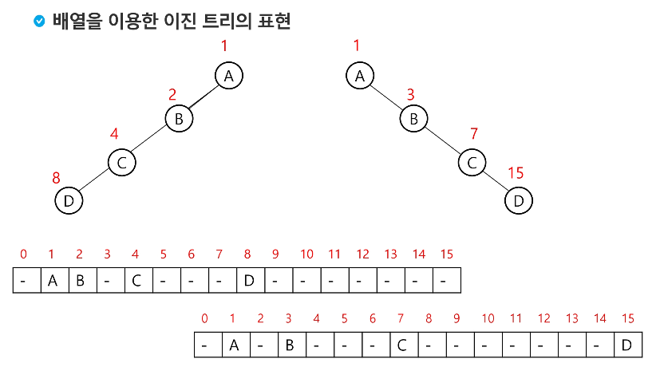
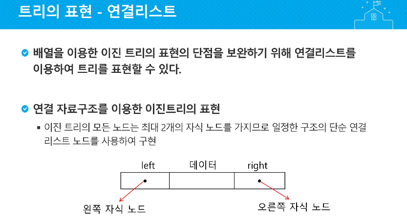
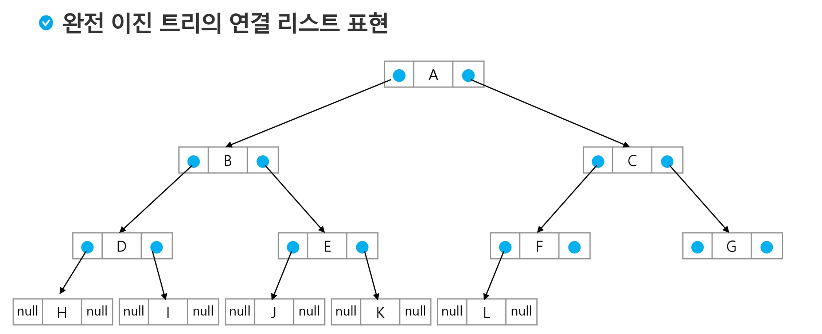

# 이진 TREE 표현

### 2차원 배열 표현

| num  | L    | R    | P(부모) |
| ---- | ---- | ---- | ------- |
| 1    | 2    | 3    | 0=None  |
| 2    | 4    | 0    | 1       |
| 3    | 5    | 6    | 1       |
| 4    | 7    | 0    | 2       |
| 5    | 8    | 9    | 3       |
| 6    | 10   | 11   | 3       |
| 7    | 12   | 0    | 4       |
| 8    | 0    | 0    | 5       |
| 9    | 0    | 0    | 5       |
| 10   | 13   | 0    | 6       |
| 11   | 0    | 0    | 6       |
| 12   | 0    | 0    | 7       |
| 13   | 0    | 0    | 10      |

---

---

**왼쪽자식노드 : 내위치 * 2**

**오른쪽 : 내위치 * 2 + 1**

**나의 부모 : 내위치 // 2**

---

---

---

---

