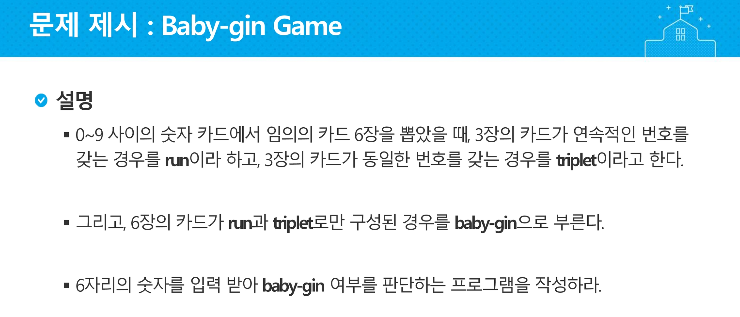

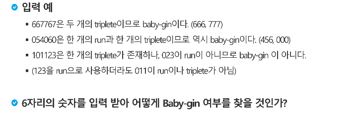

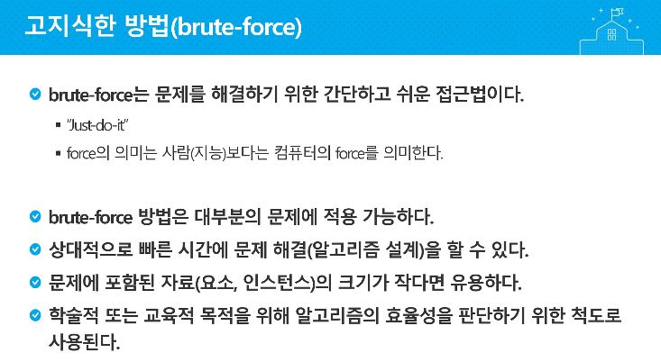

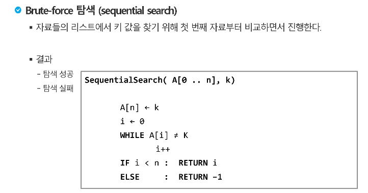

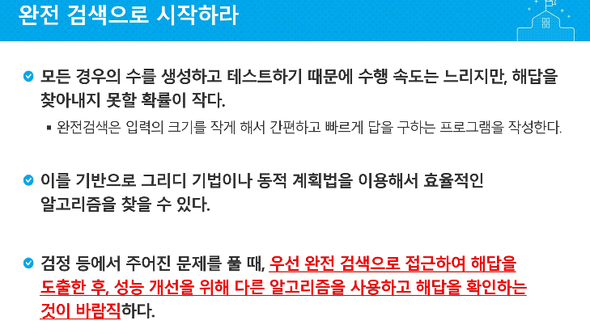

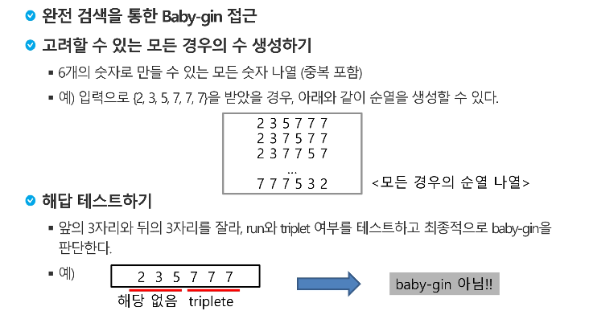

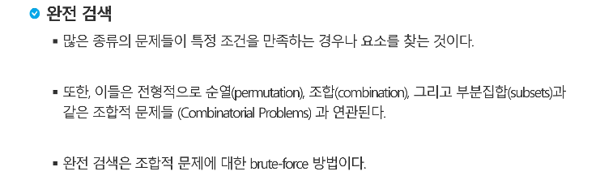

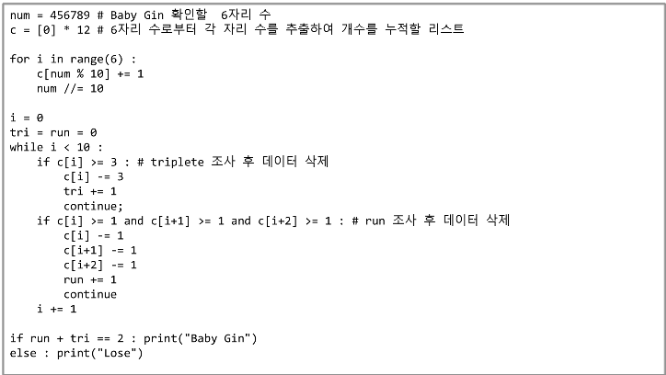

---

# 조합적 문제

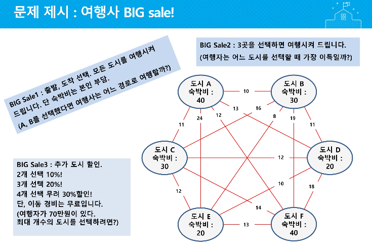


**1 - 순열**

**2 - 조합**

**3 - 부분집합**


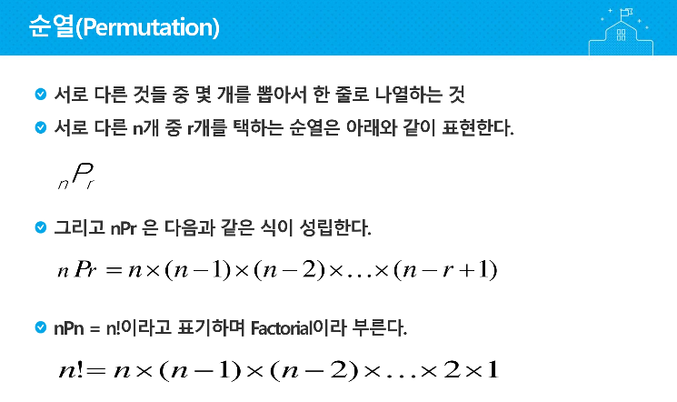

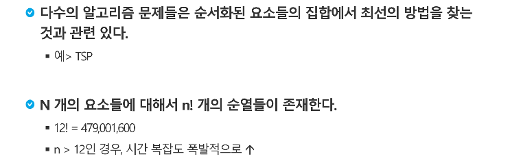

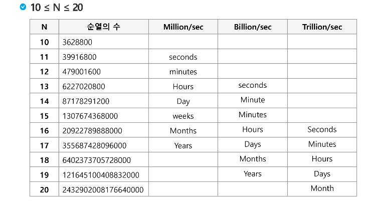

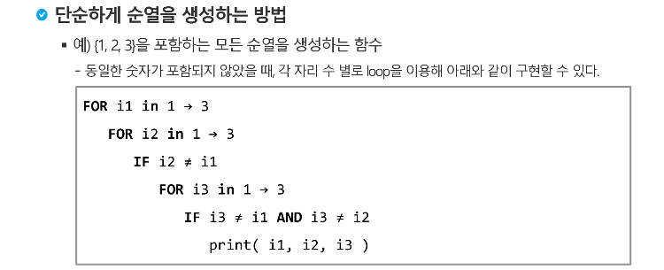

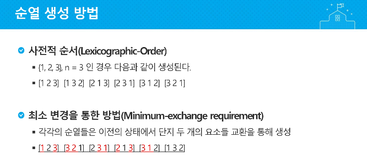

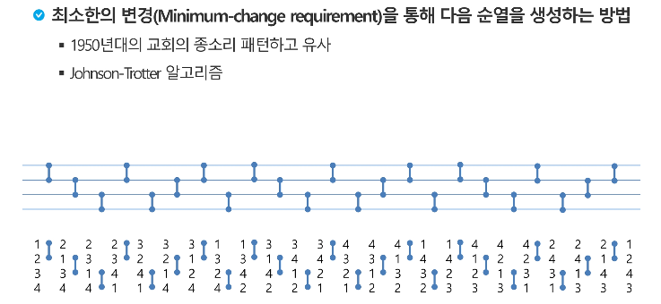

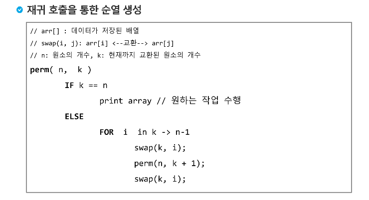


# baby-gin 문제

**배열**

```python
# 숫자
# num = 667767
# c = [0] * 12
#
# for i in range(6):
#     c[num%10] += 1
#     num //= 10

#문자열
num = '124783'
c = [0] * 12

for i in range(6):
    c[int(num[i])] += 1

i = 0
tri = run = 0
while i < 10:
    if c[i] >= 3:
        c[i] -= 3
        tri += 1
        continue
    if c[i]>=1 and c[i+1]>=1 and c[i+2] >= 1:
        c[i] -= 1
        c[i+1] -= 1
        c[i+2] -= 1
        run += 1
        continue
    i += 1

if run + tri == 2: print("Baby-gin이 맞습니다")
else: print("Baby-gin이 아닙니다")
```

**순열**

```python
def permutation(n, k):
    global baby
    if k == n:
        print(a)
    else:
        for i in range(k, n-1):
            a[k], a[i] = a[i], a[k]
            permutation(n, k+1)
            a[k], a[i] = a[i], a[k]

            if a[0]==a[1] and a[0]==a[2] and a[3]==a[4] and a[3]==a[5]:
                baby += 1
            if a[0]==a[1] and a[0]==a[2] and a[5] - a[4] == 1 and a[4] - a[3] == 1:
                baby += 1
            if a[2] - a[1] == 1 and a[1] - a[0] == 1 and a[3] == a[4] and a[3] == a[5]:
                baby += 1
            if a[2] - a[1] == 1 and a[1] - a[0] == 1 and a[5] - a[4] == 1 and a[4] - a[3] == 1:
                baby += 1
baby = 0
a = [1,2,4,7,8,3]
permutation(len(a), 0)

if baby > 0 :
    print("Baby-gin이 맞습니다")
else:
    print("Baby-gin이 아닙니다")

```

**완전검색**

```python
a = '101123'
baby = 0
for i1 in range(6):
    for i2 in range(6):
        if i2 != i1 :
            for i3 in range(6):
                if i3 != i1 and i3 != i2:
                    for i4 in range(6):
                        if i4 != i3 and i4 != i2 and i4 != i1:
                            for i5 in range(6):
                                if i5 != i4 and i5 != i3 and i5 != i2 and i5 != i1:
                                    for i6 in range(6):
                                        if i6 != i5 and i6 != i4 and i6 != i3 and i6 != i2 and i6 != i1:
                                            a = [int(a[i1]),int(a[i2]),int(a[i3]),int(a[i4]),int(a[i5]),int(a[i6])]
                                            if a[0]==a[1] and a[0]==a[2] and a[3]==a[4] and a[3]==a[5]:
                                                baby += 1
                                            if a[0]==a[1] and a[0]==a[2] and a[5] - a[4] == 1 and a[4] - a[3] == 1:
                                                baby += 1
                                            if a[2] - a[1] == 1 and a[1] - a[0] == 1 and a[3] == a[4] and a[3] == a[5]:
                                                baby += 1
                                            if a[2] - a[1] == 1 and a[1] - a[0] == 1 and a[5] - a[4] == 1 and a[4] - a[3] == 1:
                                                baby += 1

if baby > 0: print("Baby-gin이 맞습니다")
else: print("Baby-gin이 아닙니다")
```

**itertools.permutations() 함수 사용**

```python
import itertools
a = [1,0,3,4,4,4]
b = list(map(list,itertools.permutations(a)))
baby = 0
for i in b:
    if a[0]==a[1] and a[0]==a[2] and a[3]==a[4] and a[3]==a[5]:
        baby += 1
    if a[0]==a[1] and a[0]==a[2] and a[5] - a[4] == 1 and a[4] - a[3] == 1:
        baby += 1
    if a[2] - a[1] == 1 and a[1] - a[0] == 1 and a[3] == a[4] and a[3] == a[5]:
        baby += 1
    if a[2] - a[1] == 1 and a[1] - a[0] == 1 and a[5] - a[4] == 1 and a[4] - a[3] == 1:
        baby += 1
if baby > 0: print("Baby-gin이 맞습니다")
else: print("Baby-gin이 아닙니다")
```


