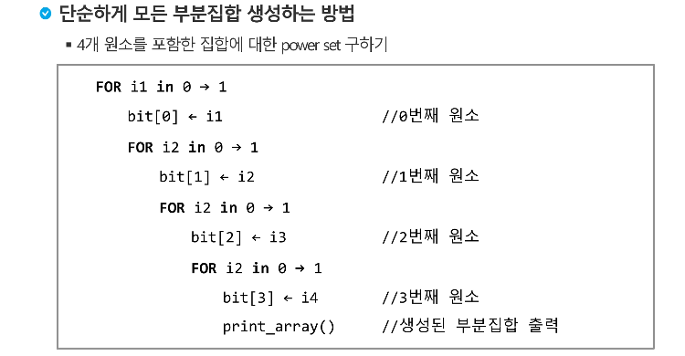
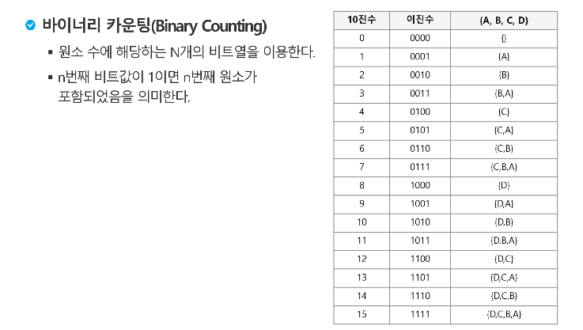
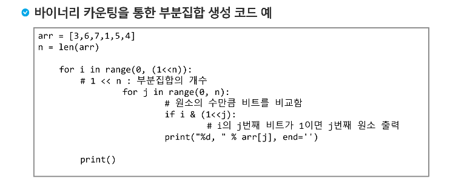
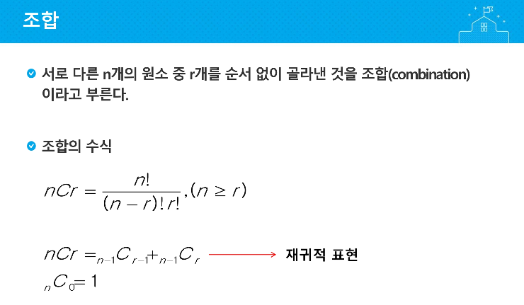
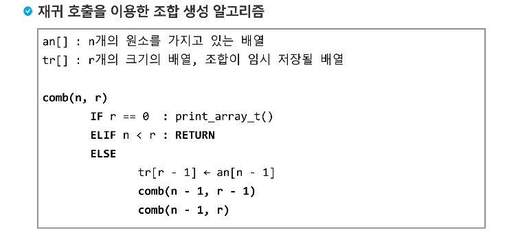

```python
arr = [-1, 3, -9, 6, 7, -6, 1, 5, 4, -2]
n = len(arr)
cnt = 0
for i in range(1<<n):
    result = []
    for j in range(n):   # << n임!!
        if i & (1<<j):
            result.append(arr[j])
    if sum(result) == 0 and result:
            cnt += 1
            print("{} : {}".format(cnt, result))
```

---

**조합**

```python
def comb(n, r):
    global cnt
    if r == 0 :
        if sum(tr) == 0 and tr:
            cnt += 1
            print("{} : {}".format(cnt, tr))
    elif n < r :
        return
    else:
        tr[r-1] = arr[n-1]
        comb(n-1, r-1)
        comb(n-1, r)

arr = [-1, 3, -9, 6, 7, -6, 1, 5, 4, -2]
cnt = 0
for i in range(len(arr)):
    tr = [0] * i
    comb(len(arr), i)
```

