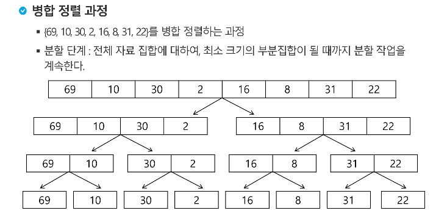

정렬이 된 것을 잘라냄.(asc, desc 상관없음)

stack 에 넣음. 

> stack = [A, B, C] 일 때. A>B+C, B>C 이여야함

만약 이미 있던 A보다 다음에 들어온 B가 더 크면 합쳐줌

>  stack = [A+B, C]

Galloping : stak에 있는 배열의 가장 끝 값보다 그 다음 배열의 가장 앞 값이 더 크면 그냥 그 뒤에 붙임

> A = [1, 2, 3, 4]
>
> B = [5, 6]
>
> [1,2,3,4] + [5,6]

---

---

