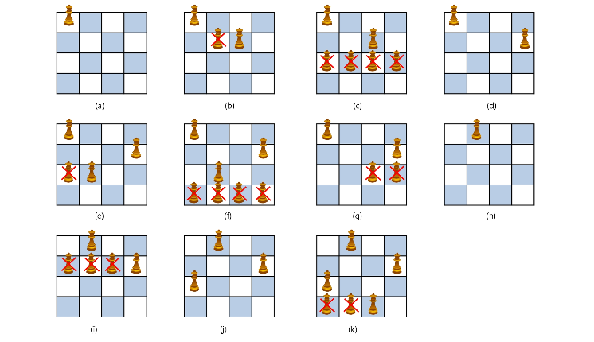

- Back Tracking

  > **일단 진행하다가, 막다른 길에서 다시 돌아가서 다시 다른 길로 찾아가는 것**

- Brand and Bound(prunning) 가지치기

  > **답에 해당 되는 것이 아니면 버리는 개념**

- DFS(Depth First Search)

  


---





---

---


```python
a = ['A', 'B', 'C', 'D']
b = [0, 0, 0, 0]
def powerset(k, n):
    if(k == n):
        result=[]
        for i in range(n):
            if(b[i] == 1):
                result.append(a[i])
        print(result)
    else:
        b[k] = 0
        powerset(k + 1, n);
        b[k] = 1;
        powerset(k + 1, n);

powerset(0, 4)  # index, 원소의 개수
```


```python
'''
[1,2,3,4,5,6,7,8,9,10]의 powerset중 원소의 합이 10인 부분집합을 출력
'''
def powerset(k, n):
    if(k == n):
        result=[]
        for i in range(n):
            if(b[i] == 1):
                result.append(i+1)
        sum1 = 0
        for j in range(len(result)):
            sum1+=result[j]
        if(sum1 == 10):
            print(result)
    else:
        b[k] = 0
        powerset(k+1, n);
        b[k] = 1;
        powerset(k+1, n);

a = [1,2,3,4,5,6,7,8,9,10]
b = [0] * len(a)
powerset(0, len(a))  # index, 원소의 개수


# 2
# def backtrack(a, k, sum):
#     if k == N:
#         if sum == 10:
#             for i in range(1, 11):
#                 if a[i] == True:
#                     print(i, end=' ')
#             print()
#     else:
#         k += 1
#
#         a[k] = 1
#         backtrack(a, k, sum + k)
#         a[k] = 0
#         backtrack(a, k, sum)
#
# N = 10
# a = [0] * (N + 1)
#
# backtrack(a, 0, 0)


# 3
# def construct_candidates(a, k, input, c):
#     c[0] = True
#     c[1] = False
#     return 2
#
# def process_solution(a, k):
#     sum = 0
#     for i in range(1, 11):
#         if a[i] == True:
#             sum += i
#     if sum == 10:
#         for i in range(1, 11):
#             if a[i] == True:
#                 print(i, end = ' ')
#         print()
#
# def backtrack(a, k, input):
#     c = [0] * MAXCANDIDATES
#
#     if k == input:
#         process_solution(a, k)  # 답이면 원하는 작업을 한다
#     else:
#         k += 1
#         ncandidates = construct_candidates(a, k, input, c)
#         for i in range(ncandidates):
#             a[k] = c[i]
#             backtrack(a, k, input)
#
# MAXCANDIDATES = 100
# NMAX = 100
# a = [0] * NMAX
# backtrack(a, 0, 10)


```


