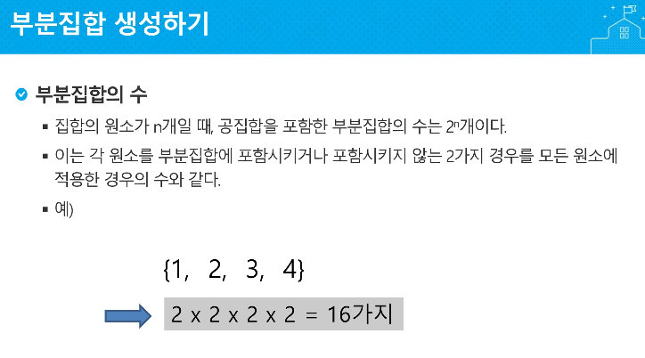
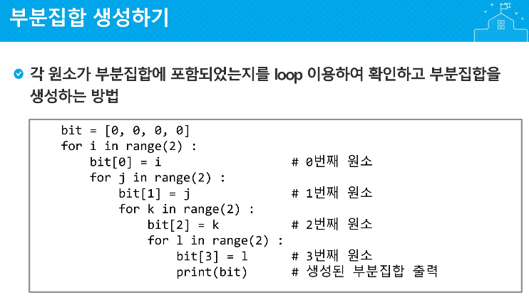
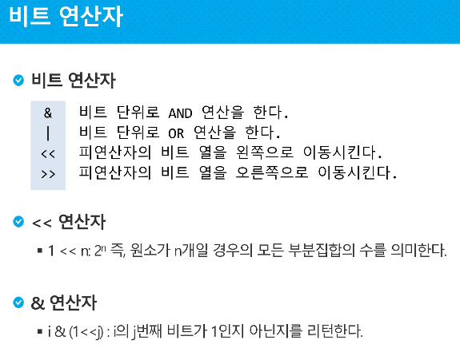
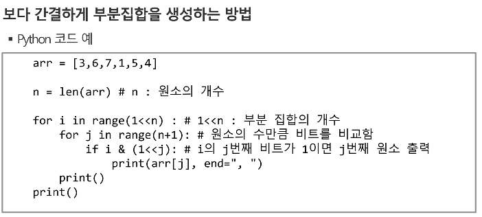

# 2019-01-23 - 2 부분집합






# 비트 연산자



```
	비트단위 &
6 & 10 = 2
0110 & 1010 = 0010 

	비트단위 |
6 | 10 = 14
0110 | 1010 = 1110

 	not연산
1111 -> 0000
	
	비트단위 << 
  6 << 1 = 12
0001 << 1  = 0010
0001 << 2  = 0100

	비트단위 >>
 12 >> 1 = 6
0010 >> 1  = 0001
0100 >> 2  = 0001
```


`i(1<<j)` :  i라는 값에서 j번째 위치의 비트가 어딘지

ex ) i = 6, j = 2일때,

0110에서 3번쨰 원소가 뭔지 파악하고싶다? --> 

6 & (1<<2)

6 & 110 -> 0110 & 110 --> 100

```python
print(i & (1<<j)) = true 2의2승이 살이있으니까 true
```


### 코드로 작성하면



```python
오타있음!
arr = [3,6,7,1,5,4]
n = len(arr)
for i in range(1<<n):
    for j in range(n):   # << n임!!
        if i & (1<<j):
            print(arr[j],end= ", ")
    print()
print()
```


