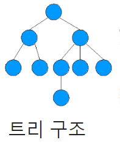
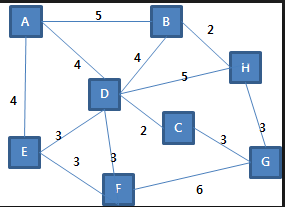

# 2019-01-16 - 1 자료구조적

### lang 

- type
- 제어
  - 순차구조 (x=10; x=20 -->  x=20!)
  - 선택구조 (if)
  - 반복구조

​     intermidiate

------

### 자료구조 - 자료를 저장했다가 필요할 때 갖다 쓸려고

- 자료의 구조적 모습
- 연산이 뭐냐
- 삽입, 삭제 후에도 논리적인 구조를 계속 유지해야함

 ---> 이런걸 ADT(abstract data type)라고 함

---> 검정 : 구현 - 선택

> ### 선형자료구조
>
> : 배열(삭제한 공간 붕 뜸), 리스트(삭제한 공간 자동으로 체워짐),스텍,큐,문자열 

> ### 비선형자료구조
>
> > 트리 : 그래프의 부분집합 , 표현방법->1.1차배열, 2.linked list
> >
> > - 3개의 구성요소
>
> > 그래프 : 표현방법 -> 1. 인접행렬, 2.인접리스트

> BFS, DFS 
>
> **★★순회(traversal) : 자료들을 하나도 중복없이 빠짐없이 순회하는 것★★**
>
> DFS : 찾았고 계속 찾을때 까지  갈수있는 방향으로 계속 감
>
> BFS: 넓이를 우선으로 탐색

advance

------

### 트리구조 - 이진트리, 이진탐색트리,AVL,Bt,트라이, 세그먼트,인덱스, 허프만

> 이진탐색 : 항상 왼쪽은 나보다 작고, 오른쪽은 나보다 큰 값
>
> ​	메모리 비효율
>
> ​    ▼
>
> 링크드리스트
>
> ​     메모리효율, 퍼포먼스x
>
> ▼
>
> 링크드리스트 트리

--> 나만의 앞뒤 시점을 정리해 단단하게 

### 그래프구조

- MST
- 최단경로(다익스,벨만포드,플로이드워셜)
- TSP : 모든 정점을 거쳐서 자기 자신으로 돌아오는 가장 짧은 경로: 순열로 접근
- AOE, AOV : 작업경로
- 네트워크유량

​			    

------

