# 2019-01-16 - 3 배열1

im - 정보 올림피아드 

adv - sw ecpert academy - https://www.swexpertacademy.com/main/learn/course/subjectList.do?courseId=AVvlSPbKAAHw5UPa

ASP => 자료구조+알고리즘

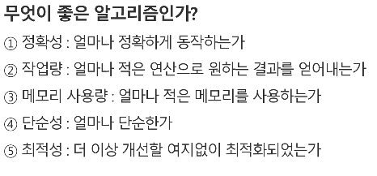

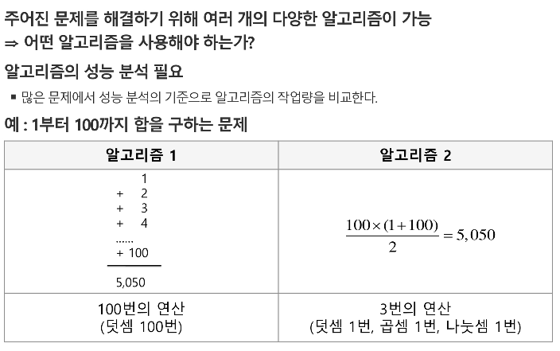

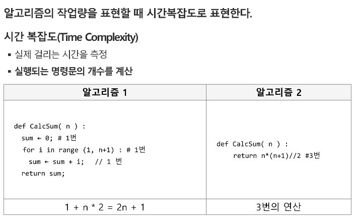

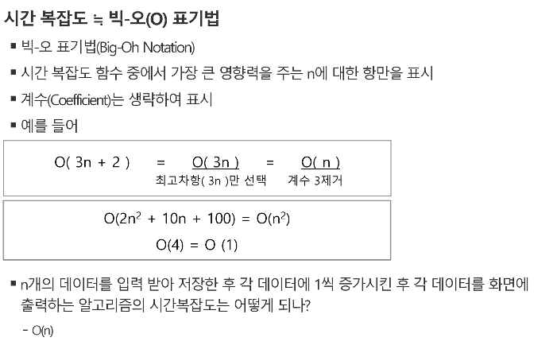

##        **3n -> n에 디펜드, n**2 -> n제곱에 디펜드**

​								**1억번 -> 1초**

---

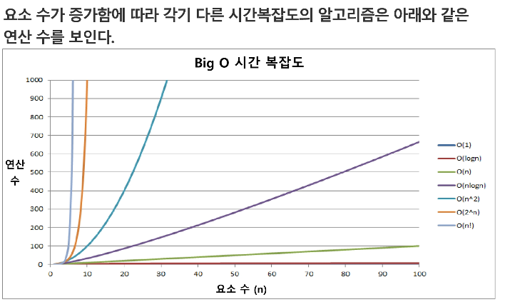

---

### 배열

> **일정 자료형 변수들을 하나의 이름으로 열거하여 사용하는 자료구조**

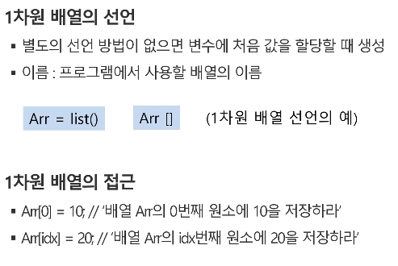

---

### 연습문제 1 - Gravity

---

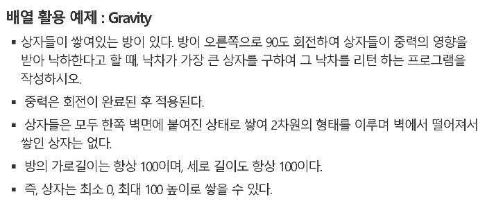

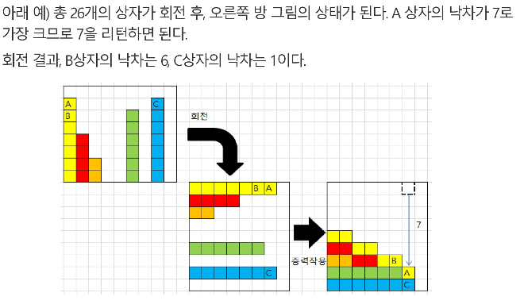

입력 : data[100]: 위에 예시는 [7,4,2,0,0,6,0,7,0]

좁은 범위에서 먼저 생각 -> 큰 범위에서 어떻게 될까?

A 이상인건  C뿐, 방해를 C한테 한번 받겠구나.. 

7 4 2 0 0 6 0 7 0   -> 8개

7 : 8-1  = 8개중 방해하는게 1개

4 : 7-2

2: 4

6: 2

7: 1

최댓값 : 7

---

## 완전 검색 : 연습문제 - baby-gin

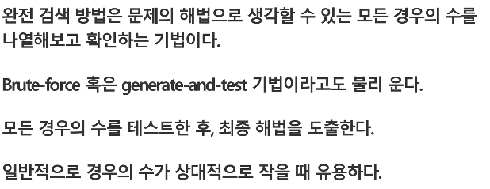

>  **brute-force : 순차적으로 다 ~ 돌아서 조사해!**

>  **generate-and-test :  다 생성을해서 조사해 : 백트레킹**

> 순열(중복) : n!
>
> 조합(중복) : nCr = n!/(r!(n-r)!)
>
> 부부집합 : 2**n

---

### baby-gin

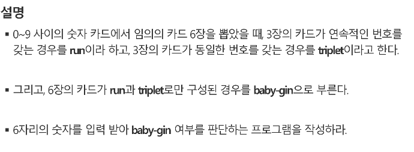

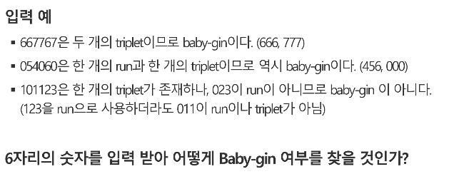

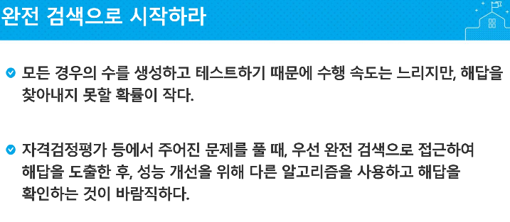

---

{1,2,3} r=3, n=3

nPr = 3P3 = 3x2x1 = 3! = 6

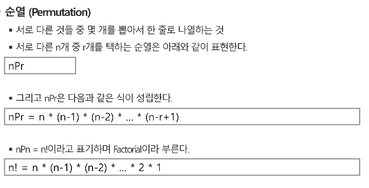

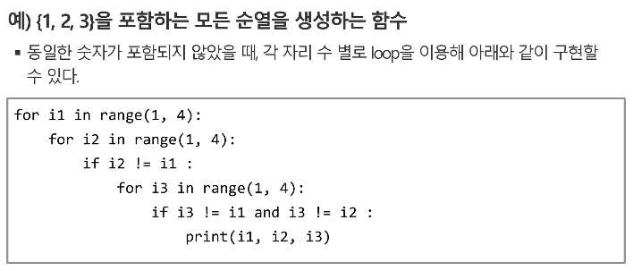

---

>### 결정 문제 - True or False

> 이 거리가 가장 짧아? 

---

## 탐욕(Greedy) 알고리즘

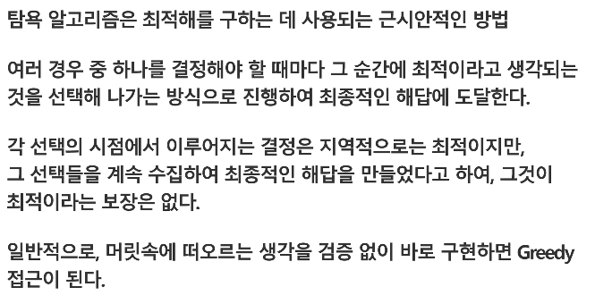

> ### Greedy : 좀 위험함..

### 탐욕 알고리즘의 동작과정

> 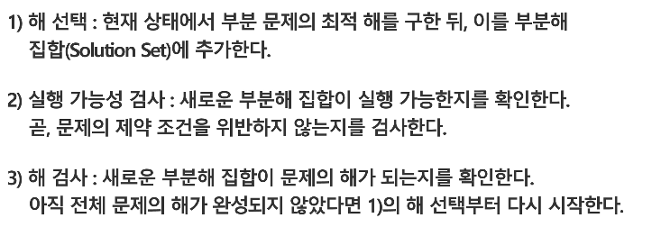

### 예시

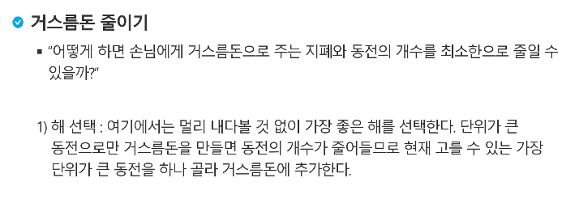

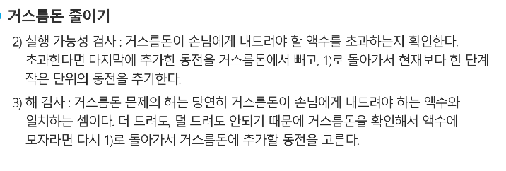

> [5000, 1000, 500, 100, 50, 10]
>
> 1700원이면, 5000원은 안돼, 
>
> 1000원빼면 700원, 다시 1000원빼면 안돼.
>
> 700원-500빼면 200원, 다시 500빼면 안돼.
>
> 200-100 = 100,  다시 100-100 뺴면 0! 

==> 다른 경우의 수가 있을수도 있음

--> 결국 완전검색 . 

---

---

### baby-gin

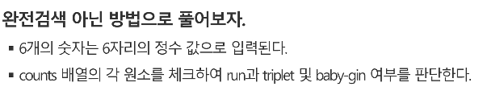

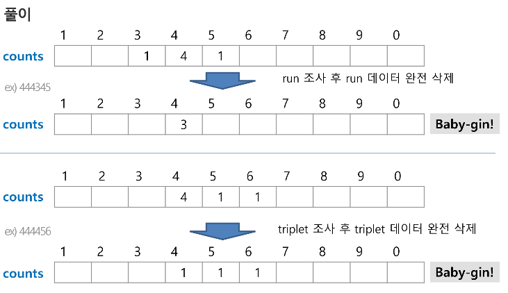

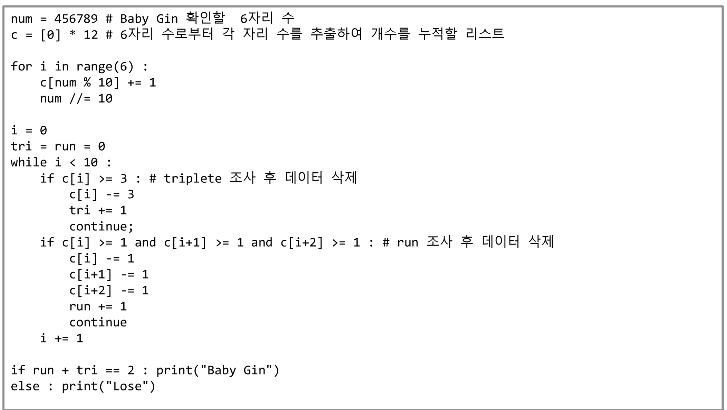

--> 순서는 바꾸면 안돼, 만약 run먼저 하면 삭제를 하고 trip에 가면 trip이 아니라 하니까

--> 위험하닷

---

### 자주 실수하는 오답

>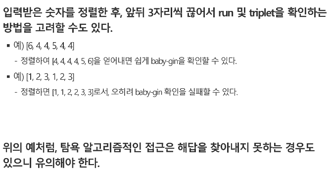

---

## 대표적인 정렬 방식의 종류

- 버블 정렬 Bubble Sort
- 카운팅 정렬 Counting Sort
- 선택 정렬 Selection Sort
- 퀵 정렬 Quick Sort
- 삽입 정렬 Insertion Sort
- 병합 정렬 Merge Sort

---

---

# 버블 정렬

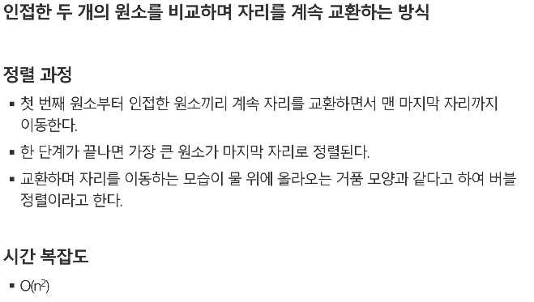

## 버블 정렬 과정

>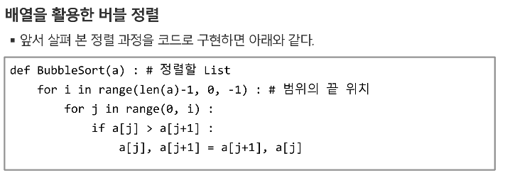
>
>>  **i는 뒤부터 시작, j는 앞부터 시작**
>
>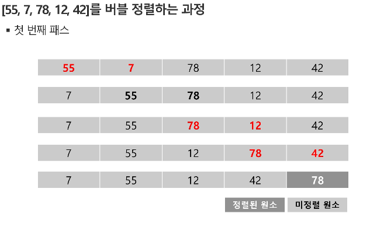
>
>> **==> 여기까지 하면, 맨 오른쪽에는 가장 큰 값이 들어가게됨-> sorted영역**
>>
>>  **i = 3, j 는 3까지** !
>>
>> **즉, unsorted 영역만 다시 정렬하는 거**
>
>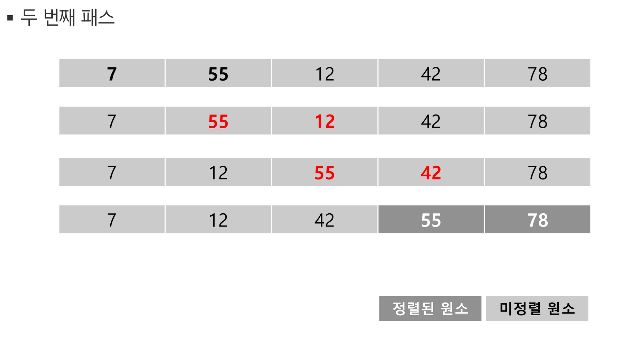
>
>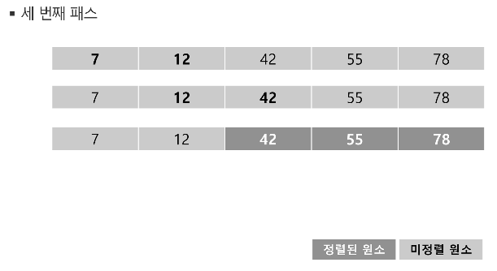
>
>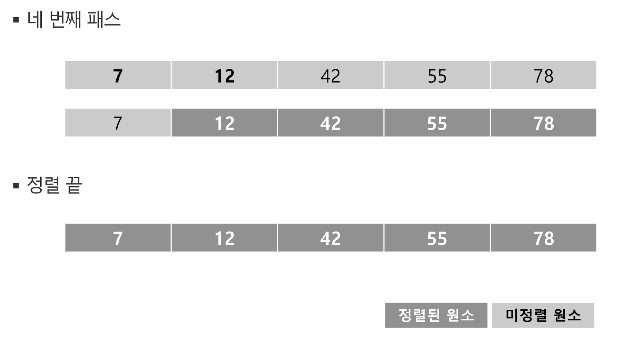

---

## 역전된 쌍의 개수

ex) 55 7 78 12 42

(55,7) (55,12)(55,42)

(58,12) (78,42)

if a[j]> a[j+1] ==> cnt++

---

---

## -> 병합 정렬로도 풀 수 있음 inversion counting

---

---

# 카운팅 정렬 (Counting Sort)

> 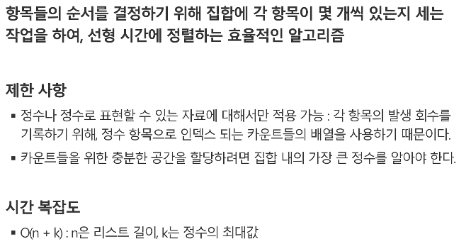
>
>  
>
> # 카운팅 정렬 과정
>
> 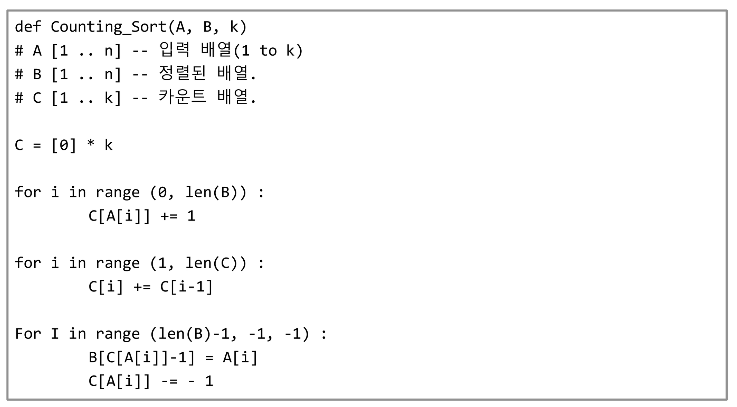
>
> **c[] ==> 배열에 0,1,2,3,4 번지수가 있는데,**
>
> **주어진 배열에 0이 있으면 c[0]번지에 카운트+1**
>
> **4면 c[4]번지수에 카운트 +=**
>
> >A : 0 4 1 3 1 2 4 1
> >
> >C : 1 3 1 1 2 -----------c[i] += c[i-1]-------> 1 4 5 6 8  
> >
> >B : 0 1 1 1 2 3 4 4 
> >
> >C : 1 4 5 6 8   ------- C[A[i]] -= -1 ----> 1,1,4,5,6
> >
> >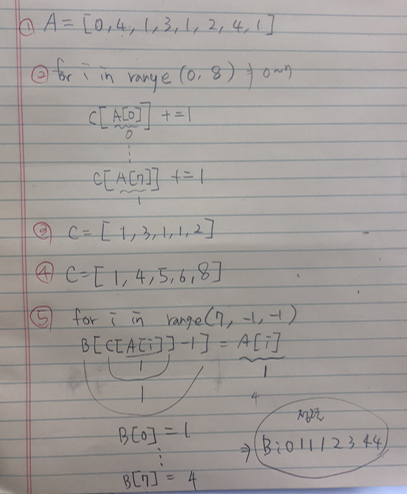
>
> 
>
> 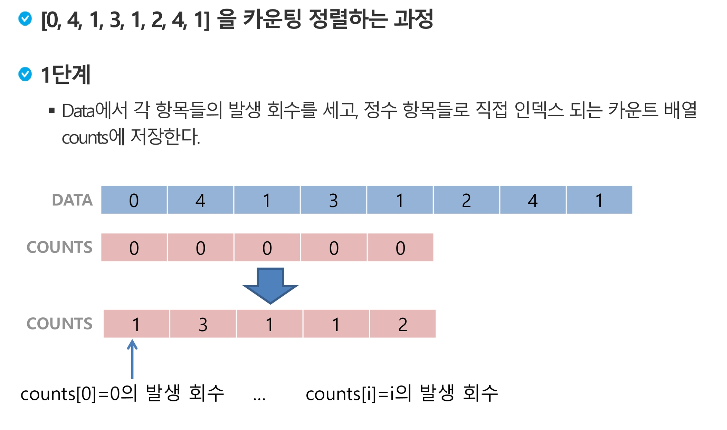
>
> 0~4의 수를 가진 8개 데이터를 가진 배열
>
> 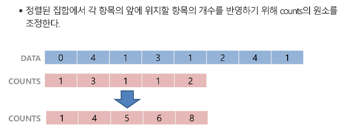
>
> 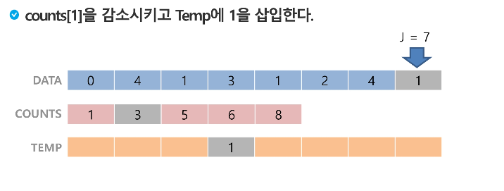
>
> 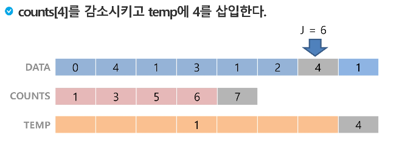
>
> 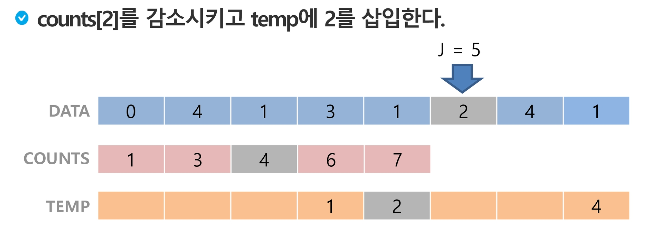
>
> 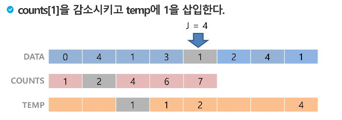
>
> 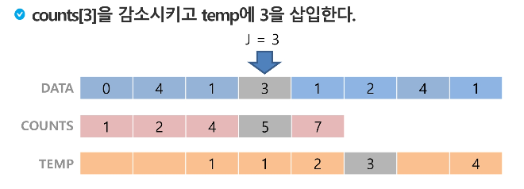
>
> 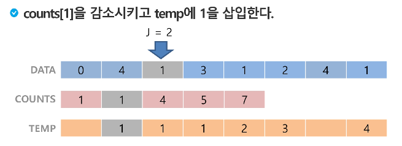
>
> 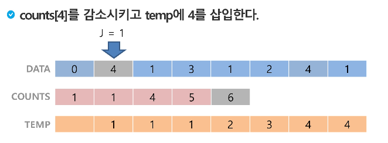
>
> 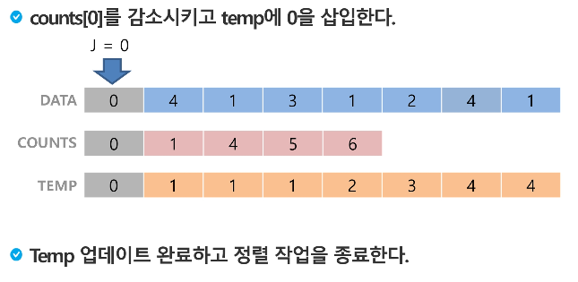
>
> 

