# 2019-01-30 - String 2

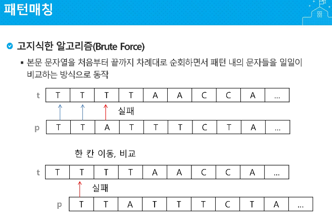

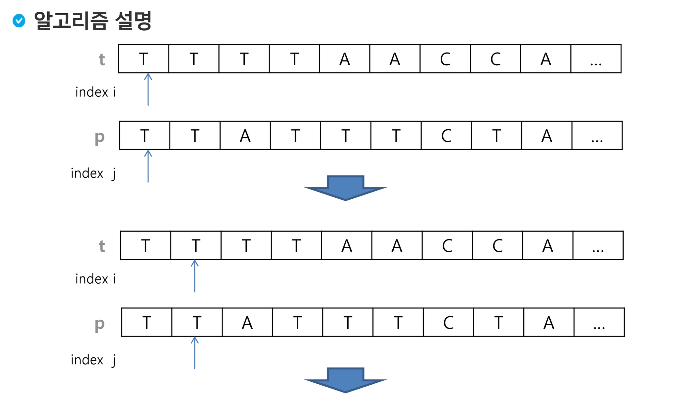

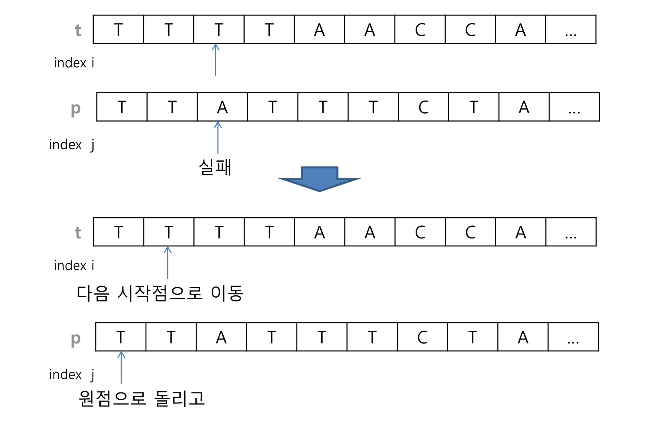

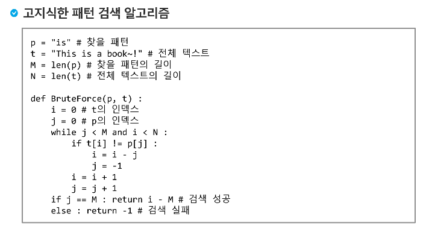


---


---

# Hash

참고 : https://hsp1116.tistory.com/35

참고 : https://ratsgo.github.io/blog/categories/

> 임의의 크기를 가진 데이터를 고정된 데이터의 크기로 변환
>
> > 특정한 배열의 인덱스나 위치나, 위치를 입력하고자 하는 데이터의 값을 이용해 저장하거나 찾을 수 있음.
> >
> > 해쉬를 이용하면 즉시 저장하거나, 찾고자 하는 위치를 참조할 수 있음 -> 빠른 속도

- 해쉬 테이블 

>   저장된 자료의 양에 상관없이 원소 하나를 저장·검색하는 데 항상 상수 시간에 가능하게 할 수 없는지 사람들은 요구하게 되었고, 이를 실현한 것이 해시 테이블이다. 해시 테이블은 자료의 저장·검색에 있어 극단적인 효율에 다다른 자료구조이다.
>
>   해시(Hash) 테이블은 원소의 값에 의해 결정되는 자료구조이다. 즉, 저장된 자료와의 비교를 통해 자리를 찾지 않고 단 한번의 계산으로 자리를 찾는다.
>
> > 해시함수를 사용하여 키를 해시값으로 매핑하고, 이 해시값을 색인(index) 혹은 주소 삼아 데이터의 값(value)을 키와 함께 저장하는 자료구조를 **해시테이블(hash table)**이라고 합니다. 이 때 데이터가 저장되는 곳을 버킷(bucket) 또는 슬롯(slot)이라고 합니다. 해시테이블의 기본 연산은 삽입, 삭제, 탐색(search)입니다. 다음 그림과 같습니다.
> >
> > 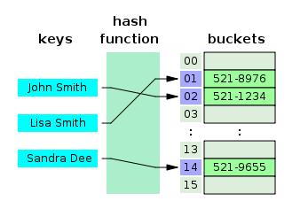
> >
> > 위 예시 그림 각 버킷에는 데이터가 다음과 같이 저장됩니다.
> >
> > | Index(Hash Value) | Data                   |
> > | ----------------- | ---------------------- |
> > | 01                | (Lisa Smith, 521-8976) |
> > | 02                | (John Smith, 521-1234) |
> > | …                 | …                      |
> >
> > 키의 전체 개수와 동일한 크기의 버킷을 가진 해시테이블을 Direct-address table이라고 합니다. 다음 그림과 같습니다.
> >
> > 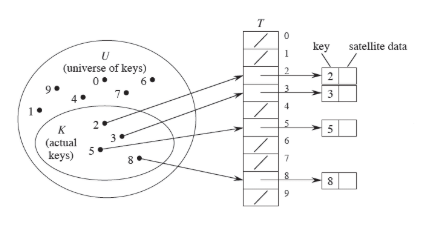

- 해쉬 충돌


---

카프-라빈 해쉬( 시간복잡도 : n+m, but 항상 보장되진 않음. 엄청나게 더 걸릴수도있어)

ex ) 111234123 에서 1234를 찾아봐

--> 첫 검색 : 1112

--> 두번째 검색: 1번지를 버리고 112 *10 + 다음번지값 : 1123 

---


---

참고 : https://bowbowbow.tistory.com/6

---


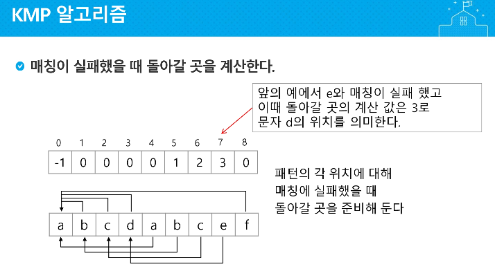


---


---

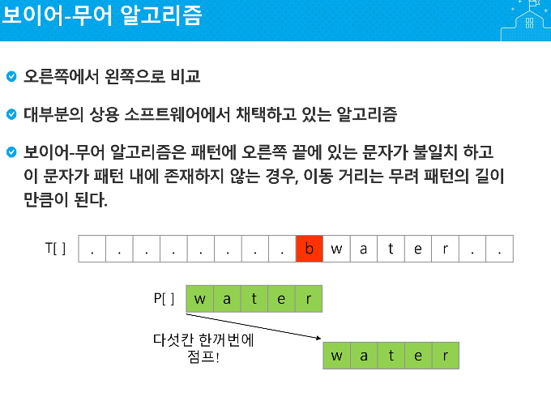


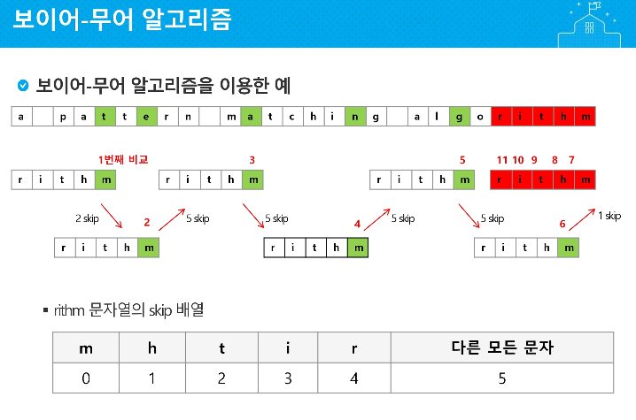

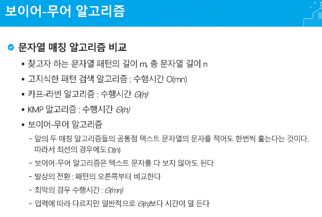

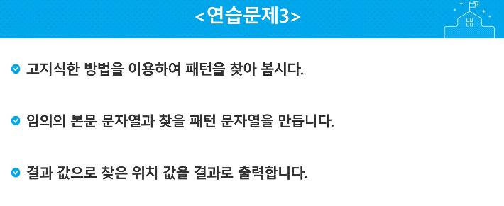

---


---

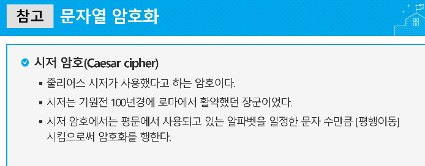

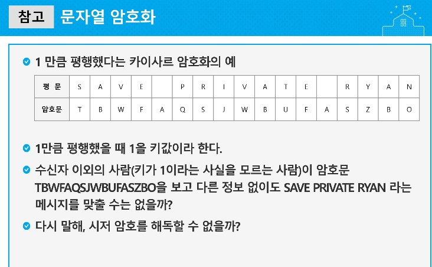

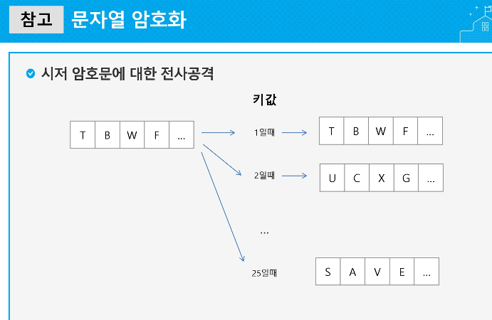

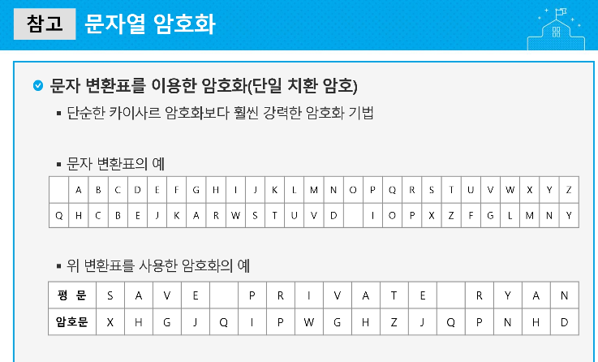

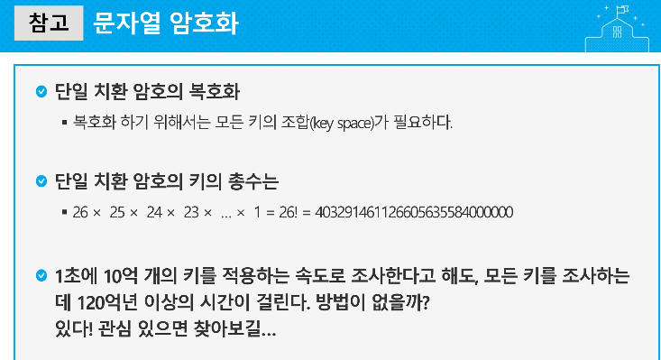

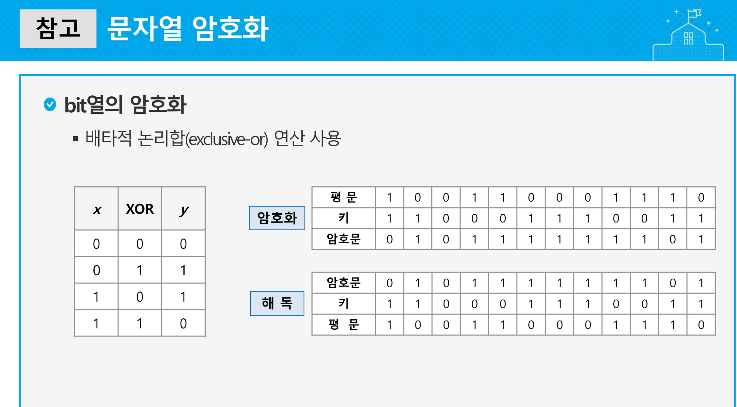

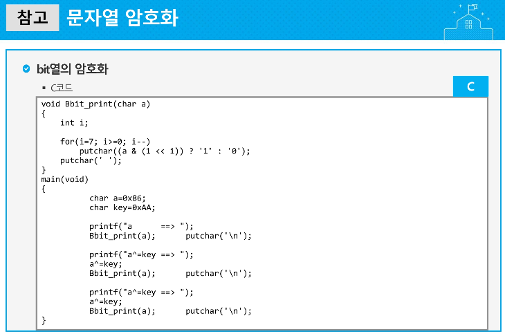

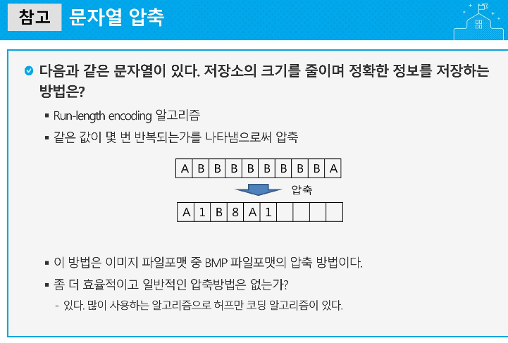

---

```python
def B(t, p):
    i = j = 0
    N = len(t)
    M = len(p)

    while j < M and i < N:
        if t[i] != p[j]:
            i = i - j
            j = -1
        i += 1
        j += 1
    if j == M:
        return i - M
    else:
        return i


T = "sadewgsfd"
P = "wg"
print(T[B(T, P):])
```

