# 계산기

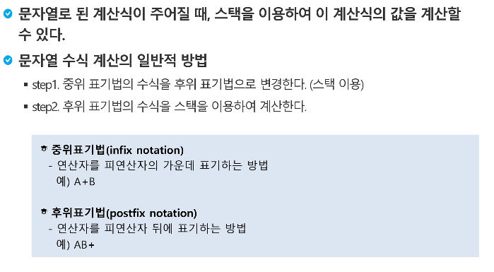

​                 **전위 표기법 : +AB**

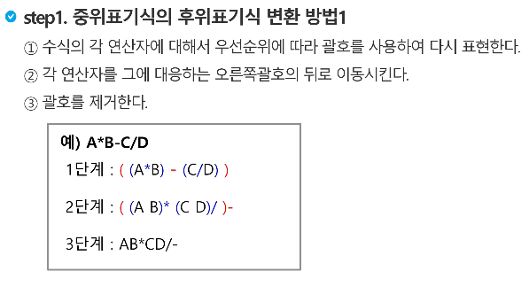

---

​				**연산자 : 수식 , 피연산자 : 값을 갖고 있는 것**

​					**( 3 + 4 )   연산자 : ( + ) ,  피연산자 : 3 4** 

---

# ex) (6 + 5 * (2 - 8) / 2) 

> ## 중위표기법 -> 후위표기법으로 변환

연산자 -> 스택에 넣음

피연산자 -> post에 넣음

>  stack = (  +    

> post = 6 5 

까지 넣고  * 가 들어 왔을 때 *가 +보다 쎄니까 + 위에 쌓아버림 

> stack = (  +  *

( 는 stack에 들어가기 전에는 제일 쎄,  누가 있던 무조건 들어감=> stack에 들어가면 제일 약함

> stack = (  +  *  (  -
>
> post = 6 5 2  8

)가 들어온 순간 짝이 나올때까지 다꺼내. 그리고 짝이랑 같이 없애버려.

>stack = (  +  *   
>
>post = 6 5 2  8 -

/ 는 *와 같은 레벨이니까 * 치우고 들어가

> stack = (  +   /
>
> post = 6 5 2  8 - *  

2는 post에 그냥 넣어 

> post = 6 5 2  8 - *  2

)가 들어왔네??

> stack = 
>
> post = 6 5 2  8 - *  2  / + 

---

> ## 후위표기법을 계산하기

6 5 2 8 - * 2 / +

>  stack  = 6 5 2 8

`-` 가 들어온 순간 2와 8을 꺼내서 계산해

> 2 -  8 = -6 -> 다시 스택에
>
>   stack  = 6 5  -6

`*`가 들어옴? 두개꺼내

> 5 * -6 = -30
>
> stack = 6 -30

2 넣어 

> stack = 6 -30  2

`/`가 들어옴? 두개 꺼내

>  -30 / 2 = -15
>
> stack = 6 -15

+가 들어옴?

> 6 + -15 = -9

## 그림으로 확인

---

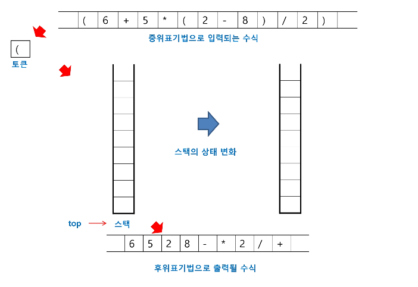

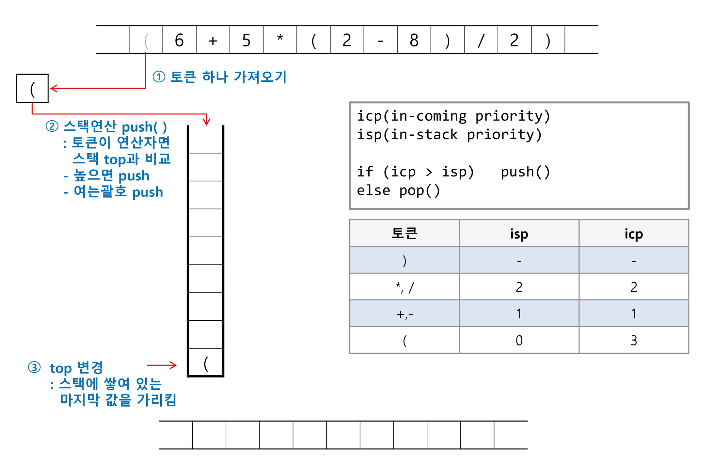

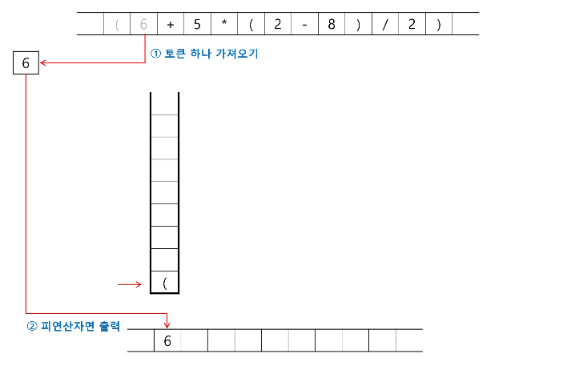

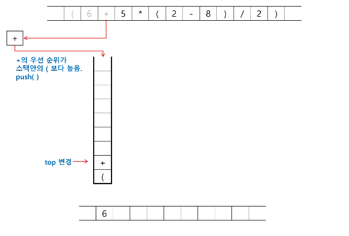

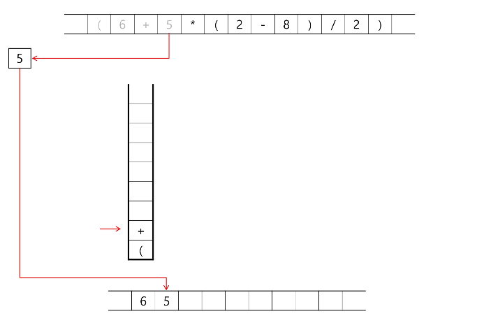

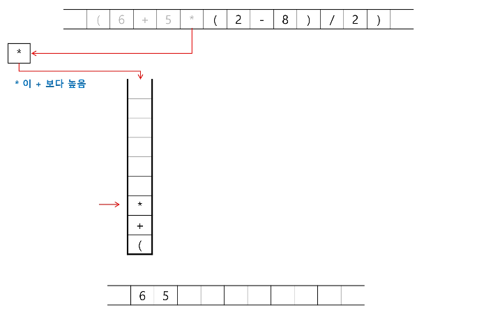

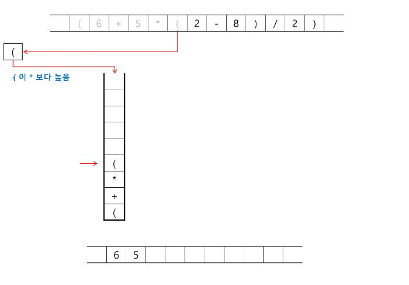

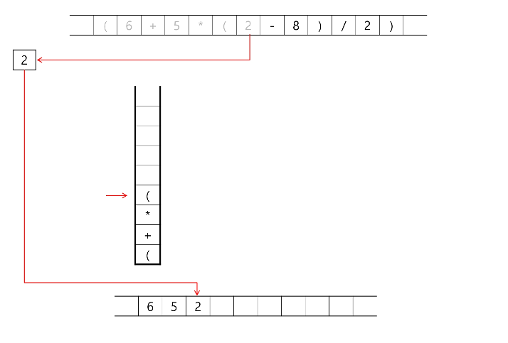

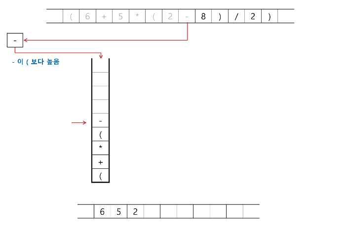

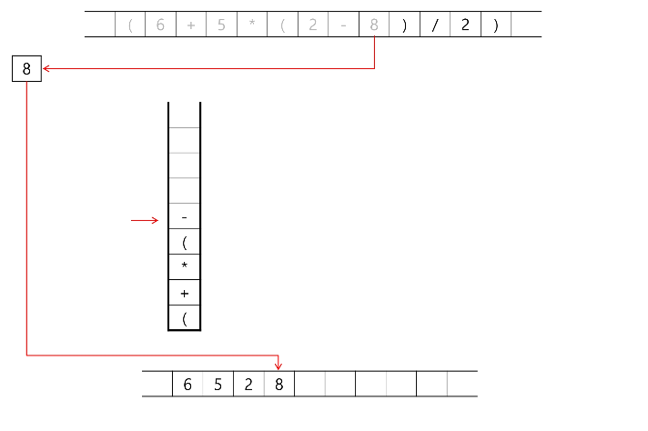

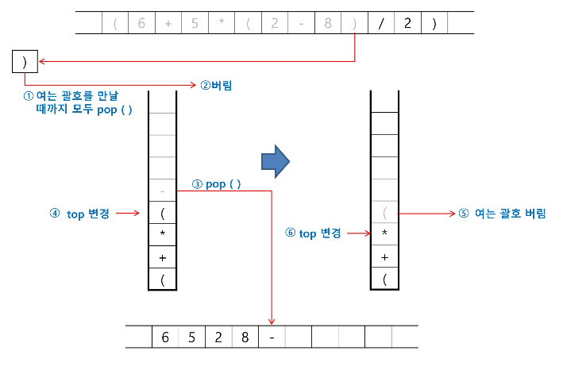

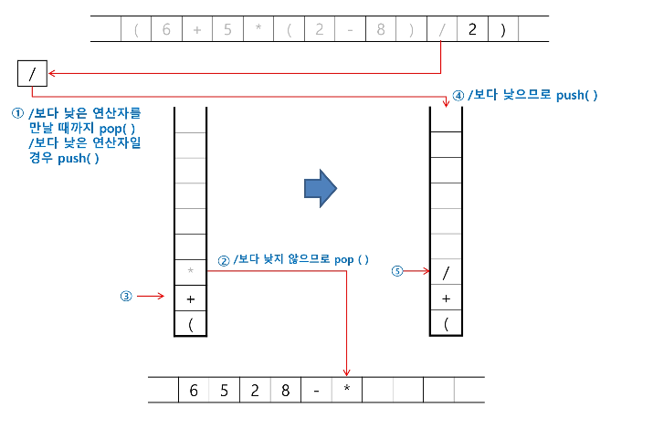

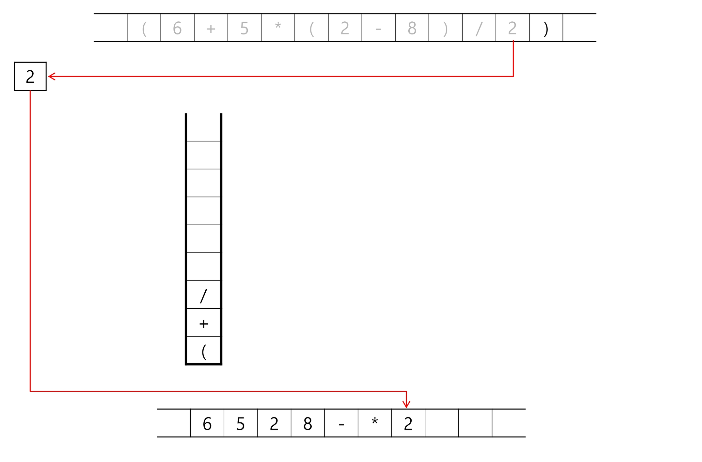

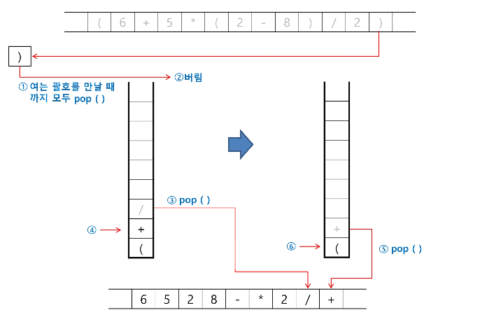

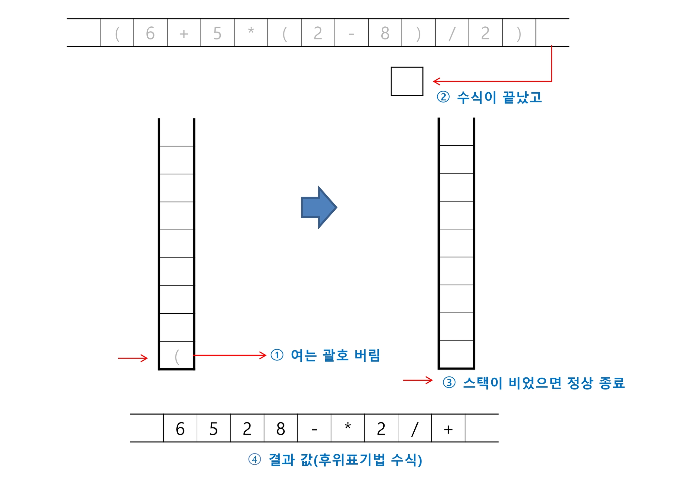

---

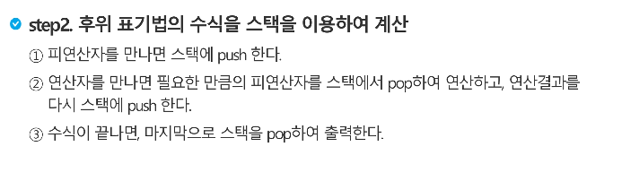

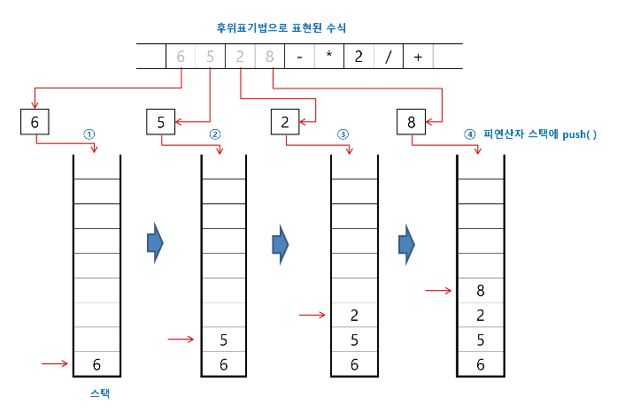

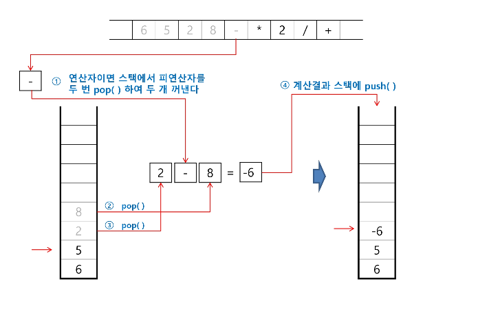

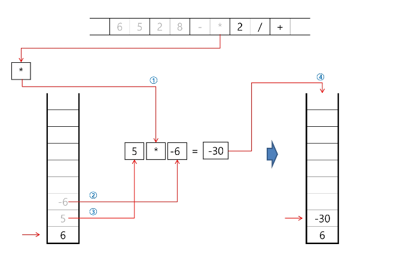

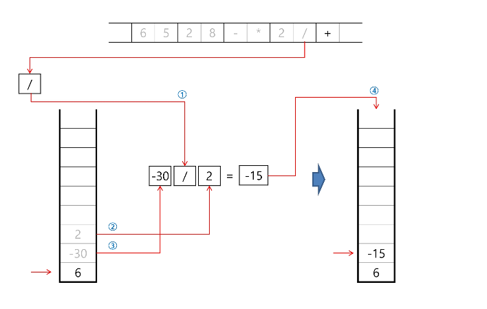

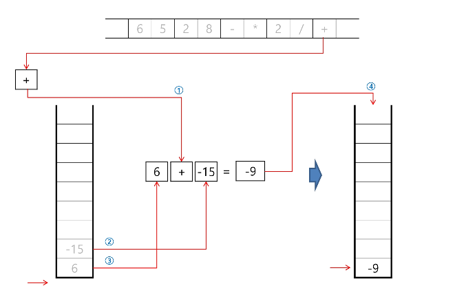

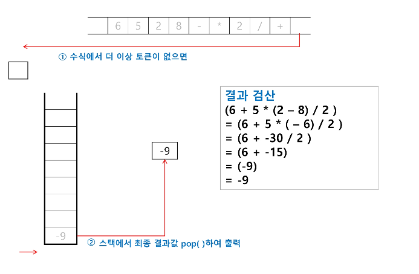

