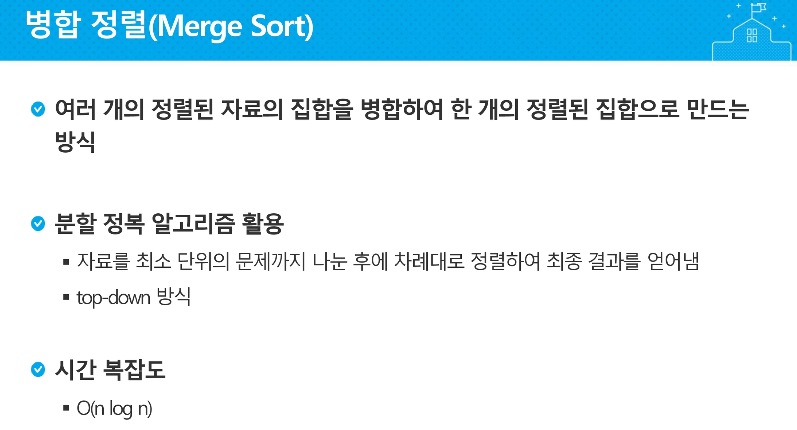
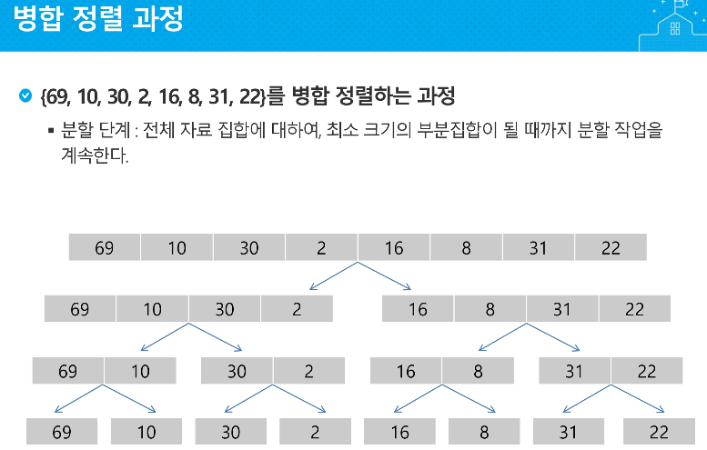
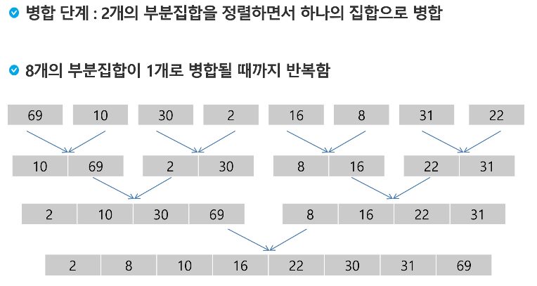
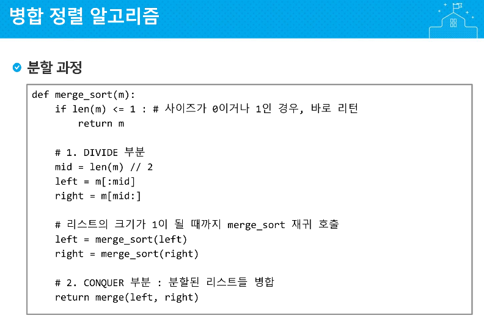
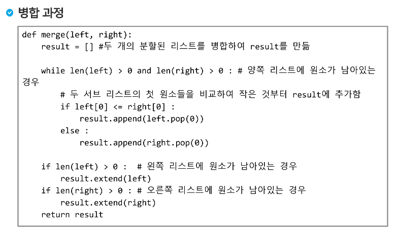
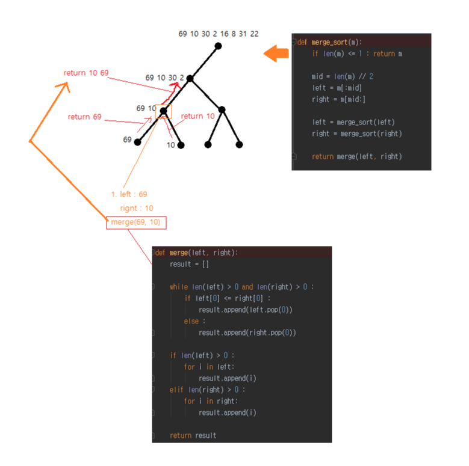
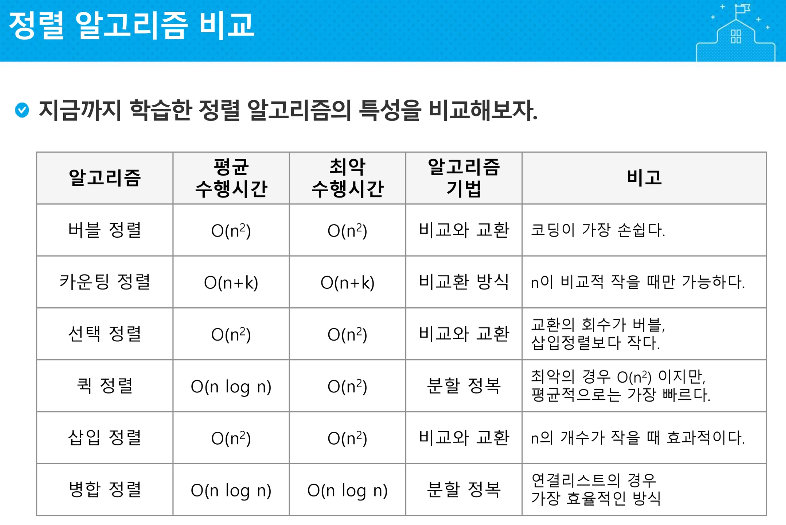

## 4. 병합 정렬(Merge Sort)











# 구현

```python
'''
오름 차순 병합 정렬 구현
69, 10, 30, 2, 16, 8, 31, 22
'''
a = [69, 10, 30, 2, 16, 8, 31, 22]

def merge_sort(m):
    if len(m) <= 1 : return m

    mid = len(m) // 2
    left = m[:mid]
    right = m[mid:]

    left = merge_sort(left)
    right = merge_sort(right)

    return merge(left, right)

def merge(left, right):
    result = []

    while len(left) > 0 and len(right) > 0 :
        if left[0] <= right[0] :
            result.append(left.pop(0))
        else :
            result.append(right.pop(0))

    if len(left) > 0 :
        result += left
    elif len(right) > 0 :
        result += right

    return result

print(merge_sort(a))
```





