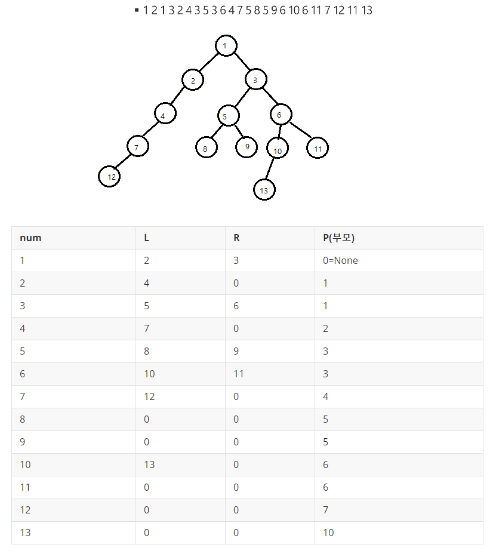
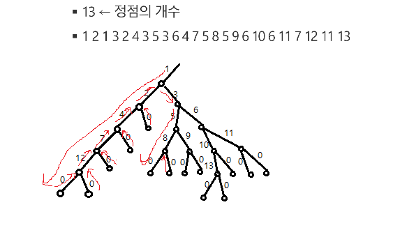
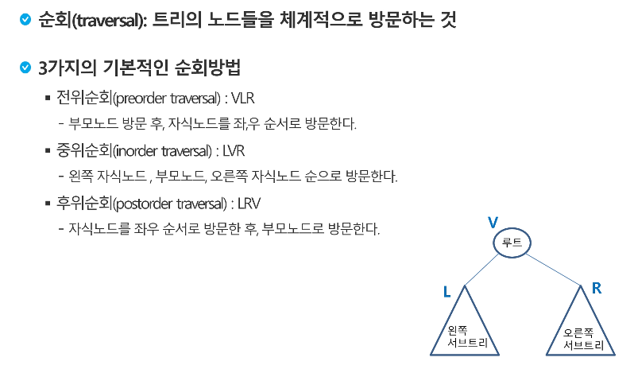
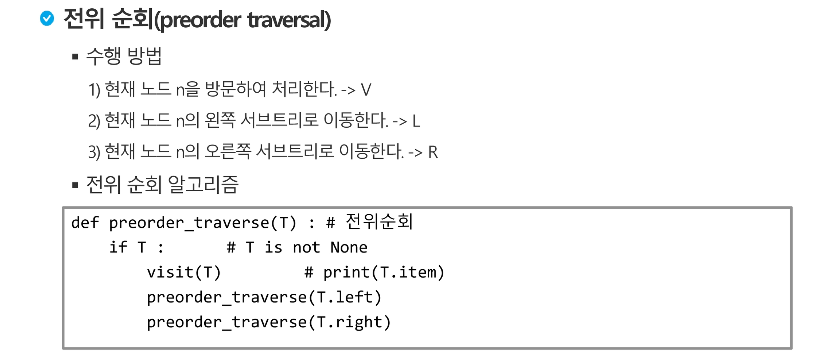
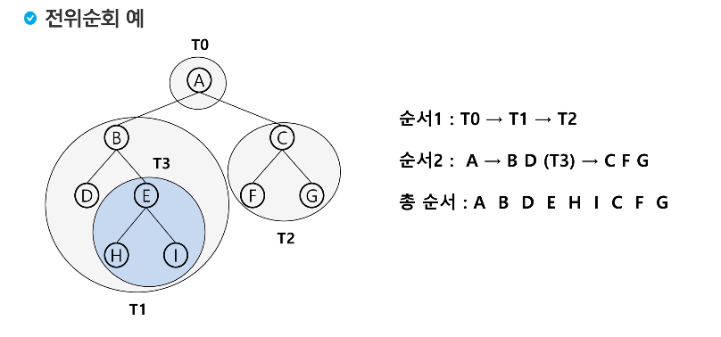
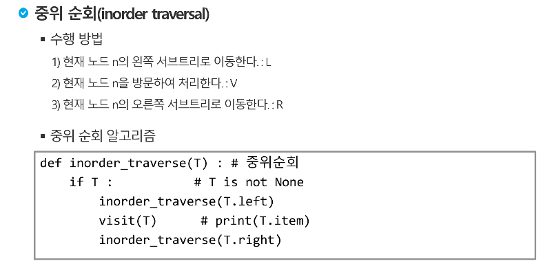
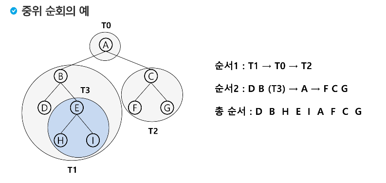
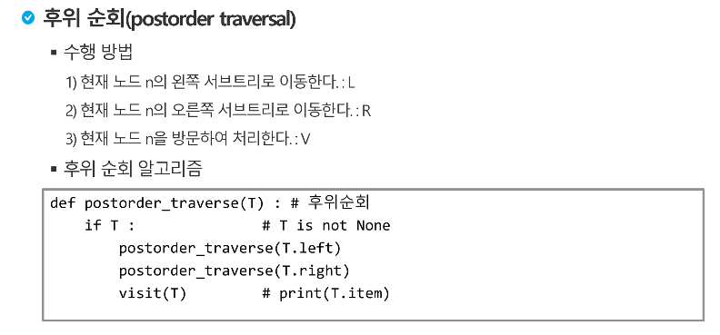
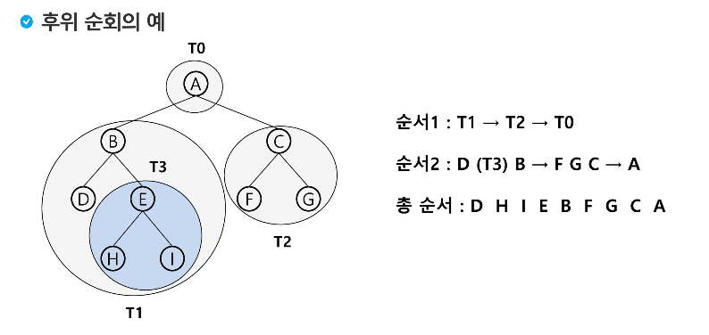

# 이진 TREE 순회

예제 ) 



### 기본 흐름



전위 :`visited = [1,2,4,7,12,3,5,8,9,6,10,13,11]`

중위:  `visited =[12,7,4,2,1,8,5,9,3,13,10,6,11]`

후위:  `visited =[12,7,4,2,8,9,5,13,10,11,6,3,1]`




---

## 전위순회





---

## 중위순회





---

## 후위순회





---

# 코드

```python
# 전위순회
def preorder_traverse(T):
    if T :
        visited.append(T)
        preorder_traverse(G[T][0])
        preorder_traverse(G[T][1])
# 중위순회
def preorder_traverse(T):
    if T :
        preorder_traverse(G[T][0])
        visited.append(T)
        preorder_traverse(G[T][1])
# 후위순회
def preorder_traverse(T):
    if T :
        preorder_traverse(G[T][0])
        preorder_traverse(G[T][1])
        visited.append(T)
        
        
# -----------------------------------------------------------------------------------
# 트리의 정점 총 수
V = 13
# 간선
a = [1, 2, 1, 3, 2, 4, 3, 5, 3, 6, 4, 7, 5, 8, 5, 9, 6, 10, 6, 11, 7, 12, 10, 13]
G = [[0]*3 for _ in range(14)]

for i in range(0, len(a)-1, 2):
    if G[a[i]][0] == 0 :
        G[a[i]][0] = a[i+1]
    else: G[a[i]][1] = a[i+1]
    if G[a[i+1]][2] == 0 : G[a[i+1]][2] = a[i]
        
# G = [[0, 0, 0],
#      [2, 3, 0],
#      [4, 0, 1],
#      [5, 6, 1],
#      [7, 0, 2],
#      [8, 9, 3],
#      [10, 11, 3],
#      [12, 0, 4],
#      [0, 0, 5],
#      [0, 0, 5],
#      [13, 0, 6],
#      [0, 0, 6],
#      [0, 0, 7],
#      [0, 0, 10]]

visited = []
T = 0
for i in range(len(G)):
    if G[i][2] == 0 : T = i
preorder_traverse(T)
print(visited)

```


