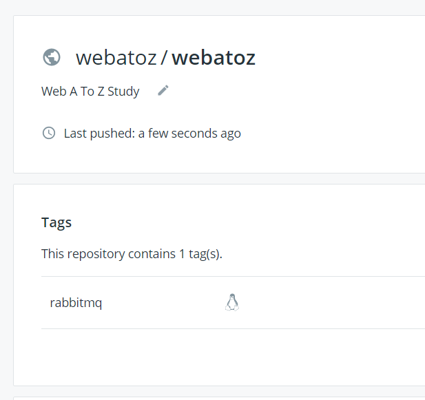

rabbitmq 이미지 올리기

```powershell
D:> docker image pull rabbitmq:3.8.0-management

D:> docker images
REPOSITORY          TAG                 IMAGE ID            CREATED             SIZE
postgres            latest              4a82a16ee75c        4 weeks ago         394MB
rabbitmq            3.8.0-management    8bdbe10dc73e        2 months ago        180MB

D:> docker tag rabbitmq:3.8.0-management webatoz/webatoz:rabbitmq

D:> docker push webatoz/webatoz:rabbitmq
The push refers to repository [docker.io/webatoz/webatoz]
28aac147e8cc: Preparing
1491751e211e: Preparing
2e45bcc23a82: Preparing
2ba02d8dba8b: Preparing
41b6fca36b81: Preparing
066ee7ef9615: Preparing
55a2c6b5a30c: Preparing
92524aad4a69: Preparing
e0b3afb09dc3: Preparing
6c01b5a53aac: Preparing
2c6ac8e5063e: Preparing
cc967c529ced: Preparing
55a2c6b5a30c: Waiting
92524aad4a69: Waiting
e0b3afb09dc3: Waiting
6c01b5a53aac: Waiting
2c6ac8e5063e: Waiting
cc967c529ced: Waiting
066ee7ef9615: Waiting
41b6fca36b81: Mounted from library/rabbitmq
2ba02d8dba8b: Mounted from library/rabbitmq
1491751e211e: Mounted from library/rabbitmq
2e45bcc23a82: Mounted from library/rabbitmq
28aac147e8cc: Mounted from library/rabbitmq
e0b3afb09dc3: Mounted from library/rabbitmq
92524aad4a69: Mounted from library/rabbitmq
55a2c6b5a30c: Mounted from library/rabbitmq
066ee7ef9615: Mounted from library/rabbitmq
6c01b5a53aac: Mounted from library/rabbitmq
cc967c529ced: Mounted from library/rabbitmq
2c6ac8e5063e: Mounted from library/rabbitmq
rabbitmq: digest: sha256:1bc0f71e474748dfd9c58d6e633953785d0141ec269327fa1ecdfb5ea3897ad8 size: 2829
```


확인

<https://hub.docker.com/repository/docker/webatoz/webatoz>



