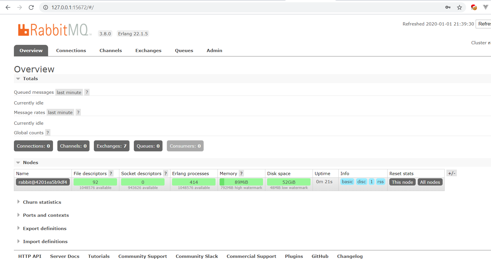
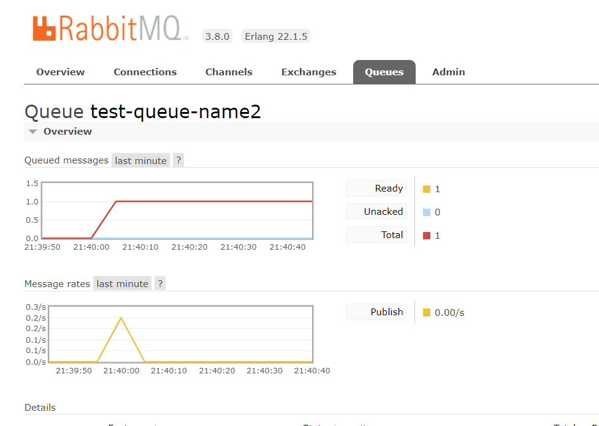
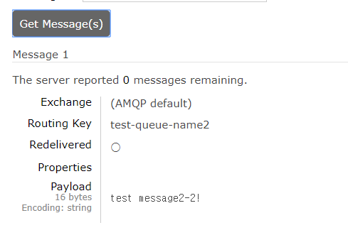

docker compose up

```powershell
$ docker ps
CONTAINER ID        IMAGE               COMMAND             CREATED             STATUS              PORTS               NAMES

$ ls
 Django/  'docker-compose - 복사본.yml'   docker-compose.yml   RabbitMQ.md   README.md   Spring/

$ docker-compose up
docker-compose_db_1 is up-to-date
Creating docker-compose_nodejs_1 ...
Creating docker-compose_rabbitmq_1 ...
Creating docker-compose_django_1   ...
Creating docker-compose_nodejs_1     ... done
Creating docker-compose_rabbitmq_1   ... done
Creating docker-compose_django_1     ... done
7d36264f5aa3903ef661c5fe0): Error starting userland proxy: listen tcp 0.0.0.0:8080: bind: Only one usage of each socket address (protocol/network address/port) is normally permitted.

$ docker ps
CONTAINER ID        IMAGE                      COMMAND                  CREATED              STATUS              PORTS                                                                                        NAMES
4c4ee58f2ed2        docker-compose_django      "bash -c 'python man…"   About a minute ago   Up About a minute   0.0.0.0:8100->8100/tcp                                                                       docker-compose_django_1
4201ea5b9df4        webatoz/webatoz:rabbitmq   "docker-entrypoint.s…"   About a minute ago   Up About a minute   4369/tcp, 5671/tcp, 0.0.0.0:5672->5672/tcp, 15671/tcp, 25672/tcp, 0.0.0.0:15672->15672/tcp   docker-compose_rabbitmq_1
4e24b71c2201        webatoz/node-docker        "docker-entrypoint.s…"   About a minute ago   Up About a minute   0.0.0.0:3000->3000/tcp                                                                       docker-compose_nodejs_1
50405b0c8052        webatoz/postgres-docker    "docker-entrypoint.s…"   7 minutes ago        Up 7 minutes        5432/tcp                                                                                     docker-compose_db_1
```




## message push

```java
package com.kongjung.rabbitmq;

import com.rabbitmq.client.Channel;
import com.rabbitmq.client.Connection;
import com.rabbitmq.client.ConnectionFactory;

public class Publisher {

    private final static String QUEUE_NAME = "test-queue-name2";
    private final static String QUEUE_HOST = "10.0.75.1";
    private final static int QUEUE_PORT = 5672;
    private final static String QUEUE_USER_NAME = "guest";
    private final static String QUEUE_PASSWORD = "guest";

    public static void main(String[] args) throws Exception {
        ConnectionFactory factory = new ConnectionFactory();
        factory.setHost(QUEUE_HOST);
        factory.setPort(QUEUE_PORT);
        factory.setUsername(QUEUE_USER_NAME);
        factory.setPassword(QUEUE_PASSWORD);
        String message = "test message2-2!";

        Connection connection = factory.newConnection();
        Channel channel = connection.createChannel();

        channel.queueDeclare(QUEUE_NAME, false, false, false, null);
        channel.basicPublish("", QUEUE_NAME, null, message.getBytes("UTF-8"));

        System.out.println(" [x] Sent '" + message + "'");

        channel.close();
        connection.close();
    }
}
```



