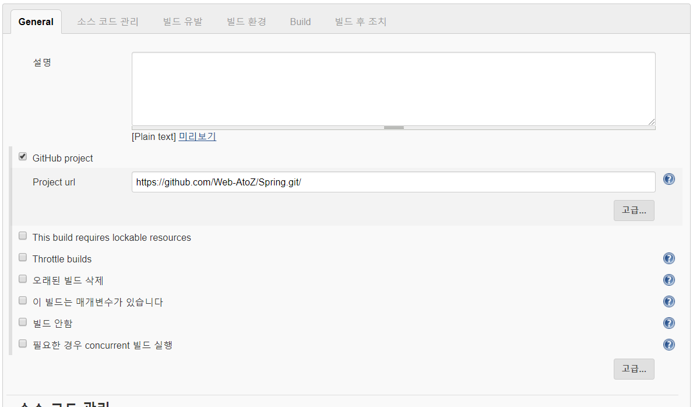
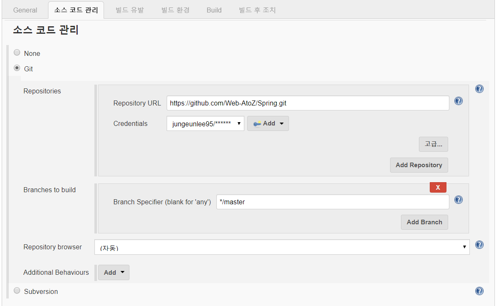
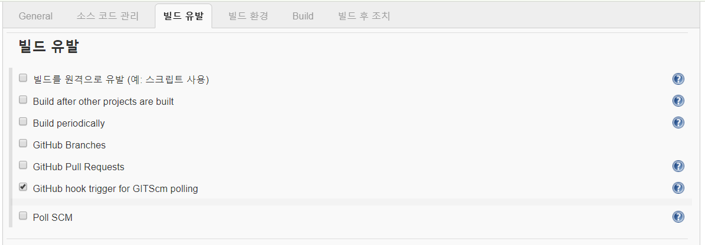
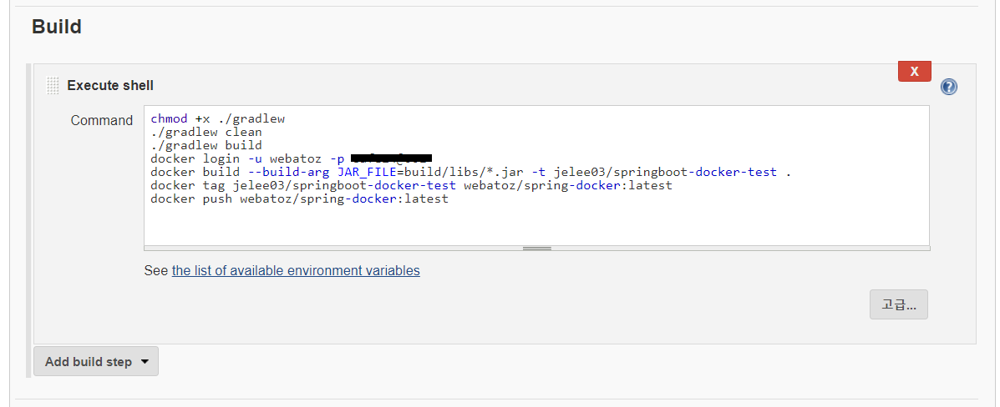
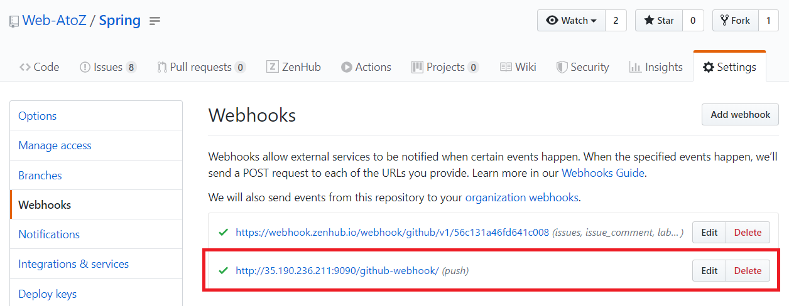
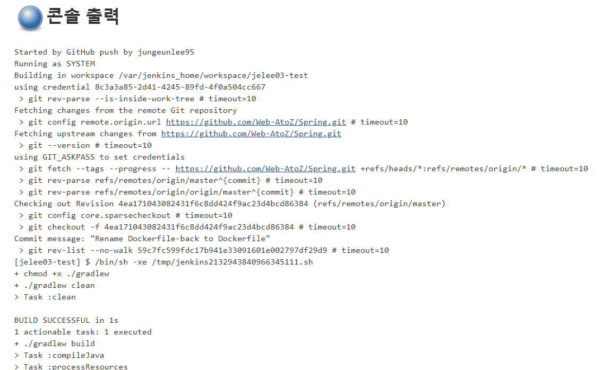
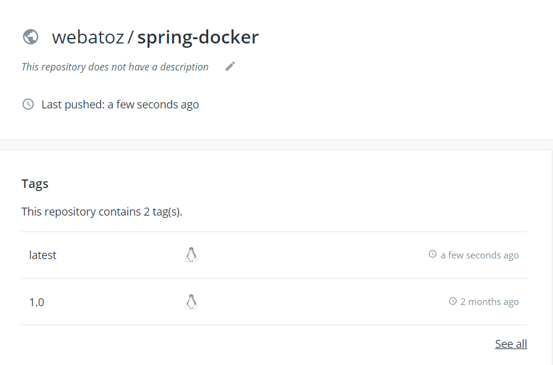
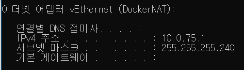
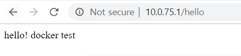

[TOC]

## ETC

Jenkins - <http://webatoz.com:9090/job/jelee03-test/>

docker hub - <https://hub.docker.com/repository/docker/webatoz/spring-docker>

---

## Spring boot project

##### Dockerfile

```dockerfile
# openjdk 8
FROM openjdk:8-jdk-alpine
# image maintainer
LABEL maintainer="f.leeap1004@gmail.comSS"

# data directory
# Add a volume to /tmp
VOLUME /tmp

# Make port 8080 available to the world outside this container
EXPOSE 8080

# The application's jar file
ARG JAR_FILE=Spring/build/libs/springboot-docker-test-0.0.1-SNAPSHOT.jar

# Add the application's jar to the container
ADD ${JAR_FILE} springboot-docker-test.jar

# Run the jar file
ENTRYPOINT ["java","-Djava.security.egd=file:/dev/./urandom","-jar","/springboot-docker-test.jar"]
```

##### build.gradle

```yml
plugins {
	id 'org.springframework.boot' version '2.1.3.RELEASE'
	id 'java'
	id 'application'
}

mainClassName = 'com.test.hello.DockerTestApplication'

apply plugin: 'io.spring.dependency-management'

group = 'com.test.hello'
version = '0.0.1-SNAPSHOT'
sourceCompatibility = '1.8'

repositories {
	mavenCentral()
}

jar {
	baseName = 'docker-test'
	version = '0.1.0'
}

sourceCompatibility = 1.8
targetCompatibility = 1.8

dependencies {
	//implementation 'org.springframework.boot:spring-boot-starter-data-jpa'
	implementation 'org.springframework.boot:spring-boot-starter-web'
	compileOnly 'org.projectlombok:lombok'
	runtimeOnly 'org.springframework.boot:spring-boot-devtools'
	testImplementation 'org.springframework.boot:spring-boot-starter-test'
	compile("org.springframework.boot:spring-boot-starter-web")
	testCompile("org.springframework.boot:spring-boot-starter-test")
}
```

##### application.yml

```yml
server:
  port: 80
  address: 0.0.0.0

spring:
  application:
    name: dockerTestApp

ribbon:
  ServerListRefreshInterval: 1000

endpoints:
  health:
    sensitive: false
  restart:
    enabled: true
  shutdown:
    enabled: true
```

##### test controller

```java
@RestController
public class HelloController{

    @GetMapping("/")
    public String createApp()  {
        return "docker test";
    }

    @GetMapping("/hello")
    public String hello()  {
        return "hello! docker test"; 
    }
 
}
```

---

## Jenkins Job 생성









```shell
chmod +x ./gradlew 
./gradlew clean 
./gradlew build
docker login -u webatoz -p *****
docker build --build-arg JAR_FILE=build/libs/*.jar -t jelee03/springboot-docker-test .
docker tag jelee03/springboot-docker-test webatoz/spring-docker:latest
docker push webatoz/spring-docker:latest
```

> 비밀번호는 나중에 뺴야 됨
>
> 이렇게 생성하면 해당 url github repository에서 webhook이 생성 됨



---

## github push event

push 하면 젠킨스에서 build -> image -> push to docker hub 




##### Dockerhub 확인!




---

## docker test

## docker pull image

```powershell
leeap@DESKTOP-550L6OS MINGW64 /
$ docker images
REPOSITORY                  TAG                 IMAGE ID            CREATED             SIZE
docker-compose_springboot   latest              a313ec8a7341        5 weeks ago         122MB
docker-compose_django       latest              dd3f7303660f        5 weeks ago         999MB
python                      3                   038a832804a0        6 weeks ago         932MB
webatoz/node-docker         latest              12f898fee30a        7 weeks ago         898MB
postgres                    latest              4a82a16ee75c        2 months ago        394MB
webatoz/postgres-docker     latest              4a82a16ee75c        2 months ago        394MB
rabbitmq                    3.8.0-management    8bdbe10dc73e        3 months ago        180MB
webatoz/webatoz             rabbitmq            8bdbe10dc73e        3 months ago        180MB
openjdk                     8-jdk-alpine        a3562aa0b991        9 months ago        105MB

leeap@DESKTOP-550L6OS MINGW64 /
$ docker pull webatoz/spring-docker:latest
latest: Pulling from webatoz/spring-docker
e7c96db7181b: Already exists
f910a506b6cb: Already exists
c2274a1a0e27: Already exists
4791754aab21: Pulling fs layer
4791754aab21: Verifying Checksum
4791754aab21: Download complete
4791754aab21: Pull complete
Digest: sha256:69e002654c86bce906c7ecbe824e2e67c1d8e4c492f2e8ecf61067507ec23baa
Status: Downloaded newer image for webatoz/spring-docker:latest
docker.io/webatoz/spring-docker:latest

leeap@DESKTOP-550L6OS MINGW64 /
$ docker images
REPOSITORY                  TAG                 IMAGE ID            CREATED             SIZE
webatoz/spring-docker       latest              2d1f1eae86cf        2 hours ago         122MB
docker-compose_springboot   latest              a313ec8a7341        5 weeks ago         122MB
docker-compose_django       latest              dd3f7303660f        5 weeks ago         999MB
python                      3                   038a832804a0        6 weeks ago         932MB
webatoz/node-docker         latest              12f898fee30a        7 weeks ago         898MB
postgres                    latest              4a82a16ee75c        2 months ago        394MB
webatoz/postgres-docker     latest              4a82a16ee75c        2 months ago        394MB
rabbitmq                    3.8.0-management    8bdbe10dc73e        3 months ago        180MB
webatoz/webatoz             rabbitmq            8bdbe10dc73e        3 months ago        180MB
openjdk                     8-jdk-alpine        a3562aa0b991        9 months ago        105MB

```


## docker run

```powershell
leeap@DESKTOP-550L6OS MINGW64 /
$ docker run -p 80:80 -t webatoz/spring-docker

  .   ____          _            __ _ _
 /\\ / ___'_ __ _ _(_)_ __  __ _ \ \ \ \
( ( )\___ | '_ | '_| | '_ \/ _` | \ \ \ \
 \\/  ___)| |_)| | | | | || (_| |  ) ) ) )
  '  |____| .__|_| |_|_| |_\__, | / / / /
 =========|_|==============|___/=/_/_/_/
 :: Spring Boot ::        (v2.1.3.RELEASE)

2020-02-08 10:39:08.409  INFO 1 --- [           main] com.test.hello.DockerTestApplication     : Starting DockerTestApplication on 98e0640e0ace with PID 1 (/springboot-docker-test.jar started by root in /)
2020-02-08 10:39:08.422  INFO 1 --- [           main] com.test.hello.DockerTestApplication     : No active profile set, falling back to default profiles: default
2020-02-08 10:39:10.352  INFO 1 --- [           main] o.s.b.w.embedded.tomcat.TomcatWebServer  : Tomcat initialized with port(s): 80 (http)
2020-02-08 10:39:10.405  INFO 1 --- [           main] o.apache.catalina.core.StandardService   : Starting service [Tomcat]
2020-02-08 10:39:10.406  INFO 1 --- [           main] org.apache.catalina.core.StandardEngine  : Starting Servlet engine: [Apache Tomcat/9.0.16]
2020-02-08 10:39:10.423  INFO 1 --- [           main] o.a.catalina.core.AprLifecycleListener   : The APR based Apache Tomcat Native library which allows optimal performance in production environments was not found on the java.library.path: [/usr/lib/jvm/java-1.8-openjdk/jre/lib/amd64/server:/usr/lib/jvm/java-1.8-openjdk/jre/lib/amd64:/usr/lib/jvm/java-1.8-openjdk/jre/../lib/amd64:/usr/java/packages/lib/amd64:/usr/lib64:/lib64:/lib:/usr/lib]
2020-02-08 10:39:10.534  INFO 1 --- [           main] o.a.c.c.C.[Tomcat].[localhost].[/]       : Initializing Spring embedded WebApplicationContext
2020-02-08 10:39:10.535  INFO 1 --- [           main] o.s.web.context.ContextLoader            : Root WebApplicationContext: initialization completed in 2010 ms
2020-02-08 10:39:10.832  INFO 1 --- [           main] o.s.s.concurrent.ThreadPoolTaskExecutor  : Initializing ExecutorService 'applicationTaskExecutor'
2020-02-08 10:39:11.211  INFO 1 --- [           main] o.s.b.w.embedded.tomcat.TomcatWebServer  : Tomcat started on port(s): 80 (http) with context path ''
2020-02-08 10:39:11.214  INFO 1 --- [           main] com.test.hello.DockerTestApplication     : Started DockerTestApplication in 3.7 seconds (JVM running for 4.437)

```


## 접근






