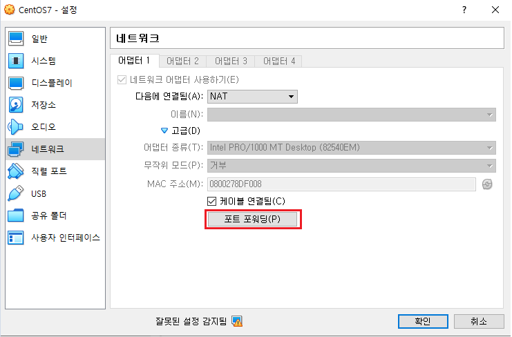
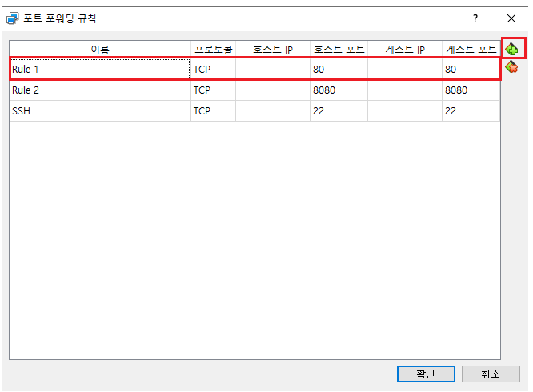
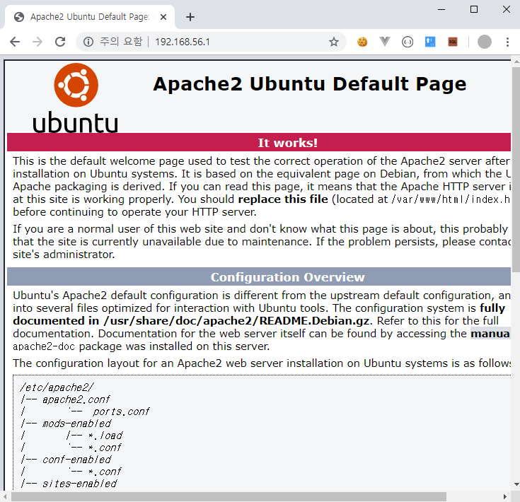
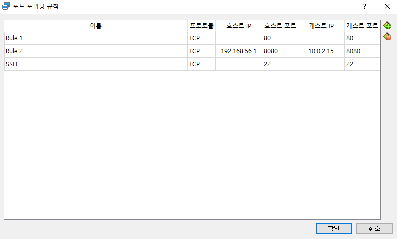
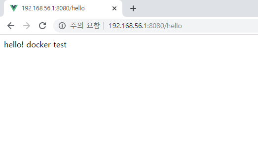

참고 : 
https://imasoftwareengineer.tistory.com/40

http://containertutorials.com/docker-compose/spring-boot-app.html

https://github.com/spring-guides/gs-spring-boot-docker/tree/master/complete

https://nashorn.tistory.com/entry/Spring-Boot-%EC%96%B4%ED%94%8C%EB%A6%AC%EC%BC%80%EC%9D%B4%EC%85%98%EC%9D%84-Docker%EB%A1%9C-%EB%B0%B0%ED%8F%AC%ED%95%98%EA%B8%B0

https://jinwooe.wordpress.com/2017/06/08/spring-boot-with-docker/

https://gist.github.com/nacyot/8366310

<br>

sample app git
https://github.com/jungeunlee95/spring-docker-test

<Br>

[TOC]

<br>

### 요약

```
container id 확인
# docker container ps -a

container kill
# docker container rm 854

images 확인
# docker images

image 삭제
# docker rmi springboot-docker-test

git pull
# git pull origin jelee03

docker image build
# docker build -t springboot-docker-test .

images 확인
# docker images

8081->8081 포트 포워딩 run
# docker run -p 8081:8081 springboot-docker-test

# 접근 확인
# curl 10.0.2.15:8081/hello
# curl 172.17.0.3:8081/hello

#로컬에서 접근 
http://192.168.56.1:8081/hello
```


<br>

### docker images tag name none 전체 삭제

`[root@localhost spring-docker-test]# docker rmi $(docker images -q)`

<br>

### 도커 파일 만들기

```
# openjdk 8
FROM openjdk:8-jdk-alpine
# image maintainer
LABEL maintainer="f.leeap1004@gmail.com"
# data directory
# Add a volume to /tmp
VOLUME /tmp

# Make port 8080 available to the world outside this container
EXPOSE 8080

# The application's jar file
ARG JAR_FILE=build/libs/springboot-docker-test-0.0.1-SNAPSHOT.jar

# Add the application's jar to the container
ADD ${JAR_FILE} springboot-docker-test.jar

# Run the jar file
ENTRYPOINT ["java","-Djava.security.egd=file:/dev/./urandom","-jar","/springboot-docker-test.jar"]
```

<br>

### linux 도커 이미지 실행

```shell
[root@localhost spring-docker-test]# git pull
remote: Enumerating objects: 19, done.
remote: Counting objects: 100% (19/19), done.
remote: Compressing objects: 100% (7/7), done.
remote: Total 17 (delta 2), reused 17 (delta 2), pack-reused 0
Unpacking objects: 100% (17/17), done.
From https://github.com/jungeunlee95/spring-docker-test
   6889c2f..7600faa  master     -> origin/master
Updating 6889c2f..7600faa
Fast-forward
 .gitignore                                                         |   1 -
 build/classes/java/main/com/test/hello/DockerTestApplication.class | Bin 0 -> 747 bytes
 build/libs/springboot-docker-test-0.0.1-SNAPSHOT.jar               | Bin 0 -> 16714812 bytes
 build/resources/main/application.yml                               |  17 +++++++++++++++++
 build/tmp/bootJar/MANIFEST.MF                                      |   4 ++++
 5 files changed, 21 insertions(+), 1 deletion(-)
 create mode 100644 build/classes/java/main/com/test/hello/DockerTestApplication.class
 create mode 100644 build/libs/springboot-docker-test-0.0.1-SNAPSHOT.jar
 create mode 100644 build/resources/main/application.yml
 create mode 100644 build/tmp/bootJar/MANIFEST.MF
 
[root@localhost spring-docker-test]# ls
Dockerfile  README.md  build  build.gradle  gradle  gradlew  gradlew.bat  settings.gradle  src

[root@localhost spring-docker-test]# docker build -t springboot-docker-test .
Sending build context to Docker daemon 32.02 MB
Step 1/7 : FROM openjdk:8-jdk-alpine
Trying to pull repository docker.io/library/openjdk ... 
8-jdk-alpine: Pulling from docker.io/library/openjdk
e7c96db7181b: Pull complete 
f910a506b6cb: Pull complete 
c2274a1a0e27: Pull complete 
Digest: sha256:94792824df2df33402f201713f932b58cb9de94a0cd524164a0f2283343547b3
Status: Downloaded newer image for docker.io/openjdk:8-jdk-alpine
 ---> a3562aa0b991
Step 2/7 : LABEL maintainer "f.leeap1004@gmail.com"
 ---> Running in 912e55c0c9ed
 ---> a8a62116929b
Removing intermediate container 912e55c0c9ed
Step 3/7 : VOLUME /tmp
 ---> Running in 1989fe73668e
 ---> a1455147aefb
Removing intermediate container 1989fe73668e
Step 4/7 : EXPOSE 8080
 ---> Running in 4e746a39f8e7
 ---> f5aa33687da9
Removing intermediate container 4e746a39f8e7
Step 5/7 : ARG JAR_FILE=build/libs/springboot-docker-test-0.0.1-SNAPSHOT.jar
 ---> Running in b1745b6c270b
 ---> d6c802b525b8
Removing intermediate container b1745b6c270b
Step 6/7 : ADD ${JAR_FILE} springboot-docker-test.jar
 ---> cb4b40fea9cd
Removing intermediate container 5270a4afdf33
Step 7/7 : ENTRYPOINT java -Djava.security.egd=file:/dev/./urandom -jar /springboot-docker-test.jar
 ---> Running in 96388990e194
 ---> dfdfe0e7176a
Removing intermediate container 96388990e194
Successfully built dfdfe0e7176a

[root@localhost spring-docker-test]# docker images
REPOSITORY               TAG                 IMAGE ID            CREATED             SIZE
springboot-docker-test   latest              dfdfe0e7176a        5 seconds ago       122 MB
docker.io/centos         latest              67fa590cfc1c        3 months ago        202 MB
docker.io/openjdk        8-jdk-alpine        a3562aa0b991        6 months ago        105 MB

[root@localhost spring-docker-test]# docker run -p 5000:8000 springboot-docker-test

  .   ____          _            __ _ _
 /\\ / ___'_ __ _ _(_)_ __  __ _ \ \ \ \
( ( )\___ | '_ | '_| | '_ \/ _` | \ \ \ \
 \\/  ___)| |_)| | | | | || (_| |  ) ) ) )
  '  |____| .__|_| |_|_| |_\__, | / / / /
 =========|_|==============|___/=/_/_/_/
 :: Spring Boot ::        (v2.1.3.RELEASE)

2019-12-04 09:29:47.224  INFO 1 --- [           main] com.test.hello.DockerTestApplication     : Starting DockerTestApplication on f80b09deb2b4 with PID 1 (/springboot-docker-test.jar started by root in /)
2019-12-04 09:29:47.229  INFO 1 --- [           main] com.test.hello.DockerTestApplication     : No active profile set, falling back to default profiles: default
2019-12-04 09:29:49.318  INFO 1 --- [           main] o.s.b.w.embedded.tomcat.TomcatWebServer  : Tomcat initialized with port(s): 8080 (http)
2019-12-04 09:29:49.392  INFO 1 --- [           main] o.apache.catalina.core.StandardService   : Starting service [Tomcat]
2019-12-04 09:29:49.393  INFO 1 --- [           main] org.apache.catalina.core.StandardEngine  : Starting Servlet engine: [Apache Tomcat/9.0.16]
2019-12-04 09:29:49.416  INFO 1 --- [           main] o.a.catalina.core.AprLifecycleListener   : The APR based Apache Tomcat Native library which allows optimal performance in production environments was not found on the java.library.path: [/usr/lib/jvm/java-1.8-openjdk/jre/lib/amd64/server:/usr/lib/jvm/java-1.8-openjdk/jre/lib/amd64:/usr/lib/jvm/java-1.8-openjdk/jre/../lib/amd64:/usr/java/packages/lib/amd64:/usr/lib64:/lib64:/lib:/usr/lib]
2019-12-04 09:29:49.589  INFO 1 --- [           main] o.a.c.c.C.[Tomcat].[localhost].[/]       : Initializing Spring embedded WebApplicationContext
2019-12-04 09:29:49.589  INFO 1 --- [           main] o.s.web.context.ContextLoader            : Root WebApplicationContext: initialization completed in 2264 ms
2019-12-04 09:29:49.892  INFO 1 --- [           main] o.s.s.concurrent.ThreadPoolTaskExecutor  : Initializing ExecutorService 'applicationTaskExecutor'
2019-12-04 09:29:50.299  INFO 1 --- [           main] o.s.b.w.embedded.tomcat.TomcatWebServer  : Tomcat started on port(s): 8080 (http) with context path ''
2019-12-04 09:29:50.303  INFO 1 --- [           main] com.test.hello.DockerTestApplication     : Started DockerTestApplication in 3.773 seconds (JVM running for 4.503)
```

container run
`# docker run -it --name "helloApp" springboot-docker-test -p 80:8080`

<br>

리눅스에서접근

```
[root@localhost ~]# curl http://172.17.0.2:8080/hello
hello! docker test
```

<br>

로컬에서 접근 안됨mm 80포트도 안뜸

```
[root@localhost ~]# netstat -anlpt | grep LIST
tcp        0      0 0.0.0.0:22              0.0.0.0:*               LISTEN      1387/sshd           
tcp6       0      0 :::22                   :::*                    LISTEN      1387/sshd  
```

  <br>

80 포트 열기

`iptables -I INPUT 1 -p tcp --dport 80 -j ACCEPT`

<br>

안됨

<br>

다른 도커 실행해보기 (ubuntu 환경)

```shell
$ systemctl status firewalld.service
$ systemctl disable firewalld.service
$ systemctl status firewalld.service
$ sync
$ reboot
$ netstat -anlpt | grep LIST
$ iptables -nvL
$ docker ps
$ docker ps -a

$ docker run -idt -p 80:80 --name ubuntu docker.io/ubuntu

# ubuntu docker 환경
...
    1  apt update
    2  apt upgrade
    3  apt install apache2
    4  service apache2 start
    5  apt install curl
    6  curl localhost
...
```

> 얘도 내부에서는 되는데 호스트pc 80 접근이 안됨..;;

<br>

### 80 포트 접근 해결

네트워크 설정 > 포트포워딩 > 80 rule 추가






### 접근 성공




<br>

근데.. spring은 계속 안됨

 오류원인 예상

```
It's probably because Spring Boot will bind to localhost by default (127.0.0.1). You need to add the following properties to bind to all host (or specify which IP on which to bind):
Spring Boot가 기본적으로 로컬 호스트 (127.0.0.1)에 바인딩되기 때문일 수 있습니다. 모든 호스트에 바인딩하려면 (또는 바인딩 할 IP를 지정하려면) 다음 속성을 추가해야합니다.

> server.address=0.0.0.0 # Bind all
```


다시 빌드해서 올렸는데 안됨;;;

뭔가 원인이 도커파일 설정중에 ([참고](https://gist.github.com/nacyot/8366310))

`EXPOSE 8080` << 이게 의심돼서 이거 삭제하고 다시 띄워봄 

```
EXPOSE 명령은 Docker에게 컨테이너가 런타임에 지정된 네트워크 포트에서 수신 대기 함을 알려줍니다. EXPOSE는 컨테이너의 포트를 호스트가 액세스 할 수있게하지 않습니다.
```

---

참고부분

먼저 Dockerfile에서 포트를 노출시킨다.

```
EXPOSE <CONTAINERPORT>
```

그리고 `docker run` 명령어를 통해서 컨테이너의 포트와 호스트의 포트를 맵핑시킨다.

```
docker run -p $HOSTPORT:$CONTAINERPORT -name CONTAINER -t someimage
```

---


### 띄워놓았던 도커 이미지, 컨테이너 확인 후 삭제 -> 다시 띄우기

```shell
[root@localhost spring-docker-test]# docker images
REPOSITORY               TAG                 IMAGE ID            CREATED             SIZE
springboot-docker-test   latest              61da75dbf5e2        18 hours ago        122 MB
docker.io/ubuntu         latest              775349758637        4 weeks ago         64.2 MB
docker.io/centos         latest              67fa590cfc1c        3 months ago        202 MB
docker.io/openjdk        8-jdk-alpine        a3562aa0b991        6 months ago        105 MB

[root@localhost spring-docker-test]# docker stop 5f2
5f2

[root@localhost spring-docker-test]# docker rm 5f2
5f2

[root@localhost spring-docker-test]# docker container ps
CONTAINER ID        IMAGE               COMMAND             CREATED             STATUS              PORTS                NAMES
b0f066a2e5aa        docker.io/ubuntu    "/bin/bash"         7 hours ago         Up 7 hours          0.0.0.0:80->80/tcp   ubuntu

[root@localhost spring-docker-test]# docker images
REPOSITORY               TAG                 IMAGE ID            CREATED             SIZE
springboot-docker-test   latest              61da75dbf5e2        18 hours ago        122 MB
docker.io/ubuntu         latest              775349758637        4 weeks ago         64.2 MB
docker.io/centos         latest              67fa590cfc1c        3 months ago        202 MB
docker.io/openjdk        8-jdk-alpine        a3562aa0b991        6 months ago        105 MB

[root@localhost spring-docker-test]# docker container ps -a
CONTAINER ID        IMAGE               COMMAND             CREATED             STATUS                      PORTS                NAMES
b0f066a2e5aa        docker.io/ubuntu    "/bin/bash"         7 hours ago         Up 7 hours                  0.0.0.0:80->80/tcp   ubuntu
3b21a2c13b30        centos              "/bin/bash"         3 months ago        Exited (127) 3 months ago                        wizardly_cori
67ad92eccb8f        centos              "/bin/bash"         3 months ago        Exited (130) 3 months ago                        cocky_spence

[root@localhost spring-docker-test]# docker build -t springboot-docker-test .
Sending build context to Docker daemon 77.12 MB
Step 1/6 : FROM openjdk:8-jdk-alpine
 ---> a3562aa0b991
Step 2/6 : LABEL maintainer "f.leeap1004@gmail.com"
 ---> Running in 6803e1594ae3
 ---> a861d3879547
Removing intermediate container 6803e1594ae3
Step 3/6 : VOLUME /tmp
 ---> Running in b60ad2beff6d
 ---> 9e40e4f659c7
Removing intermediate container b60ad2beff6d
Step 4/6 : ARG JAR_FILE=build/libs/springboot-docker-test-0.0.1-SNAPSHOT.jar
 ---> Running in 2b577ba78a05
 ---> 4f47f061f743
Removing intermediate container 2b577ba78a05
Step 5/6 : ADD ${JAR_FILE} springboot-docker-test.jar
 ---> c7b53e0f40f2
Removing intermediate container c7b825dd3222
Step 6/6 : ENTRYPOINT java -Djava.security.egd=file:/dev/./urandom -jar /springboot-docker-test.jar
 ---> Running in d278f98ab344
 ---> f20e8349d6ae
Removing intermediate container d278f98ab344
Successfully built f20e8349d6ae

[root@localhost spring-docker-test]# docker images
REPOSITORY               TAG                 IMAGE ID            CREATED             SIZE
springboot-docker-test   latest              f20e8349d6ae        5 seconds ago       122 MB
docker.io/ubuntu         latest              775349758637        4 weeks ago         64.2 MB
docker.io/centos         latest              67fa590cfc1c        3 months ago        202 MB
docker.io/openjdk        8-jdk-alpine        a3562aa0b991        6 months ago        105 MB

[root@localhost spring-docker-test]# docker run -p 8081:8081 springboot-docker-test

  .   ____          _            __ _ _
 /\\ / ___'_ __ _ _(_)_ __  __ _ \ \ \ \
( ( )\___ | '_ | '_| | '_ \/ _` | \ \ \ \
 \\/  ___)| |_)| | | | | || (_| |  ) ) ) )
  '  |____| .__|_| |_|_| |_\__, | / / / /
 =========|_|==============|___/=/_/_/_/
 :: Spring Boot ::        (v2.1.3.RELEASE)

2019-12-05 08:19:22.775  INFO 1 --- [           main] com.test.hello.DockerTestApplication     : Starting DockerTestApplication on 2a912804acfd with PID 1 (/springboot-docker-test.jar started by root in /)
2019-12-05 08:19:22.779  INFO 1 --- [           main] com.test.hello.DockerTestApplication     : No active profile set, falling back to default profiles: default
2019-12-05 08:19:24.572  INFO 1 --- [           main] o.s.b.w.embedded.tomcat.TomcatWebServer  : Tomcat initialized with port(s): 8080 (http)
2019-12-05 08:19:24.627  INFO 1 --- [           main] o.apache.catalina.core.StandardService   : Starting service [Tomcat]
2019-12-05 08:19:24.630  INFO 1 --- [           main] org.apache.catalina.core.StandardEngine  : Starting Servlet engine: [Apache Tomcat/9.0.16]
2019-12-05 08:19:24.648  INFO 1 --- [           main] o.a.catalina.core.AprLifecycleListener   : The APR based Apache Tomcat Native library which allows optimal performance in production environments was not found on the java.library.path: [/usr/lib/jvm/java-1.8-openjdk/jre/lib/amd64/server:/usr/lib/jvm/java-1.8-openjdk/jre/lib/amd64:/usr/lib/jvm/java-1.8-openjdk/jre/../lib/amd64:/usr/java/packages/lib/amd64:/usr/lib64:/lib64:/lib:/usr/lib]
2019-12-05 08:19:24.767  INFO 1 --- [           main] o.a.c.c.C.[Tomcat].[localhost].[/]       : Initializing Spring embedded WebApplicationContext
2019-12-05 08:19:24.768  INFO 1 --- [           main] o.s.web.context.ContextLoader            : Root WebApplicationContext: initialization completed in 1914 ms
2019-12-05 08:19:25.116  INFO 1 --- [           main] o.s.s.concurrent.ThreadPoolTaskExecutor  : Initializing ExecutorService 'applicationTaskExecutor'
2019-12-05 08:19:25.586  INFO 1 --- [           main] o.s.b.w.embedded.tomcat.TomcatWebServer  : Tomcat started on port(s): 8080 (http) with context path ''
2019-12-05 08:19:25.593  INFO 1 --- [           main] com.test.hello.DockerTestApplication     : Started DockerTestApplication in 3.511 seconds (JVM running for 4.224)
2019-12-05 08:23:30.644  INFO 1 --- [0.0-8080-exec-1] o.a.c.c.C.[Tomcat].[localhost].[/]       : Initializing Spring DispatcherServlet 'dispatcherServlet'
2019-12-05 08:23:30.644  INFO 1 --- [0.0-8080-exec-1] o.s.web.servlet.DispatcherServlet        : Initializing Servlet 'dispatcherServlet'
2019-12-05 08:23:30.653  INFO 1 --- [0.0-8080-exec-1] o.s.web.servlet.DispatcherServlet        : Completed initialization in 9 ms

```

<br>

### 접근

```shell
# network 설정 확인
[root@localhost ~]# docker inspect 2a
[
    {
        "Id": "2a912804acfd9839fd45bf99cfbbd122af32cb1eaedc06736ca92af119f35631",
        "Created": "2019-12-05T08:19:20.545913399Z",
        "Path": "java",
        "Args": [
            "-Djava.security.egd=file:/dev/./urandom",
            "-jar",
            "/springboot-docker-test.jar"
        ],
        "State": {
            "Status": "running",
            "Running": true,
            "Paused": false,
            "Restarting": false,
            "OOMKilled": false,
            "Dead": false,
            "Pid": 15461,
            "ExitCode": 0,
            "Error": "",
            "StartedAt": "2019-12-05T08:19:21.364250888Z",
            "FinishedAt": "0001-01-01T00:00:00Z"
        },
        "Image": "sha256:f20e8349d6ae3e2520781aaf2657a08eb9ec6251f5c8bba8ca5f0435271ee708",
        "ResolvConfPath": "/var/lib/docker/containers/2a912804acfd9839fd45bf99cfbbd122af32cb1eaedc06736ca92af119f35631/resolv.conf",
        "HostnamePath": "/var/lib/docker/containers/2a912804acfd9839fd45bf99cfbbd122af32cb1eaedc06736ca92af119f35631/hostname",
        "HostsPath": "/var/lib/docker/containers/2a912804acfd9839fd45bf99cfbbd122af32cb1eaedc06736ca92af119f35631/hosts",
        "LogPath": "",
        "Name": "/cranky_pasteur",
        "RestartCount": 0,
        "Driver": "overlay2",
        "MountLabel": "system_u:object_r:svirt_sandbox_file_t:s0:c35,c812",
        "ProcessLabel": "system_u:system_r:svirt_lxc_net_t:s0:c35,c812",
        "AppArmorProfile": "",
        "ExecIDs": null,
        "HostConfig": {
            "Binds": null,
            "ContainerIDFile": "",
            "LogConfig": {
                "Type": "journald",
                "Config": {}
            },
            "NetworkMode": "default",
            "PortBindings": {
                "8080/tcp": [
                    {
                        "HostIp": "",
                        "HostPort": "8080"
                    }
                ]
            },
            "RestartPolicy": {
                "Name": "no",
                "MaximumRetryCount": 0
            },
            "AutoRemove": false,
            "VolumeDriver": "",
            "VolumesFrom": null,
            "CapAdd": null,
            "CapDrop": null,
            "Dns": [],
            "DnsOptions": [],
            "DnsSearch": [],
            "ExtraHosts": null,
            "GroupAdd": null,
            "IpcMode": "",
            "Cgroup": "",
            "Links": null,
            "OomScoreAdj": 0,
            "PidMode": "",
            "Privileged": false,
            "PublishAllPorts": false,
            "ReadonlyRootfs": false,
            "SecurityOpt": null,
            "UTSMode": "",
            "UsernsMode": "",
            "ShmSize": 67108864,
            "Runtime": "docker-runc",
            "ConsoleSize": [
                0,
                0
            ],
            "Isolation": "",
            "CpuShares": 0,
            "Memory": 0,
            "NanoCpus": 0,
            "CgroupParent": "",
            "BlkioWeight": 0,
            "BlkioWeightDevice": null,
            "BlkioDeviceReadBps": null,
            "BlkioDeviceWriteBps": null,
            "BlkioDeviceReadIOps": null,
            "BlkioDeviceWriteIOps": null,
            "CpuPeriod": 0,
            "CpuQuota": 0,
            "CpuRealtimePeriod": 0,
            "CpuRealtimeRuntime": 0,
            "CpusetCpus": "",
            "CpusetMems": "",
            "Devices": [],
            "DiskQuota": 0,
            "KernelMemory": 0,
            "MemoryReservation": 0,
            "MemorySwap": 0,
            "MemorySwappiness": -1,
            "OomKillDisable": false,
            "PidsLimit": 0,
            "Ulimits": null,
            "CpuCount": 0,
            "CpuPercent": 0,
            "IOMaximumIOps": 0,
            "IOMaximumBandwidth": 0
        },
        "GraphDriver": {
            "Name": "overlay2",
            "Data": {
                "LowerDir": "/var/lib/docker/overlay2/cbadf634af097be75d7eabb4972104af8e797fdc68016f6f541246208522163d-init/diff:/var/lib/docker/overlay2/ce750588471ba26c7399d24fb58e790dba3bd7de67a3d54f60e6a2e282cc3fbc/diff:/var/lib/docker/overlay2/cf321e07a4b616486eeaee470179f3fdd48afb6d209e9704daa72541ab51628c/diff:/var/lib/docker/overlay2/7d9ac89f6953e53470d261994aaba1ed8e7b5894db7528d8e983b3c9d7be1032/diff:/var/lib/docker/overlay2/f0f1fb40a1e2588e8165fbb7155b3322b95e13ffcfc9d734b1085c4c65a14c09/diff",
                "MergedDir": "/var/lib/docker/overlay2/cbadf634af097be75d7eabb4972104af8e797fdc68016f6f541246208522163d/merged",
                "UpperDir": "/var/lib/docker/overlay2/cbadf634af097be75d7eabb4972104af8e797fdc68016f6f541246208522163d/diff",
                "WorkDir": "/var/lib/docker/overlay2/cbadf634af097be75d7eabb4972104af8e797fdc68016f6f541246208522163d/work"
            }
        },
        "Mounts": [
            {
                "Type": "volume",
                "Name": "6d5ea2a4890a1c4d2f77ade556909805b6ed2b8289e47e7ca8bc18dd97930c39",
                "Source": "/var/lib/docker/volumes/6d5ea2a4890a1c4d2f77ade556909805b6ed2b8289e47e7ca8bc18dd97930c39/_data",
                "Destination": "/tmp",
                "Driver": "local",
                "Mode": "",
                "RW": true,
                "Propagation": ""
            }
        ],
        "Config": {
            "Hostname": "2a912804acfd",
            "Domainname": "",
            "User": "",
            "AttachStdin": false,
            "AttachStdout": true,
            "AttachStderr": true,
            "ExposedPorts": {
                "8080/tcp": {}
            },
            "Tty": false,
            "OpenStdin": false,
            "StdinOnce": false,
            "Env": [
                "PATH=/usr/local/sbin:/usr/local/bin:/usr/sbin:/usr/bin:/sbin:/bin:/usr/lib/jvm/java-1.8-openjdk/jre/bin:/usr/lib/jvm/java-1.8-openjdk/bin",
                "LANG=C.UTF-8",
                "JAVA_HOME=/usr/lib/jvm/java-1.8-openjdk",
                "JAVA_VERSION=8u212",
                "JAVA_ALPINE_VERSION=8.212.04-r0"
            ],
            "Cmd": null,
            "ArgsEscaped": true,
            "Image": "springboot-docker-test",
            "Volumes": {
                "/tmp": {}
            },
            "WorkingDir": "",
            "Entrypoint": [
                "java",
                "-Djava.security.egd=file:/dev/./urandom",
                "-jar",
                "/springboot-docker-test.jar"
            ],
            "OnBuild": null,
            "Labels": {
                "maintainer": "f.leeap1004@gmail.com"
            }
        },
        "NetworkSettings": {
            "Bridge": "",
            "SandboxID": "8dea07c0db5c37ff646832f569664ef664c912a667b0f7fd612373f64e28897b",
            "HairpinMode": false,
            "LinkLocalIPv6Address": "",
            "LinkLocalIPv6PrefixLen": 0,
            "Ports": {
                "8080/tcp": [
                    {
                        "HostIp": "0.0.0.0",
                        "HostPort": "8080"
                    }
                ]
            },
            "SandboxKey": "/var/run/docker/netns/8dea07c0db5c",
            "SecondaryIPAddresses": null,
            "SecondaryIPv6Addresses": null,
            "EndpointID": "fd66868a57a7a87381d4f8494a9bafc8da2f8a9ad229ee16d11fd1e8342933de",
            "Gateway": "172.17.0.1",
            "GlobalIPv6Address": "",
            "GlobalIPv6PrefixLen": 0,
            "IPAddress": "172.17.0.3",
            "IPPrefixLen": 16,
            "IPv6Gateway": "",
            "MacAddress": "02:42:ac:11:00:03",
            "Networks": {
                "bridge": {
                    "IPAMConfig": null,
                    "Links": null,
                    "Aliases": null,
                    "NetworkID": "61f10b6931f0d8f27f8d2b1858f2b8b9f767e2e6af755559239eba586e56e755",
                    "EndpointID": "fd66868a57a7a87381d4f8494a9bafc8da2f8a9ad229ee16d11fd1e8342933de",
                    "Gateway": "172.17.0.1",
                    "IPAddress": "172.17.0.3",
                    "IPPrefixLen": 16,
                    "IPv6Gateway": "",
                    "GlobalIPv6Address": "",
                    "GlobalIPv6PrefixLen": 0,
                    "MacAddress": "02:42:ac:11:00:03"
                }
            }
        }
    }
]

# 띄워진 포트 확인
[root@localhost ~]# netstat -anlpt | grep LIST
tcp        0      0 0.0.0.0:22              0.0.0.0:*               LISTEN      1215/sshd           
tcp6       0      0 :::8080                 :::*                    LISTEN      15432/docker-proxy- 
tcp6       0      0 :::80                   :::*                    LISTEN      11167/docker-proxy- 
tcp6       0      0 :::22                   :::*                    LISTEN      1215/sshd 

# 도커 프로세스 확인
[root@localhost ~]# docker ps -a
CONTAINER ID        IMAGE                    COMMAND                  CREATED             STATUS                      PORTS                    NAMES
2a912804acfd        springboot-docker-test   "java -Djava.secur..."   9 minutes ago       Up 9 minutes                0.0.0.0:8080->8080/tcp   cranky_pasteur
b0f066a2e5aa        docker.io/ubuntu         "/bin/bash"              8 hours ago         Up 8 hours                  0.0.0.0:80->80/tcp       ubuntu
3b21a2c13b30        centos                   "/bin/bash"              3 months ago        Exited (127) 3 months ago                            wizardly_cori
67ad92eccb8f        centos                   "/bin/bash"              3 months ago        Exited (130) 3 months ago                            cocky_spence

# 도커 내부 접근
[root@localhost ~]# curl 172.17.0.3:8080/hello
hello! docker test

# 게스트 ip 접근
[root@localhost ~]# curl 10.0.2.15:8080/hello
hello! docker test
```


### 로컬 접근 허용하기

host ip > get ip

로컬에서 버추얼박스에서 사용하는 네트워크 어댑터를 NAT로 설정

이것도 어떻게보면 그 도커 -p 8080:8080 이거랑 같은 개념이라고 생각하는게 편함




### 접근




