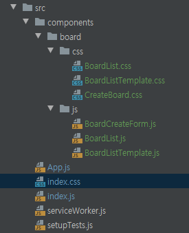
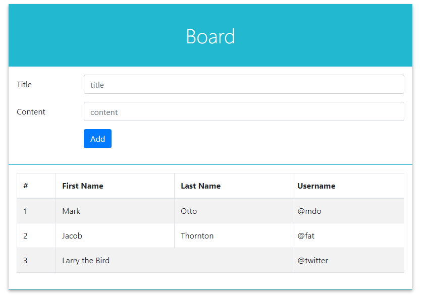

[TOC]

---

## 기본 게시판

### [1] bootstrap 설치

```shell
# yarn add install react-bootstrap bootstrap
```

<br>

### [2] `src/index.js` file import

```js
import 'bootstrap/dist/css/bootstrap.css';
```

<br>

### [3] 프로젝트 구조



<br>

### [4] App.js (최상위)

```js
import React, { Component } from 'react';
import BoardListTemplate from './components/board/js/BoardListTemplate';
import BoardList from './components/board/js/BoardList';
import BoardCreateForm from './components/board/js/BoardCreateForm';

class App extends Component {
  render() {
    return (
        <BoardListTemplate table={<BoardList/>} form={<BoardCreateForm/>}>
          BoardListTemplate
        </BoardListTemplate>
    );
  }
}

export default App;
```

<br>

### [5] BoardListTemplate.js

```js
import React from 'react';
import '../css/BoardListTemplate.css';

const BoardListTemplate = (props) => {
    return (
        <main className="board-list-template">
            <div className="title">
                Board
            </div>
            <section className="form-wrapper">
                { props.form }
            </section>
            <section className="form-wrapper">
                { props.table }
            </section>
        </main>
    );
};

export default BoardListTemplate;
```

**BoardListTemplate.css**

```css
.board-list-template {
    background: white;
    width: 800px;
    box-shadow: 0 3px 6px rgba(0,0,0,0.16), 0 3px 6px rgba(0,0,0,0.23); /* 그림자 */
    margin: 0 auto; /* 페이지 중앙 정렬 */
    margin-top: 4rem;
}

.title {
    padding: 2rem;
    font-size: 2.5rem;
    text-align: center;
    font-weight: 100;
    background: #22b8cf;;
    color: white;
}

.form-wrapper {
    padding: 1rem;
    border-bottom: 1px solid #22b8cf;
}

.boards-wrapper {
    min-height: 5rem;
}
```

<br>

### [6] form, table components

**BoardList.js**

```js
import React from 'react';
import '../css/BoardList.css';
import { Table } from 'react-bootstrap';

const BoardList = ({value, onChange, onCreate, onKeyPress}) => {
    return (
        <Table striped bordered>
            <thead>
            <tr>
                <th>#</th>
                <th>First Name</th>
                <th>Last Name</th>
                <th>Username</th>
            </tr>
            </thead>
            <tbody>
            <tr>
                <td>1</td>
                <td>Mark</td>
                <td>Otto</td>
                <td>@mdo</td>
            </tr>
            <tr>
                <td>2</td>
                <td>Jacob</td>
                <td>Thornton</td>
                <td>@fat</td>
            </tr>
            <tr>
                <td>3</td>
                <td colSpan="2">Larry the Bird</td>
                <td>@twitter</td>
            </tr>
            </tbody>
        </Table>
    );
};

export default BoardList;
```

**BoardCreateForm.js**

```js
import React from 'react';
import '../css/CreateBoard.css';
import { Form, Col, Row, Button } from 'react-bootstrap';

const BoardCreateForm = ({value, onChange, onCreate, onKeyPress}) => {
    return (
        <div>
            <Form>
                <Form.Group as={Row} controlId="formPlaintextEmail">
                    <Form.Label column sm="2">
                        Title
                    </Form.Label>
                    <Col sm="10">
                        <Form.Control type="text" placeholder="title" />
                    </Col>
                </Form.Group>

                <Form.Group as={Row} controlId="formPlaintextPassword">
                    <Form.Label column sm="2">
                        Content
                    </Form.Label>
                    <Col sm="10">
                        <Form.Control type="text" placeholder="content" />
                    </Col>
                </Form.Group>

                <Form.Group as={Row}>
                    <Col sm={{ span: 10, offset: 2 }}>
                        <Button type="submit">Add</Button>
                    </Col>
                </Form.Group>

            </Form>
        </div>
    );
};

export default BoardCreateForm;
```




