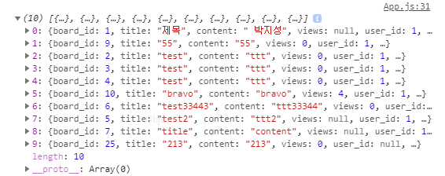

[TOC]

---

### [1] axios 설치

```shell
# yarn add axios
```

<br>

### [2] template

**api/board.js**

```js
import axios from 'axios';

export function getBoards(param) {
    return axios.get('http://127.0.0.1:8080/boards/2', {
        params: param
    });
}

export function postBoard(body) {
    return axios.post('http://127.0.0.1:8080/boards', body)
}
```

<br>

### [3] call

```js
import React, {Component} from 'react';
import BoardListTemplate from './components/board/js/BoardListTemplate';
import BoardList from './components/board/js/BoardList';
import BoardCreateForm from './components/board/js/BoardCreateForm';

import * as boardsApi from './api/board'

class App extends Component {

    state = {
        boards: []
    }

    callBoardList = async () => {
        const obj = this
        boardsApi.getBoards().then(function (response) {
                obj.setState({boards: response.data._embedded.boardList})
            }
        ).catch(e => {
            console.log(e)
        });
    }

    componentDidMount() {
        this.callBoardList()
    }

    render() {
        const { boards } = this.state.boards
        console.log(this.state.boards)
        return (
            <BoardListTemplate table={<BoardList boards={boards}/>} form={<BoardCreateForm/>}>
                BoardListTemplate
            </BoardListTemplate>
        );
    }
}

export default App;
```



