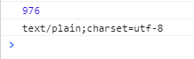

## javascript blob

- https://m.blog.naver.com/PostView.nhn?blogId=horajjan&logNo=220976788530&proxyReferer=https%3A%2F%2Fwww.google.com%2F
- https://iamawebdeveloper.tistory.com/106

파일 저장 시 사용한 `new Blob`

-   Blob은 일련의 데이터를 처리하거나 간접 참조하는 객체

- Blob은 불투명(opaque) 타입 (대형 이진 객체(Binary Large Object)를 의미)

- 오직 데이터 사이즈와 MIME 타입만 알 수 있다.

  ```
  - MIME 타입이란 클라이언트에게 전송된 문서의 다양성을 알려주기 위한 메커니즘 
  - 웹에서 파일의 확장자는 별  의미가 없기 때문에 각 문서와 함께 올바른 MIME 타입을 전송하도록, 서버가 정확히 설정하는 것이 중요. 
  - 브라우저들은 리소스를 내려받았을 때 해야 할 기본 동작이 무엇인지를 결정하기 위해 대게 MIME 타입을 사용.
  - 수 많은 종류의 문서가 있으므로 많은 MIME 타입들이 존재. 
  
  MIME 타입 참고
  1. https://developer.mozilla.org/ko/docs/Web/HTTP/Basics_of_HTTP/MIME_types
  2. https://developer.mozilla.org/en-US/docs/Web/HTTP/Basics_of_HTTP/MIME_types/Complete_list_of_MIME_types
  ```

- Blob의 일부를 Blob으로 다루기 위한 메서드가 하나 존재한다. (slice)


<br>

### test

```js
import testText from 'raw-loader!./test.txt'

...

const blob = new Blob([testText], {type: "text/plain;charset=utf-8"})
console.log(blob.size)
console.log(blob.type)
saveAs(blob, "test.txt")
```



<br>

### slice

```js
var blob = ... 

//Blob의 바이트 단위 크기
blob.size

//Blob의 MIME 타입을 저장하거나, 알 수 없으면 ""를 저장한다.
blob.type

//Blob의 첫 1킬로바이트를 텍스트로 가져온다.
var subblob = blob.slice(0, 1024, "text/plain");

//Blob의 마지막 1킬로바이트를 타입 없이 가져온다.
var last = blob.slice(blob.size - 1024, 1024);
```

