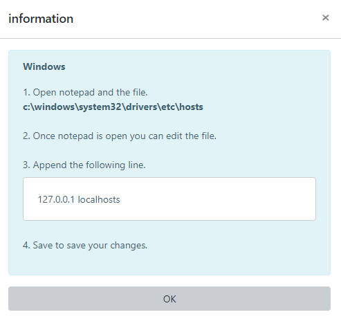

### vue bootstrap modal footer 제거 `hide-footer`



```html
<b-button class="mt-1" size="sm" variant="light btn-border" @click="openInfo">
</b-button>

<b-modal title="information" v-model="info" id="info-modal" hide-footer>
    <b-alert show variant="info">
        <p class="font-weight-bold">Windows</p>
        1. Open notepad and the file.<br>
        <b>c:\windows\system32\drivers\etc\hosts</b><br><br>
        2. Once notepad is open you can edit the file.<br><br>
        3. Append the following line.<br>
        <b-card class="mt-2">
            127.0.0.1 localhosts
        </b-card>
        4. Save to save your changes. <br><br>
    </b-alert>
    <b-button class="mt-3" block @click="$bvModal.hide('info-modal')">OK</b-button>
</b-modal>
```

```js
export default {
    name: "Test",
    data () {
        return {
            info: false
        }
    },
    methods: {
        openInfo() {
            this.info = true
        }
    }
}
```

