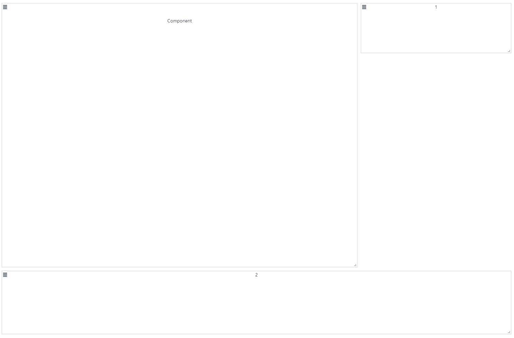

[TOC]


---

docs: https://jbaysolutions.github.io/vue-grid-layout/guide/

github: https://github.com/jbaysolutions/vue-grid-layout/tree/2.1.3

----

## npm

`npm i vue-grid-layout@2.3.7 -S`

----

## Example

### html

```html
  <div>
    <grid-layout
      :layout.sync="layout"
      :col-num="10"
      :row-height="30"
      :is-draggable="true"
      :is-resizable="true"
      :is-mirrored="false"
      :vertical-compact="true"
      :margin="[10, 10]"
      :use-css-transforms="true"
    >

      <grid-item v-for="item in layout"
                 :static="item.static"
                 :x="item.x"
                 :y="item.y"
                 :w="item.w"
                 :h="item.h"
                 :i="item.i"
                 :key="item.i"
                 drag-allow-from=".vue-draggable-handle"
                 drag-ignore-from=".no-drag"
      >
        <template>
          <div class="vue-draggable-handle">
            <font-awesome-icon icon="align-justify" class="pointer ml-1 fa-1x" style="cursor: move;"></font-awesome-icon>
          </div>
          <div class="no-drag">
            <component v-if="item.isComponent" :is="item.c"></component>
            <span v-else>{{item.i}}</span>
          </div>
        </template>
      </grid-item>
    </grid-layout>
  </div>
```

### script

```js

import VueGridLayout from 'vue-grid-layout'
import TestComponent from '@/components/TestComponent'
export default {
    name: 'Test',
    components: {
        GridLayout: VueGridLayout.GridLayout,
        GridItem: VueGridLayout.GridItem, 
        TestComponent
    },
    data: function () {
        return {
      layout: [
        {'x': 0, 'y': 0, 'w': 7, 'h': 20, 'i': '0', 'c': 'TestComponent', isComponent: true, static: false},
        {'x': 7, 'y': 0, 'w': 3, 'h': 4, 'i': '1', static: false},
        {'x': 0, 'y': 1, 'w': 10, 'h': 5, 'i': '2', static: false}
      ]
        }
    }
}
```

### style

```css
.vue-grid-item:not(.vue-grid-placeholder) {
    border: 1px solid rgba(173, 173, 173, 0.53);
}
.vue-grid-item .resizing {
    opacity: 0.9;
}
.vue-grid-item .text {
    font-size: 24px;
    text-align: center;
    position: absolute;
    top: 0;
    bottom: 0;
    left: 0;
    right: 0;
    margin: auto;
    height: 100%;
    width: 100%;
}
.vue-grid-item .no-drag {
    height: 100%;
    width: 100%;
}
.vue-grid-item .minMax {
    font-size: 12px;
}
.vue-grid-item .add {
    cursor: pointer;
}
.vue-draggable-handle {
    position: absolute;
    width: 20px;
    height: 20px;
    top: 0;
    left: 0;
    background-position: bottom right;
    padding: 0 8px 8px 0;
    background-repeat: no-repeat;
    background-origin: content-box;
    box-sizing: border-box;
    cursor: pointer;
}
.vue-grid-item .no-drag {
    height: 100%;
    width: 100%;
}
```


