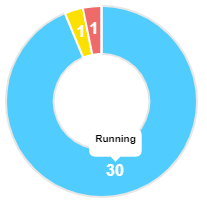

[TOC]

<br>

**sample**



**chartjs**

```
docs: https://www.chartjs.org/docs/latest/configuration/tooltip.html
```

**chartjs-plugin-datalabels**

```
docs: https://chartjs-plugin-datalabels.netlify.app/guide/getting-started.html#installation
demo: https://codesandbox.io/s/5kvll0xqyl?file=/src/App.vue
sample: https://quickchart.io/documentation/chart-js/custom-pie-doughnut-chart-labels/

npm install vue-chartjs --save
npm install chart.js --save
npm install chartjs-plugin-datalabels --save
```

<br>

### How To Use

**main.js**

> 라이브러리 추가

```js
import ChartJsPluginDataLabels from 'chartjs-plugin-datalabels'
Vue.use(ChartJsPluginDataLabels)
```

<br>

**parent vue**

```js
            labels: ['Running', 'Pending', 'Failed', 'Succeeded'],
            backgroundColor: [
                '#63c2de', // blue
                '#ffe100', // yellow
                '#f86c6b', // red
                '#4dbd74', // green
            ],
            data: [30, 1, 1, 0],
```

<br>

**component vue (chart)**

```html
<script>
    import {Doughnut} from 'vue-chartjs'

    export default {
        extends: Doughnut,
        props: {labels: Array, datasets: Array, backgroundColor: Array, data: Array},
        methods: {
            renderLineChart () {
                this.renderChart({
                    labels: this.labels,
                    datasets: [
                        {
                            backgroundColor: this.backgroundColor,
                            data: this.data
                        }
                    ]
                }, {
                    responsive: true,
                    maintainAspectRatio: false,
                    legend: {
                        display: false
                    },
                    tooltips: {
                        position: 'average',
                        callbacks: {
                            title: function(tooltipItem, data) {
                                return data['labels'][tooltipItem[0]['index']];
                            },
                            label: function() {
                                return
                            }
                        },
                        backgroundColor: '#FFF',
                        titleFontSize: 10,
                        titleFontColor: '#000',
                        displayColors: false,
                        caretPadding: 10
                    },
                    plugins: {
                        datalabels: {
                            color: 'white',
                            textAlign: 'center',
                            font: {
                                weight: "bold",
                                size: 16
                            },
                            formatter (value) {
                                if (value === 0) return ''
                                return value
                            }
                        }
                    }
                })
            }
        },
        watch: {
            data: function () {
                this.renderLineChart()
            }
        }
    }
</script>

```

