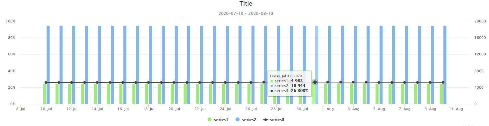

```js
data: function () {
    return {
        chartOptions: {
            time: {
                useUTC: true
            },
            chart: {
                zoomType: 'xy'
            },
            title: {
                text: ''
            },
            tooltip: {
                shared: true
            },
            subtitle: {
                text: ''
            },
            xAxis: {
                type: 'datetime',
                minPadding: 0.05,
                maxPadding: 0.05
            },
            yAxis: [{
                max: 100,
                min: 0,
                labels: {
                    format: '{value}%'
                },
                title: {
                    text: ''
                }
            }, {
                min: 0,
                title: {
                    text: ''
                },
                labels: {
                    format: '{value}'
                },
                opposite: true
            }],
            series: []
        }
    }
}    
```

<br>

```js
Api.get(this.url, queryParam).then(function (response) {
    const series = []
    if (response.status === 200) {
        const datas = response.data._embedded.datas
        for (let i = 0; i < datas.length; i++) {
            const tempSeries = {data: datas[i].data, name: datas[i].name, tooltip: {valueSuffix: ''}}
            if (tempSeries.name === 'series1') {
                tempSeries['type'] = 'column'
                tempSeries['yAxis'] = 1
                tempSeries['zIndex'] = 0
                tempSeries['color'] = 'rgb(124, 181, 236)'
                tempSeries['legendIndex'] = 2
            } else if (tempSeries.name === 'series2') {
                tempSeries['type'] = 'column'
                tempSeries['yAxis'] = 1
                tempSeries['zIndex'] = 0
                tempSeries['color'] = 'rgb(144, 237, 125)'
                tempSeries['legendIndex'] = 1
            } else {
                tempSeries['zIndex'] = 1
                tempSeries['color'] = 'rgb(67, 67, 72)'
                tempSeries['tooltip']['valueSuffix'] = '%'
                tempSeries['legendIndex'] = 3
            }
            series.push(tempSeries)
        }
        obj.chartOptions.series = series
    }
}).catch(function (error) {
    console.log(error)
})
}
```

