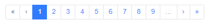

**ref**

```
https://bootstrap-vue.js.org/docs/components/pagination-nav/
```

<br>

### `:limit`



<br>

**Example**

properties

| name             | description                    |
| ---------------- | ------------------------------ |
| align            | align                          |
| v-model          | binding with current page data |
| :linkGen         | linkGen                        |
| :number-of-pages | total page count               |
| @input           | new list (call api)            |
| use-router       | use router                     |
| limit            | visible page                   |

```html
<template>
  <div>
      <b-pagination-nav 
                        align="center" 
                        v-model="currentPage" 
                        :linkGen="linkGen" 
                        :number-of-pages="page.totalPages" 
                        @input="getNewPageList" 
                        :limit="10"
                        use-router>
      </b-pagination-nav>
  </div>
</template>

<script>
import axios from 'axios'

export default {
    data() { 
        return {
            keyword: 'aaa',
            currentPage: 1,
            pageSize: 10,
            bootstrapPaginationClasses: {
                ul: 'pagination',
                li: 'page-item',
                liActive: 'active',
                liDisable: 'disabled',
                button: 'page-link'
            }
        }
    },
    methods: {
        getNewPageList () {
            let obj = this
            axios.get('baseUrl/list', obj.getSearchParam()).then(function (response) {
                if (response.status === 200) {
                   alert('success')
                }
            }).catch(function (error) {
                console.log(error)
            })
        },
        getSearchParam () {
            let params = {
                size: this.pageSize,
                page: this.currentPage
            }
            return params
        },
        linkGen (pageNum) {
            return {
                path: '/path',
                query: {
                    keyword: this.keyword,
                    page: pageNum
                }
            }
        },
        searchKeyword () {
            this.currentPage = 1
            this.$router.push({
                path: '/path',
                query: {
                    keyword: this.keyword,
                    page: this.currentPage
                }
            }).catch(err => err)
            this.getNewPageList()
        },
        checkEnterKeyEvent (e) {
            if (e.keyCode === 13) this.getNewPageList()
        }
    }
}
</script>
```

