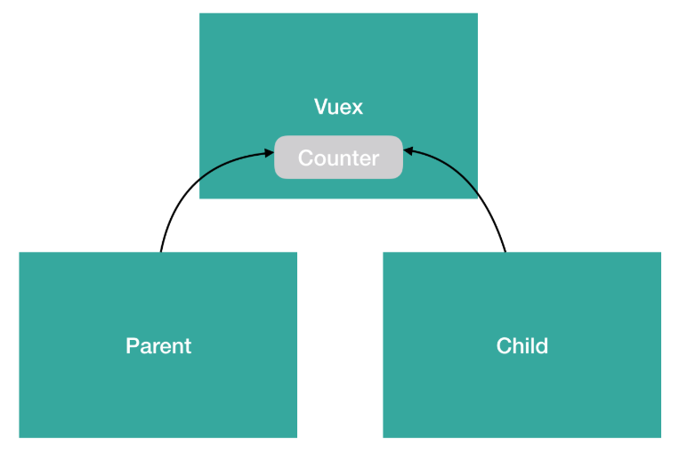

## npm 설치
`npm install vuex --save`

<br>

## store.js 파일 만들기
> 관례상 Vuex 를 등록할 js 파일은 store.js 이름을 쓴다.
```js
// store.js
import Vue from 'vue'
import Vuex from 'vuex'

Vue.use(Vuex);

export const store = new Vuex.Store({
  //
});

```
<br>

## main.js에 vuex 파일 등록
```js
// main.js
import Vue from 'vue'
import App from './App.vue'
// store.js 를 불러와
import { store } from './store'

new Vue({
  el: '#app',
  // Vue 인스턴스에 등록한다.
  store,
  render: h => h(App)
})
```
<br>

## store에 데이터 등록
> vuex를 통해 중앙 저장 공간에서 관리할 stroe에 데이터 등록하기

> stroe.js에 사용할 data를 등록하면 된다.
```js
// store.js
import Vue from 'vue'
import Vuex from 'vuex'

Vue.use(Vuex);

export const store = new Vuex.Store({
  // counter 라는 state 속성을 추가
  state: {
    counter: 0
  },
});
```
> `state` 는 컴포넌트 간에 공유할 data 속성을 의미한다

<br>

## state 접근
state 에 등록한 {데이터} 를 앱에서 접근하려면 `this.$store.state.{데이터}`로 접근할 수 있다.
```html
<template>
    <div id="app">
        Parent counter : {{ this.$store.state.counter }} <br>
        <button @click="addCounter">+</button>
        <button @click="subCounter">-</button>
    </div>
</template>
<script>
    export default {
        // 기존 코드
        // data () {
        //   return {
        //     counter: 0
        //   }
        // },
        methods: {
            addCounter() {
            this.$store.state.counter++;
            },
            subCounter() {
            this.$store.state.counter--;
            }
        }
    }
</script>
```


---

counter 라는 데이터를 Vuex 에 state 로 넘겨주면서 data 가 Vuex 로 갔기 때문에, 

모든 컴포넌트의 `this.$store.state.counter`는  Vuex 의 state(counter)를 바라본다. 

**따라서, Vuex 라는 저장소의 데이터를 모든 컴포넌트들이 동일한 조건에서 접근하여 사용하게 된다.**



---


