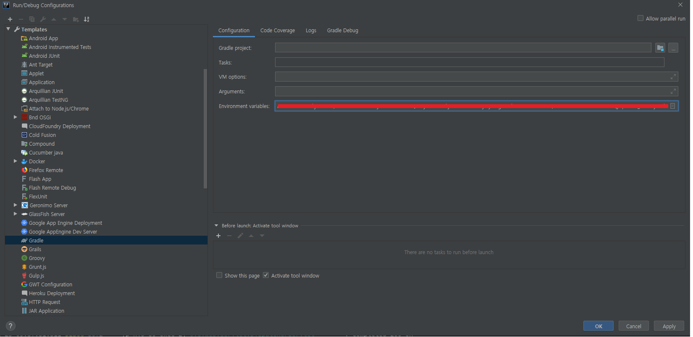

> run > edit configurations > templates > gradle > environment variables 에 등록
>
> ex) AAA-TOKEN=ABCDEFG1234;BBB-TOKEN=ABCDEFG1234;

<br>

**application.yml**

```yaml
spring :
  profiles: local
  host: test-token.com
  aaa-token: ${AAA-TOKEN}
  bbb-token: ${BBB-TOKEN}
```

<br>

**java class fields**

```java
    @Value("${spring.aaa-token}")
    private String AAA_TOKEN;

    @Value("${spring.bbb-token}")
    private String BBB_TOKEN;
```

