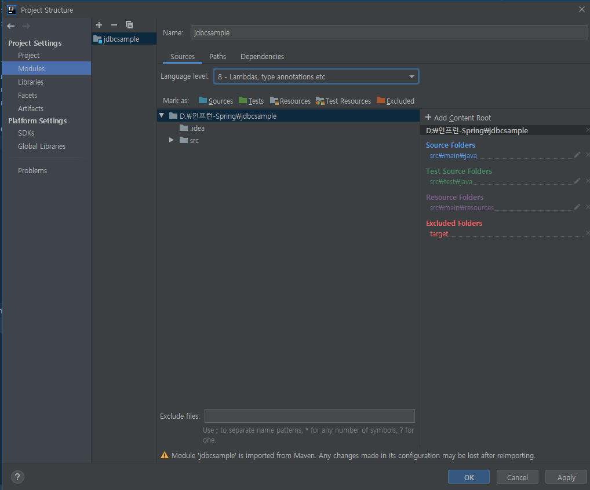
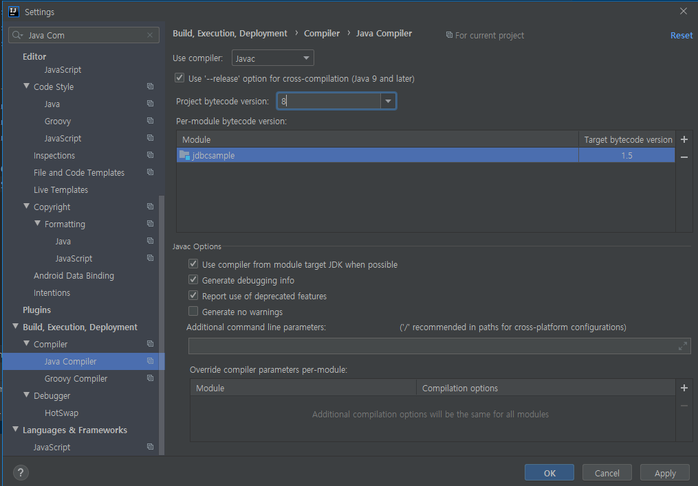
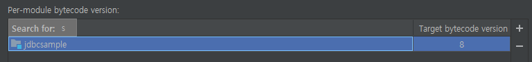
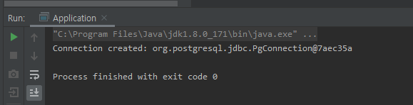
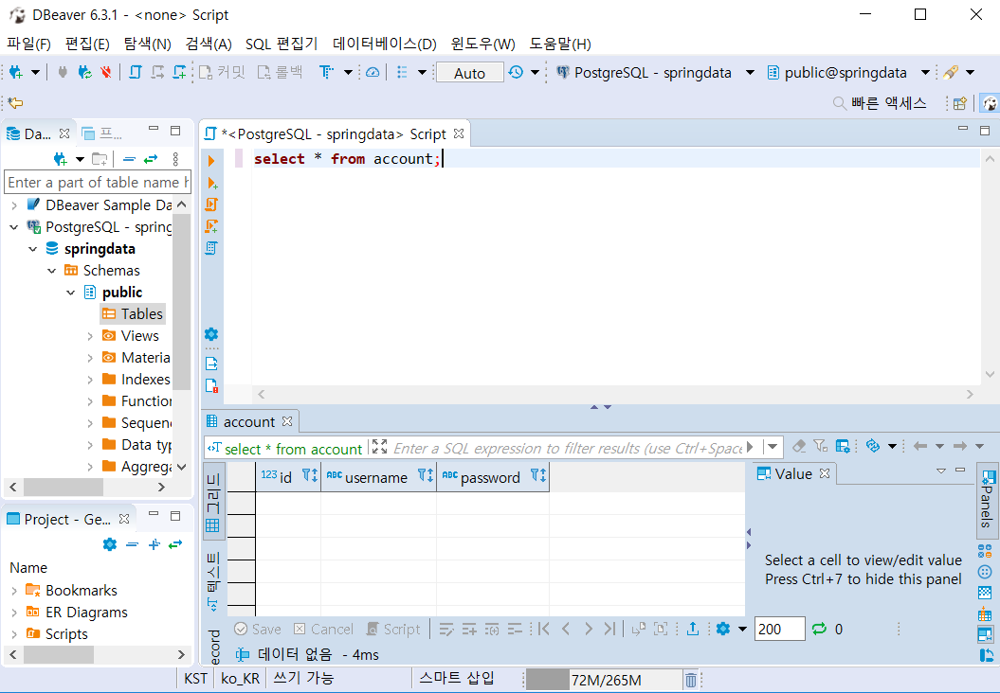
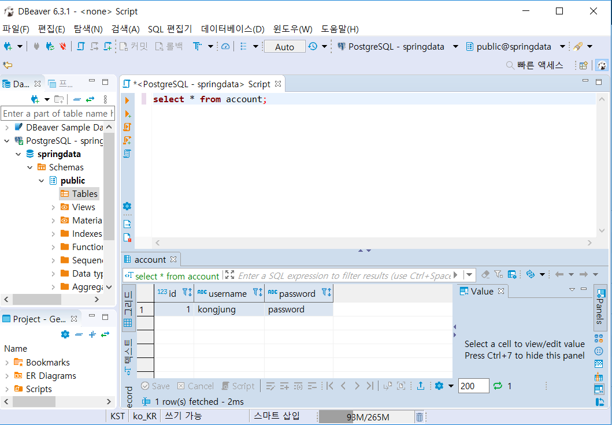

[TOC]

---

## maven pom.xml 추가

```xml
    <dependencies>
        <dependency>
            <groupId>org.postgresq;</groupId>
            <artifactId>postgresql</artifactId>
            <version>42.2.2</version>
        </dependency>
    </dependencies>
```

---

## intellij settings



> Module language level 8로 변경

---

## JDBC TEST

**Application.java**

```java
package com.kongjung;

import java.sql.Connection;
import java.sql.DriverManager;
import java.sql.SQLException;

public class Application {
    public static void main(String[] args) throws SQLException {
        String url  = "jdbc:postgresql://localhost:5432/springdata";
        String username = "root";
        String password = "root";

        try(Connection connection = DriverManager.getConnection(url, username, password)) {
            System.out.println("Connection created: " + connection);
        }
    }
}
```

---

error

```
Error:java: javacTask: source release 1.8 requires target release 1.8
```

**해결**





- **File > Settings > Build, Execution, Deployment > Java Compiler**에서 **project bytecodec version**을 설정
- Per-module bytecode version에서 특정 프로젝트의 Target bytecode version을 설정

---

## 연결 성공!



---

## CREATE TABLE

```java
public class Application {
    public static void main(String[] args) throws SQLException {
        String url  = "jdbc:postgresql://localhost:5432/springdata";
        String username = "root";
        String password = "root";

        try(Connection connection = DriverManager.getConnection(url, username, password)) {
            System.out.println("Connection created: " + connection);
            String sql = "CREATE TABLE ACCOUNT (id int, username varchar(255), password varchar(255));";
            try(PreparedStatement statement = connection.prepareStatement((sql))){
                statement.execute();
            }
        }
    }
}
```

### dockser container에서 확인

```powershell
springdata=# select * from account;
 id | username | password
----+----------+----------
(0 rows)
```

### window dbeaver에서 확인



---

## INSERT TABLE

```java
public class Application {
    public static void main(String[] args) throws SQLException {
        String url  = "jdbc:postgresql://localhost:5432/springdata";
        String username = "root";
        String password = "root";

        try(Connection connection = DriverManager.getConnection(url, username, password)) {
            System.out.println("Connection created: " + connection);
            String sql = "INSERT INTO ACCOUNT VALUES(1, 'kongjung', 'password');";
            try(PreparedStatement statement = connection.prepareStatement((sql))){
                statement.execute();
            }
        }
    }
}
```

### dockser container에서 확인

```powershell
springdata=# select * from account;
 id | username | password
----+----------+----------
  1 | kongjung | password
(1 row)
```

### window dbeaver에서 확인




