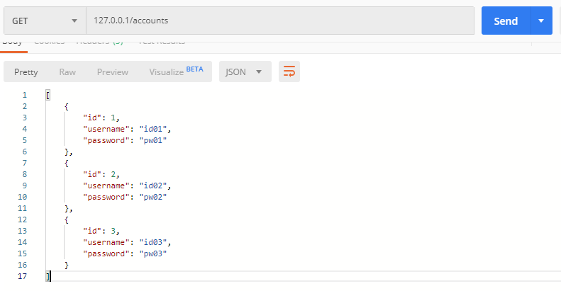

[TOC]

---

## build.gradle

```yml
plugins {
	id 'org.springframework.boot' version '2.2.4.RELEASE'
	id 'io.spring.dependency-management' version '1.0.9.RELEASE'
	id 'java'
}

group = 'com.test'
version = '0.0.1-SNAPSHOT'
sourceCompatibility = '11'

configurations {
	developmentOnly
	runtimeClasspath {
		extendsFrom developmentOnly
	}
	compileOnly {
		extendsFrom annotationProcessor
	}
}

repositories {
	mavenCentral()
}

dependencies {
	implementation 'org.springframework.boot:spring-boot-starter-data-jpa'
	implementation 'org.springframework.boot:spring-boot-starter-web'
	implementation group: 'org.mariadb.jdbc', name: 'mariadb-java-client'
	compileOnly 'org.projectlombok:lombok'
	annotationProcessor 'org.projectlombok:lombok'
	developmentOnly 'org.springframework.boot:spring-boot-devtools'
	testImplementation('org.springframework.boot:spring-boot-starter-test') {
		exclude group: 'org.junit.vintage', module: 'junit-vintage-engine'
	}
	compile group: 'com.fasterxml.jackson.jaxrs', name: 'jackson-jaxrs-json-provider', version: '2.10.1'
}

test {
	useJUnitPlatform()
}

```

---

## application.yml

```yml
server:
  port: 80

spring:
  devtools:
    livereload:
      enabled: true
  profiles:
    active: local
  jpa:
    hibernate:
      ddl-auto: create

---

spring:
  profiles: local
  datasource:
    url: jdbc:mariadb://localhost:3306/test
    username: root
    password: root
    driver-class-name: org.mariadb.jdbc.Driver
```

---

## JPA test data 

**Account**

```java
import javax.persistence.Entity;
import javax.persistence.GeneratedValue;
import javax.persistence.Id;

@Entity
public class Account {

    @Id
    @GeneratedValue
    private Long id;

    private String username;

    private String password;

    public Long getId() {
        return id;
    }

    public void setId(Long id) {
        this.id = id;
    }

    public String getUsername() {
        return username;
    }

    public void setUsername(String username) {
        this.username = username;
    }

    public String getPassword() {
        return password;
    }

    public void setPassword(String password) {
        this.password = password;
    }
}
```


**JPARunner**

```java
import org.springframework.boot.ApplicationArguments;
import org.springframework.boot.ApplicationRunner;
import org.springframework.stereotype.Component;

import javax.persistence.EntityManager;
import javax.persistence.PersistenceContext;
import javax.transaction.Transactional;

@Transactional
@Component
public class JPARunner implements ApplicationRunner {

    @PersistenceContext
    EntityManager entityManager;

    @Override
    public void run(ApplicationArguments args){

        Account account1 = new Account();
        account1.setUsername("id01");
        account1.setPassword("pw01");
        entityManager.persist(account1);

        Account account2 = new Account();
        account2.setUsername("id02");
        account2.setPassword("pw02");
        entityManager.persist(account2);

        Account account3 = new Account();
        account3.setUsername("id03");
        account3.setPassword("pw03");
        entityManager.persist(account3);

    }

}
```

---

## Controller

```java
import org.springframework.beans.factory.annotation.Autowired;
import org.springframework.web.bind.annotation.GetMapping;
import org.springframework.web.bind.annotation.RequestMapping;
import org.springframework.web.bind.annotation.RestController;

import java.util.List;

@RestController
@RequestMapping(produces = { "application/hal+json" })
public class AccountController {

    @Autowired
    private AccountService accountService;

    @GetMapping("/accounts")
    public List<Account> getAccounts () {
        List<Account> accounts = accountService.getAccounts();
        return accounts;
    }

}
```

---

## AccountService

```java
import org.springframework.beans.factory.annotation.Autowired;
import org.springframework.stereotype.Service;

import java.util.List;

@Service
public class AccountService {

    @Autowired
    private AccountRepository accountRepository;

    public List<Account> getAccounts() {
        return accountRepository.findAll();
    }

}
```

---

## AccountRepository

```java
import org.springframework.data.jpa.repository.JpaRepository;
import org.springframework.stereotype.Repository;

@Repository
public interface AccountRepository extends JpaRepository<Account, Long> {
}
```





