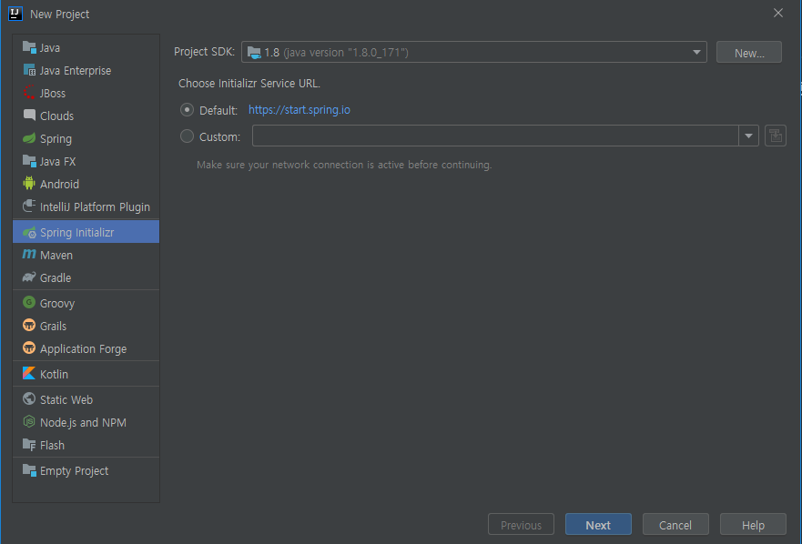
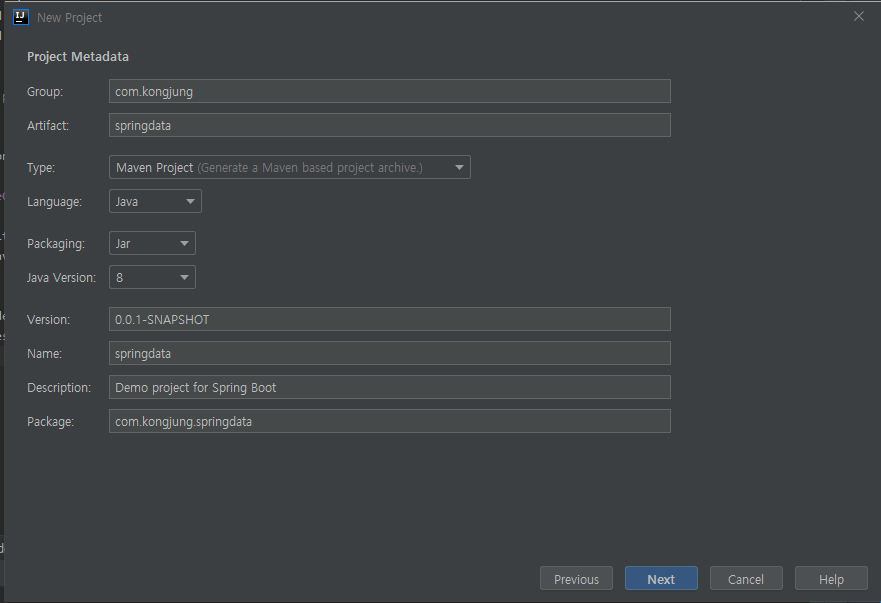
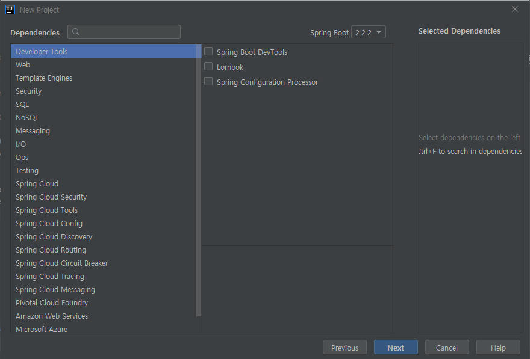
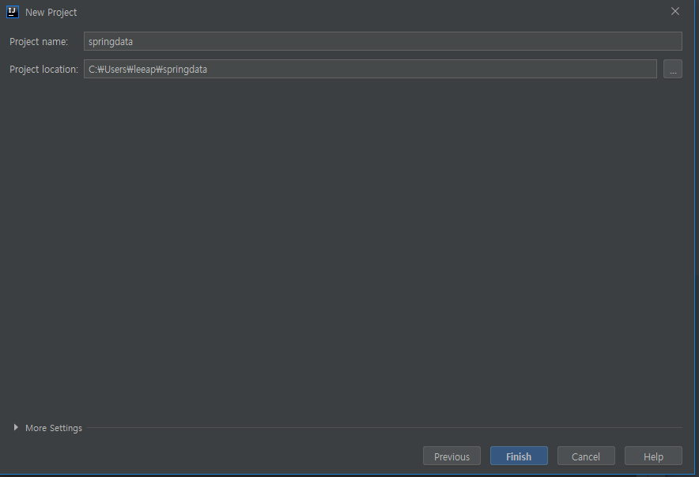

[TOC]

---

### 프로젝트 세팅









<br>

### docker postgres run

`docker ps -a`

`docker start postgres_boot`

`docker exec -i -t postgres_boot /bin/bash`

<br>

### jpa dependency 

**pom.xml**

```xml
<dependency>
    <groupId>org.springframework.boot</groupId>
    <artifactId>spring-boot-starter-data-jpa</artifactId>
</dependency>

<dependency>
    <groupId>org.postgresql</groupId>
    <artifactId>postgresql</artifactId>
</dependency>
```

<br>

### application.properties 

```properties
spring.datasource.url=jdbc:postgresql://localhost:5432/springdata
spring.datasource.username=root
spring.datasource.password=root

spring.jpa.hibernate.ddl-auto=create  # validate가 적합함
spring.jpa.properties.hibernate.jdbc.lob.non_contextual_creation=true
```

<br>

### domain

> getter. setter -> alt + insert

```java
package com.kongjung.springdata.domain;

import javax.persistence.Entity;
import javax.persistence.GeneratedValue;
import javax.persistence.Id;

@Entity
public class Account {
    @Id // PK
    @GeneratedValue //자동으로 생성되는 값을 사용
    private Long id;

    private String username;

    private String password;

    public Long getId() {
        return id;
    }

    public void setId(Long id) {
        this.id = id;
    }

    public String getUsername() {
        return username;
    }

    public void setUsername(String username) {
        this.username = username;
    }

    public String getPassword() {
        return password;
    }

    public void setPassword(String password) {
        this.password = password;
    }
}
```

<br>

### runner

> override -> ctrl+ o

```java
package com.kongjung.springdata.runner;

import com.kongjung.springdata.domain.Account;
import org.springframework.boot.ApplicationArguments;
import org.springframework.boot.ApplicationRunner;
import org.springframework.stereotype.Component;

import javax.persistence.EntityManager;
import javax.persistence.PersistenceContext;
import javax.transaction.Transactional;

@Transactional
@Component
public class JPARunner implements ApplicationRunner {
    @PersistenceContext
    EntityManager entityManager;

    @Override
    public void run(ApplicationArguments args) throws Exception {
        Account account = new Account();
        account.setUsername("kongkung");
        account.setPassword("1234");
        entityManager.persist(account); //영속화
    }
}
```

Session

```java
package com.kongjung.springdata.runner;

@Component
@Transactional
public class JPARunner implements ApplicationRunner {
    @PersistenceContext
    EntityManager entityManager;

    @Override
    public void run(ApplicationArguments args) throws Exception {
        Account account = new Account();
        account.setUsername("kongkung");
        account.setPassword("1234!");

        Session session = entityManager.unwrap(Session.class);
        session.save(account);
    }
}
```


