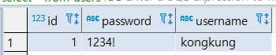
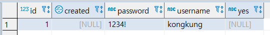
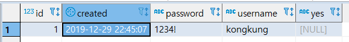

[TOC]

---

## 아주아주 기본적인 Annotation

### @Entity

● “엔티티”는 객체 세상에서 부르는 이름.
● 보통 클래스와 같은 이름을 사용하기 때문에 값을 변경하지 않음.
● 엔티티의 이름은 JQL에서 쓰임.

```
@Table ?
● “릴레이션" 세상에서 부르는 이름.
● @Entity의 이름이 기본값.
● 테이블의 이름은 SQL에서 쓰임.
```

**`@Entity` 어노테이션에 name을 지정할 수 있음**

> 실제 db 테이블명과 매핑
>
> ex) `user`는 테이블 특정 db에서 key값으로 잡고있기 때문에 테이블 명으로 사용이 불가능한 경우가 있음
>
> ```java
> package com.kongjung.springdata.domain;
> 
> import javax.persistence.Entity;
> import javax.persistence.GeneratedValue;
> import javax.persistence.Id;
> 
> @Entity(name="users")
> public class User {
>     @Id
>     @GeneratedValue
>     private Long id;
> 
>     private String username;
> 
>     private String password;
> 
>     public Long getId() {
>         return id;
>     }
> 
>     public void setId(Long id) {
>         this.id = id;
>     }
> 
>     public String getUsername() {
>         return username;
>     }
> 
>     public void setUsername(String username) {
>         this.username = username;
>     }
> 
>     public String getPassword() {
>         return password;
>     }
> 
>     public void setPassword(String password) {
>         this.password = password;
>     }
> }
> ```
>
> `select * from users;`
>
> 

<br>

### domain field type

What? long vs Long 인 경우

How? 보통 wrapper를 사용

why? 새로들어가는 로우와 기존 로우의 완벽한 구분을 위해. long인 경우 0으로 들어가지만 Long인 경우 null로 들어가니까

<br>

### @GeneratedValue
● 주키의 생성 방법을 맵핑하는 애노테이션
● 생성 전략과 생성기를 설정할 수 있다.
	○ 기본 전략은 AUTO: 사용하는 DB에 따라 적절한 전략 선택
	○ TABLE, SEQUENCE, IDENTITY 중 하나.

<br>

### @Column

```java
@Target({ElementType.METHOD, ElementType.FIELD})
@Retention(RetentionPolicy.RUNTIME)
public @interface Column {
    String name() default "";

    boolean unique() default false;

    boolean nullable() default true;

    boolean insertable() default true;

    boolean updatable() default true;

    String columnDefinition() default "";

    String table() default "";

    int length() default 255;

    int precision() default 0;

    int scale() default 0;
}
```

<br>

### @Temporal

```java
@Temporal(TemporalType.TIMESTAMP)
private Date created;
```

<br>

### @Transient

● 컬럼으로 맵핑하고 싶지 않은 멤버 변수에 사용.

<br>

## Annotation test

```java
package com.kongjung.springdata.domain;

@Entity
public class Account {
    @Id // PK
    @GeneratedValue //자동으로 생성되는 값을 사용
    private Long id;

    @Column(nullable = false, unique = true)
    private String username;

    private String password;

    @Temporal(TemporalType.TIMESTAMP)
    private Date created;

    private String yes;

    @Transient
    private String no;

    public Long getId() {
        return id;
    }

    public void setId(Long id) {
        this.id = id;
    }

    public String getUsername() {
        return username;
    }

    public void setUsername(String username) {
        this.username = username;
    }

    public String getPassword() {
        return password;
    }

    public void setPassword(String password) {
        this.password = password;
    }
}
```



### insert created time

```java
    @Temporal(TemporalType.TIMESTAMP)
    private Date created = new Date();
```



<br>

### sql 확인 -> application.properties 추가

```properties
spring.jpa.show-sql=true
spring.jpa.properties.hibernate.format_sql=true
```

console

```
Hibernate: 
    
    drop table if exists account cascade
Hibernate: 
    
    drop sequence if exists hibernate_sequence
Hibernate: create sequence hibernate_sequence start 1 increment 1
Hibernate: 
    
    create table account (
       id int8 not null,
        created timestamp,
        password varchar(255),
        username varchar(255) not null,
        yes varchar(255),
        primary key (id)
    )
Hibernate: 
    
    alter table if exists account 
       add constraint UK_gex1lmaqpg0ir5g1f5eftyaa1 unique (username)
       
       
Hibernate: 
    select
        nextval ('hibernate_sequence')
Hibernate: 
    insert 
    into
        account
        (created, password, username, yes, id) 
    values
        (?, ?, ?, ?, ?)
```


