Spring Project

New - Dynamic Web Project

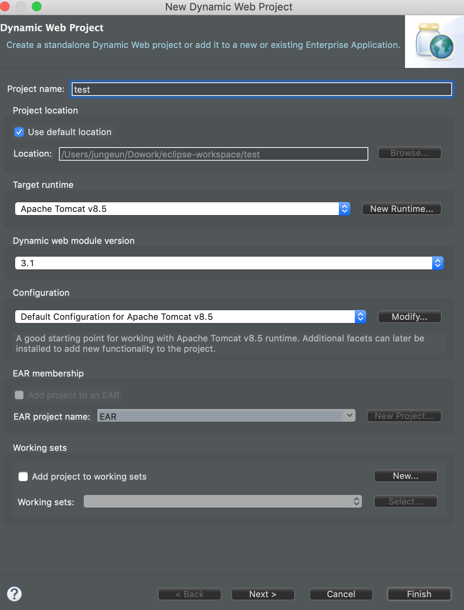

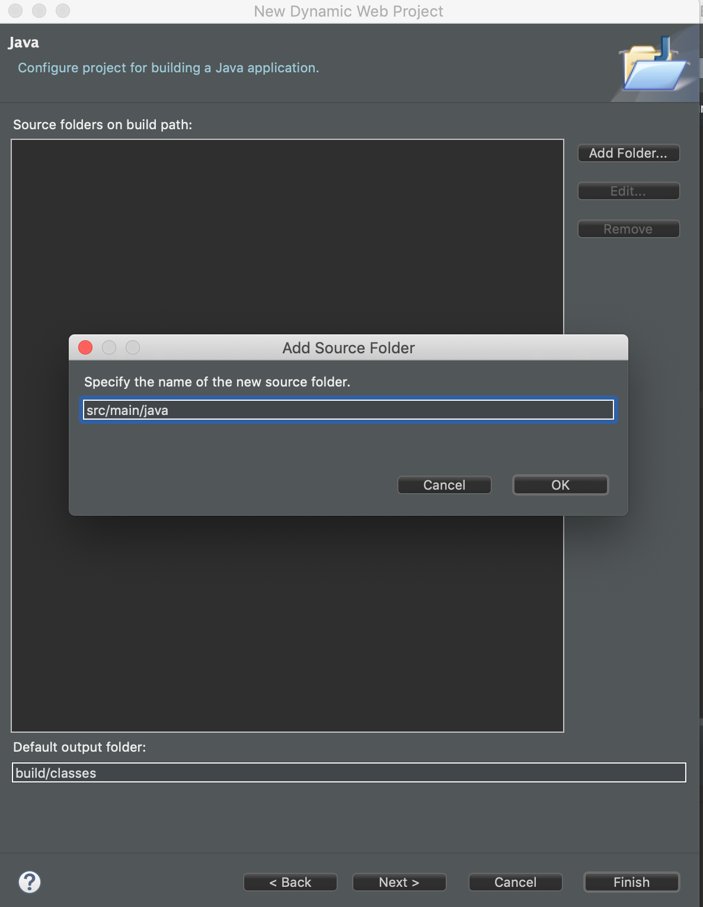

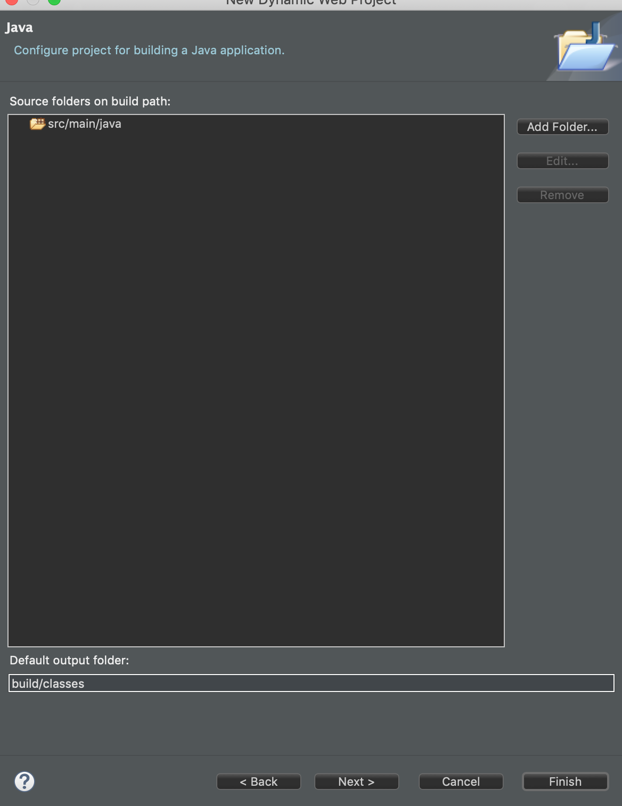

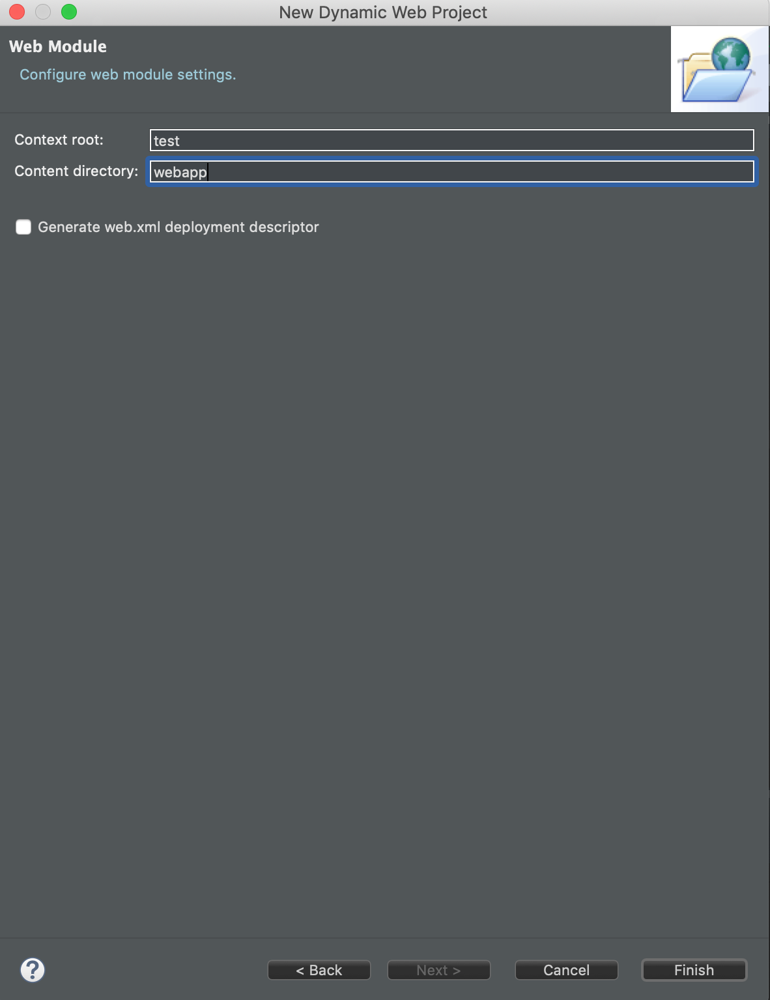

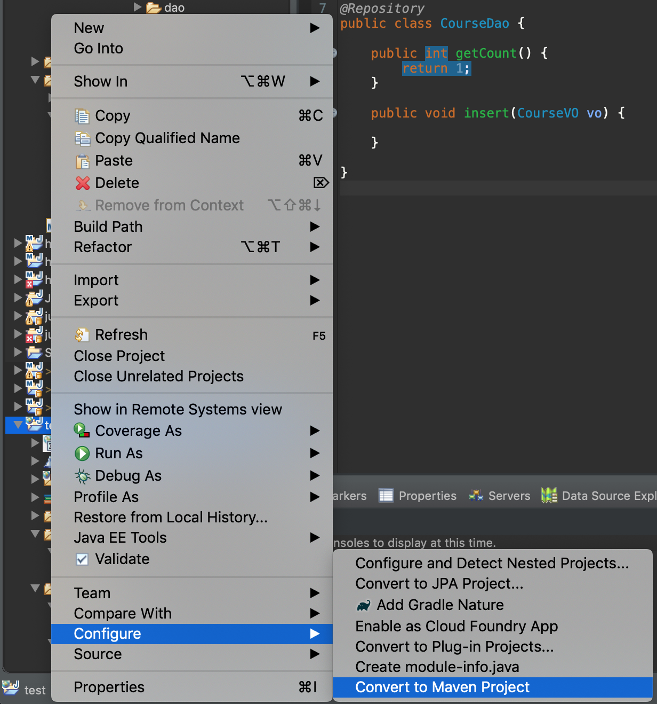

**pom.xml** 추가

```java
	<properties>
		<org.springframework-version>4.2.1.RELEASE</org.springframework-version>
	</properties>
	
	<!-- library 설정( Depnedency 설정 ) -->
	<dependencies>
		<!-- spring core -->
		<dependency>
			<groupId>org.springframework</groupId>
			<artifactId>spring-context</artifactId>
			<version>${org.springframework-version}</version>
		</dependency>

		<!-- spring web -->
		<dependency>
			<groupId>org.springframework</groupId>
			<artifactId>spring-web</artifactId>
			<version>${org.springframework-version}</version>
		</dependency>

		<!--  spring mvc -->
		<dependency>
			<groupId>org.springframework</groupId>
			<artifactId>spring-webmvc</artifactId>
			<version>${org.springframework-version}</version>
		</dependency>

	</dependencies>
```

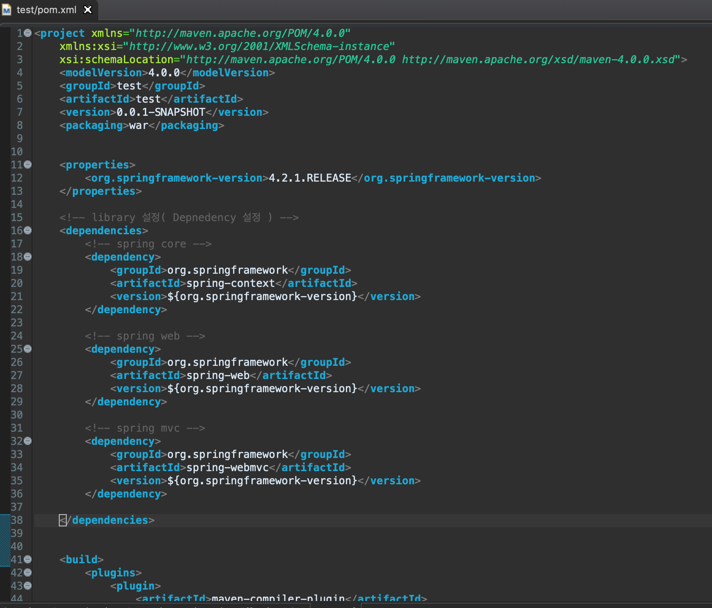

---

WEB-INF

applicationContext.xml

Spring-servlet.xml

web.xml

views/     # jsp file dir

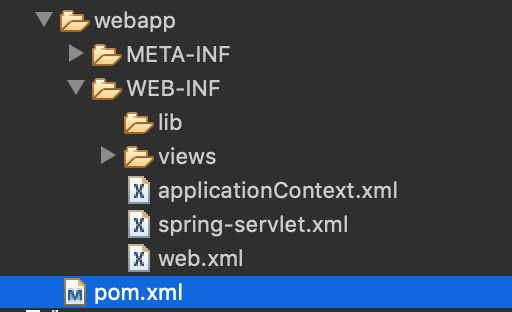

**spring-servlet.xml** controller 연결

```xml
<?xml version="1.0" encoding="UTF-8"?>
<beans xmlns:xsi="http://www.w3.org/2001/XMLSchema-instance"
	xmlns:aop="http://www.springframework.org/schema/aop"
	xmlns="http://www.springframework.org/schema/beans"
	xmlns:p="http://www.springframework.org/schema/p"
	xmlns:context="http://www.springframework.org/schema/context"
	xsi:schemaLocation="http://www.springframework.org/schema/mvc http://www.springframework.org/schema/mvc/spring-mvc-3.1.xsd
	http://www.springframework.org/schema/aop http://www.springframework.org/schema/aop/spring-aop.xsd
	http://www.springframework.org/schema/beans http://www.springframework.org/schema/beans/spring-beans-3.1.xsd
	http://www.springframework.org/schema/context http://www.springframework.org/schema/context/spring-context-3.1.xsd"
	xmlns:mvc="http://www.springframework.org/schema/mvc">

	<!-- annotation 설정을 하겠다. -->
	<context:annotation-config />

	<!-- 패키지 com.test.board.controller 밑에 있는 클래스 중에 @Controller를 달고 
		있는 클래스의 객체를 생성 하겠다. -->
	<context:component-scan
		base-package="com.test.board.controller" />
</beans>
```


---

Src/main/java

-service, controller, vo, dao 

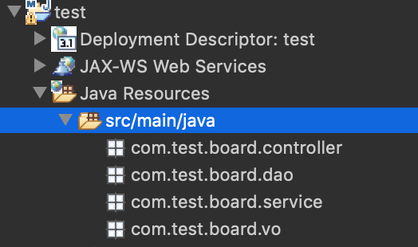

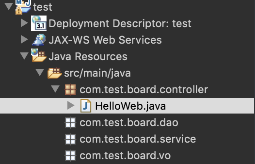

**HelloWeb.java**

```java
package com.test.board.controller;

import org.springframework.stereotype.Controller;
import org.springframework.web.bind.annotation.RequestMapping;

@Controller
public class HelloWeb {
	
	@RequestMapping("/hello")
	public String helloWeb() {
		
		return "/WEB-INF/views/helloWeb.jsp";
	}

}
```

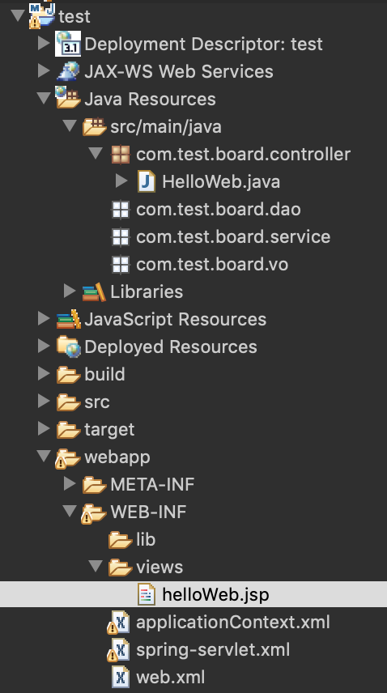

**helloWeb.jsp**

```html
<%@ page language="java" contentType="text/html; charset=UTF-8"
    pageEncoding="UTF-8"%>
<!DOCTYPE html>
<html>
<head>
<meta charset="UTF-8">
<title>Insert title here</title>
</head>
<body>
	<h1>Hello Web!</h1>
</body>
</html>
```

---

runserver!

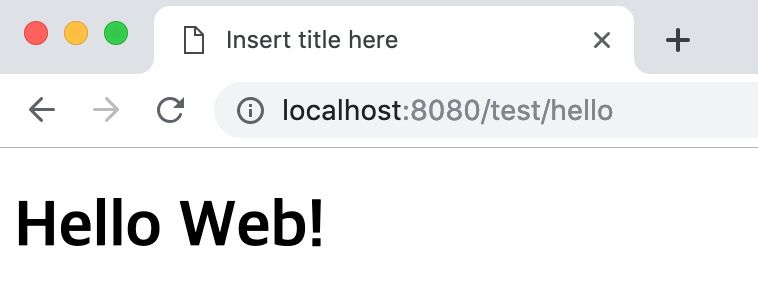