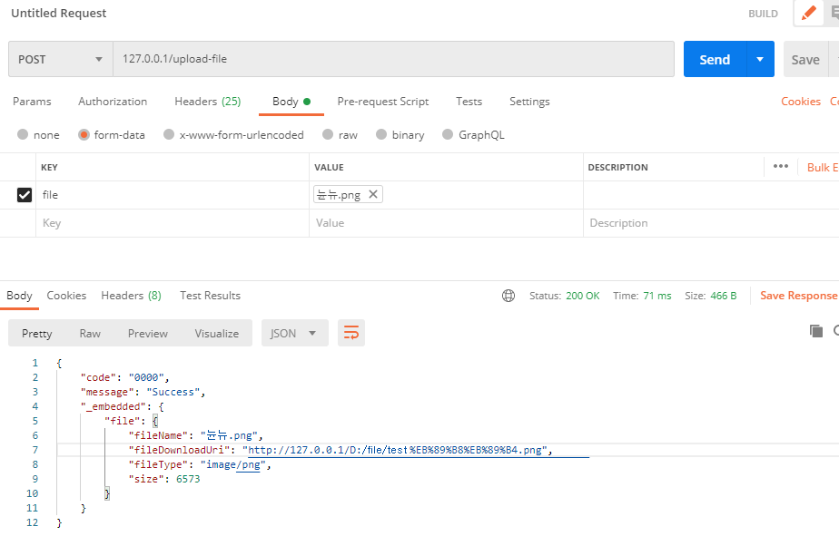
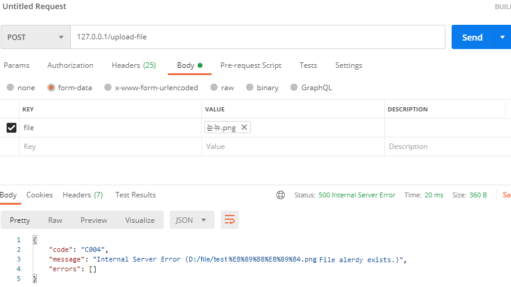

[TOC]

## application.yml

```yaml
spring:
  profiles: local
  servlet:
    multipart:
      enabled: true
      file-size-threshold: 2KB
      max-file-size: 200MB
      max-request-size: 215MB
      
file:
  location: D:/file/test
```

<br>

### Controller

```java
import lombok.RequiredArgsConstructor;
import org.springframework.beans.factory.annotation.Value;
import org.springframework.hateoas.Link;
import org.springframework.hateoas.server.mvc.WebMvcLinkBuilder;
import org.springframework.http.ResponseEntity;
import org.springframework.web.bind.annotation.*;
import org.springframework.web.multipart.MultipartFile;
import org.springframework.web.servlet.support.ServletUriComponentsBuilder;
import javax.servlet.http.HttpServletRequest;
import static org.springframework.hateoas.server.mvc.WebMvcLinkBuilder.linkTo;

@RestController
@RequestMapping(produces = {"application/hal+json;charset=utf-8"})
@RequiredArgsConstructor
public class FileController {
    
    @Value("${file.location}")
    private String fileLocation;
    
    private final FileService fileService;

    @PostMapping("/upload-file")
    public ResponseEntity uploadFile(
        HttpServletRequest request, 
        @RequestParam("file") MultipartFile file
    ) {
        String fileName = fileService.storeFile(file);

        String fileDownloadUri = ServletUriComponentsBuilder
            .fromCurrentContextPath()
            .path(fileLocation)
            .path(fileName)
            .toUriString();

        ResponseModel response = createSuccessResponseModel(
            "file", 
            new UploadFileModel(
                fileName, 
                fileDownloadUri,
                file.getContentType(), 
                file.getSize()
            )
        );

        return ResponseEntity.ok(response);
    }

    public ResponseModel createSuccessResponseModel(
        String relationship, 
        RepresentationModel resource, 
        Link...links
    ) {
        ResponseModel responseModel = new ResponseModel();
        responseModel.setCode(ResultCode.SUCCESS.getCode());
        responseModel.setMessage(ResultCode.SUCCESS.getMessage());
        responseModel.embedModel(relationship, resource);
        responseModel.add(links);
        return responseModel;
    }
}
```

<br>

### Service

```java
import lombok.RequiredArgsConstructor;
import lombok.extern.slf4j.Slf4j;
import org.springframework.beans.factory.annotation.Value;
import org.springframework.core.io.UrlResource;
import org.springframework.core.io.support.ResourceRegion;
import org.springframework.http.HttpHeaders;
import org.springframework.http.HttpRange;
import org.springframework.stereotype.Service;
import org.springframework.util.StringUtils;
import org.springframework.web.multipart.MultipartFile;

import java.io.IOException;
import java.nio.file.Files;
import java.nio.file.Path;
import java.nio.file.Paths;

@Slf4j
@Service
@RequiredArgsConstructor
public class FileService {

    @Value("${file.location}")
    private String fileLocation;
    private Path fileStorageLocation;

    public void setFileStorageLocation() {
        this.fileStorageLocation = Paths.get(this.fileLocation)
                .toAbsolutePath().normalize();
        try {
            Files.createDirectories(this.fileStorageLocation);
        } catch (Exception ex) {
            throw new FileStorageException("Could not create the directory where the uploaded files will be stored.", ex);
        }
    }

    // 파일 업로드
    public String storeFile(MultipartFile file) {
        // Normalize file name
        String fileName = StringUtils.cleanPath(file.getOriginalFilename());
        setFileStorageLocation();
        try {
            // Check if the file's name contains invalid characters 
            // (파일명에 '..' 문자가 들어 있다면 오류를 발생하고 아니라면 진행(해킹및 오류방지))
            if(fileName.contains("..")) {
                throw new FileStorageException("Sorry! Filename contains invalid path sequence " + fileName);
            }

            // 파일이 이미 존재하는 경우 오류 발생
            Path targetLocation = this.fileStorageLocation.resolve(fileName);
            if (Files.exists(targetLocation)) throw new FileAlreadyExistsException(targetLocation + " File alerdy exists.");

            // 파일 저장
            file.transferTo(targetLocation);
//            Files.copy(file.getInputStream(), targetLocation, StandardCopyOption.REPLACE_EXISTING);
            return fileName;
        } catch (IOException ex) {
            throw new FileStorageException("Could not store file " + fileName + ". Please try again!", ex);
        }
    }
}

```

<br>

### UploadFileModel

```java
import lombok.Getter;
import org.springframework.hateoas.RepresentationModel;

@Getter
public class UploadFileModel extends RepresentationModel<UploadFileModel> {
    private String fileName;
    private String fileDownloadUri;
    private String fileType;
    private long size;

    public UploadFileModel(String fileName, String fileDownloadUri, String fileType, long size) {
        this.fileName = fileName;
        this.fileDownloadUri = fileDownloadUri;
        this.fileType = fileType;
        this.size = size;
    }
}
```

<br>

### TEST

#### 파일 존재 X



#### 파일 존재 O

