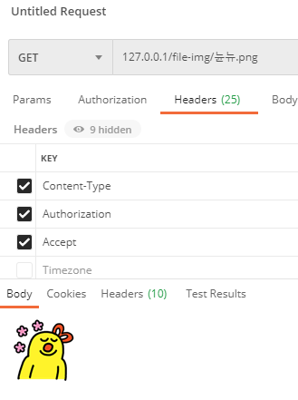

[TOC]

## application.yml

```yaml
spring:
  profiles: local
  servlet:
    multipart:
      enabled: true
      file-size-threshold: 2KB
      max-file-size: 200MB
      max-request-size: 215MB
      
file:
  location: D:/file/test
```

<br>

### Controller

```java
import lombok.RequiredArgsConstructor;
import org.apache.commons.io.IOUtils;
import org.springframework.beans.factory.annotation.Value;
import org.springframework.core.io.Resource;
import org.springframework.core.io.UrlResource;
import org.springframework.core.io.support.ResourceRegion;
import org.springframework.http.*;
import org.springframework.web.bind.annotation.*;
import org.springframework.web.multipart.MultipartFile;

import java.io.FileNotFoundException;
import java.io.IOException;
import java.io.InputStream;
import java.net.MalformedURLException;
import java.nio.file.Path;

@RestController
@RequestMapping(produces = {"application/hal+json;charset=utf-8"})
@RequiredArgsConstructor
public class FileController {

    @Value("${file.location}")
    private String fileLocation;

    private final FileService fileService;

    @GetMapping("/file-img/{name}")
    public ResponseEntity<Resource> getFileImg(
            @PathVariable String name) throws IOException {
        UrlResource file = new UrlResource("file:" + fileLocation + "/" + name);
        return ResponseEntity.ok()
                .contentType(MediaTypeFactory.getMediaType(file).orElse(MediaType.IMAGE_PNG))
                .body(file);
    }
}
```

<br>

### Test

