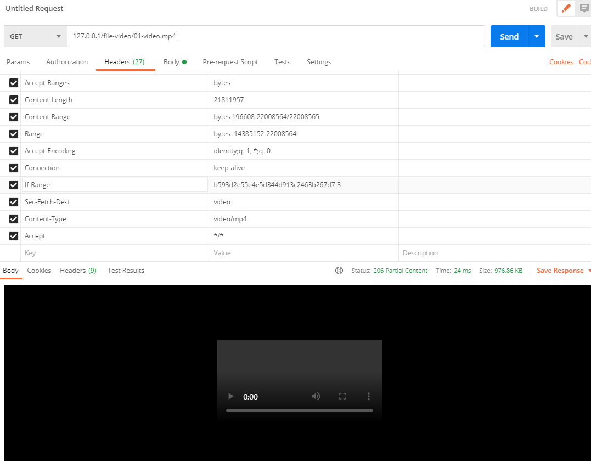

[TOC]

## application.yml

```yaml
spring:
  profiles: local
  servlet:
    multipart:
      enabled: true
      file-size-threshold: 2KB
      max-file-size: 200MB
      max-request-size: 215MB
      
file:
  location: D:/file/test
```

<br>

### Controller

```java
import lombok.RequiredArgsConstructor;
import org.apache.commons.io.IOUtils;
import org.springframework.beans.factory.annotation.Value;
import org.springframework.core.io.Resource;
import org.springframework.core.io.UrlResource;
import org.springframework.core.io.support.ResourceRegion;
import org.springframework.http.*;
import org.springframework.web.bind.annotation.*;
import org.springframework.web.multipart.MultipartFile;

import java.io.FileNotFoundException;
import java.io.IOException;
import java.io.InputStream;
import java.net.MalformedURLException;
import java.nio.file.Path;

@RestController
@RequestMapping(produces = {"application/hal+json;charset=utf-8"})
@RequiredArgsConstructor
public class FileController {

    @Value("${file.location}")
    private String fileLocation;

    private final FileService fileService;

    @GetMapping("/file-video/{name}")
    public ResponseEntity<ResourceRegion> getTutorialFileVideo(
            @PathVariable String name,
            @RequestHeader HttpHeaders headers) throws IOException {
        UrlResource file = new UrlResource("file:" + fileLocation + "/" + name);
        ResourceRegion region = odinGuideService.resourceRegionVideo(file, headers);
        return ResponseEntity
            .status(HttpStatus.PARTIAL_CONTENT)
            .contentType(MediaTypeFactory
                         .getMediaType(file)
                         .orElse(MediaType.APPLICATION_OCTET_STREAM)
                        )
            .body(region);
    }
}
```

<br>

### Service

```java
import lombok.RequiredArgsConstructor;
import lombok.extern.slf4j.Slf4j;
import org.springframework.beans.factory.annotation.Value;
import org.springframework.core.io.UrlResource;
import org.springframework.core.io.support.ResourceRegion;
import org.springframework.http.HttpHeaders;
import org.springframework.http.HttpRange;
import org.springframework.stereotype.Service;
import org.springframework.util.StringUtils;
import org.springframework.web.multipart.MultipartFile;

import java.io.IOException;
import java.nio.file.Files;
import java.nio.file.Path;
import java.nio.file.Paths;

@Slf4j
@Service
@RequiredArgsConstructor
public class FileService {

    @Value("${file.location}")
    private String fileLocation;
    private Path fileStorageLocation;

    // return 비디오 스트림
    public ResourceRegion resourceRegionVideo(
        UrlResource video, HttpHeaders headers) throws IOException {
        final long chunkSize = 1000000L;
        long contentLength = video.contentLength();

        HttpRange httpRange = headers.getRange().stream().findFirst().get();
        if(httpRange != null) {
            long start = httpRange.getRangeStart(contentLength);
            long end = httpRange.getRangeEnd(contentLength);
            long rangeLength = Long.min(chunkSize, end - start + 1);
            return new ResourceRegion(video, start, rangeLength);
        } else {
            long rangeLength = Long.min(chunkSize, contentLength);
            return new ResourceRegion(video, 0, rangeLength);
        }
    }
}

```

<br>

### Test

