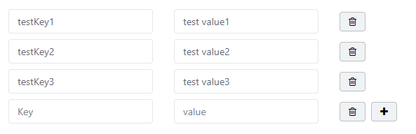
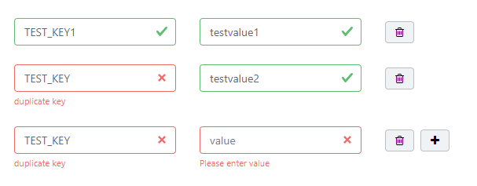

---




```vue
<template>
	<div>
        <b-card-body>
            <div v-for="(data, index) in sampleList" v-bind:key="index">
                <b-row class="m-2">
                    <b-col>
                        <b-form-group
                            id="fieldset-1"
                            label-for="input-1"
                            :invalid-feedback="invalidKeyFeedback(data.key)"
                            :state="keyState(data.key)">
                            <b-form-input
                                id="input-1"
                                v-model="data.key"
                                float-label="Key"
                                numeric-keyboard-toggle
                                type="text"
                                value=""
                                placeholder="Key"
                                :state="keyState(data.key)"/>
        				</b-form-group>
        			</b-col>
                    <b-col>
                        <b-form-group
                            id="fieldset-1"
                            label-for="input-1"
                            :invalid-feedback="invalidValueFeedback(data.value)"
                            :state="valueState(data.value)">
                            <b-form-input
                                v-model="data.value"
                                float-label="Value"
                                numeric-keyboard-toggle
                                type="text"
                                value=""
                                placeholder="value"
                                :state="valueState(data.value)"/>
        					</b-form-group>
        			</b-col>
                    <b-col>
                        <b-button @click="removeLine(index)" icon="delete" round variant="light" class="btn-border mt-1"> <i class="fa fa-trash-o"></i> </b-button>
                        <b-button v-if="index + 1 === sampleList.length"
                                  @click="addLine"
                                  variant="light"
                                  class="mt-1 btn-border justify-content-lg-start ml-2">
                            <i class="fa fa-plus"></i></b-button>
        			</b-col>
        		</b-row>
        	</div>
            <div v-if="sampleList.length === 0">
                <b-button @click="addLine" variant="light" class="justify-content-lg-start btn-border"> <i class="fa fa-plus"></i> </b-button>
        	</div>
        </b-card-body>
    </div>
</template>
<script>
    export default {
        name: "test",
        data () {
            return {
                sampleList: [],
                keyValid: false,
                valueValid: false
            }
        },
        method: {
            addPostAPI () {
                if (this.checkValid()) {
                    ------ call axios -------
                }
            },
            checkVaild () {
                if (this.keyValid) {
                    alert('please check key valid')
                    return
                } else if (this.valueValid) {
                    alert('please check value valid')
                    return
                }
                return true
            },
            addLine () {
                this.sampleList.push({
                    key: null,
                    value: null
                })
        	},
        	removeLine (lineId) {
            	this.sampleList.splice(lineId, 1)
        	},
            keyState(data) {
                if(data === null || data.trim().length === 0 || this.sampleList.filter(line => line.key === data).length > 1) {
                    this.keyValid = true
                    return false
                }
                this.keyValid = false
                return true
            },
            invalidKeyFeedback(data) {
                if(data === null || data.trim().length === 0) {
                    return 'Please enter key'
                } else if (this.sampleList.filter(line => line.key === data).length > 1){
                    return 'duplicate key'
                }
            },
            valueState(data) {
                if(data === null || data.trim().length === 0) {
                    this.valueValid = true
                    return false
                }
                this.valueValid = false
                return true
            },
            invalidValueFeedback(data) {
                if(data === null || data.trim().length === 0) {
                    return 'Please enter value'
                }
            }   

        }
    }
</script>
```

