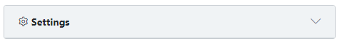
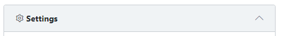

조건 클래스 바인딩 -> 리스트





```html

<div slot="header" v-b-toggle.collapse1 v-on:click=" collapsed = !collapsed">
    <span class="font-weight-bold"><i class="cui-settings"></i> Settings</span>
    <div class="card-header-actions">
        <b-link class="card-header-action btn-minimize">
            <i :class="[collapsed ? 'icon-arrow-up' : 'icon-arrow-down', 'fa']"></i>
        </b-link>
    </div>
</div>

```

<br>

```js

export default {
    name: "Test",
    data () {
        return {
            collapsed: false,
        }
    }
}

```

<br>

### 조건 많은 경우 example

method, string text, if

```html
<i :class="[getClass('icon', testData.status), 'font-weight-bold',
    testData.status==='FAILED'||testData.status==='CANCELED'? 'pointer' : '']">
```